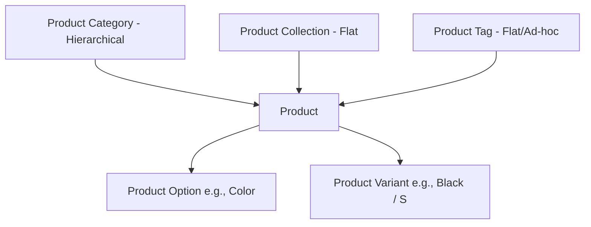

# MedusaJS v2 Agent Management & Administration Guide

This document provides a comprehensive operational reference for AI agents and human administrators on managing a **MedusaJS v2** commerce backend. It outlines concepts, command-line operations, workflows, and data structures required to manage products, pricing, inventory, regions, promotions, and sales channels.

---

## 1. Core Architecture Overview (Medusa v2)

Medusa v2 uses a modular architecture where commerce domains (Product, Cart, Order, Inventory, Pricing, Fulfillment, Promotion) are isolated into independent **Modules** communicating via **Workflows**. 

* **State Authority**: Medusa is the single source of truth for all commerce state. The storefront (Next.js) only displays projections.
* **Deterministic Decisions**: All commerce logic (calculating totals, applying discounts, checking inventory) must run inside Medusa workflows.
* **Server and Worker Process Separation**: In production environments, Medusa v2 supports splitting execution into a **Server Process** (serving API requests and Admin UI) and a **Worker Process** (handling background jobs, event subscribers, and heavy workflows) to ensure horizontal scalability without compromising API latency.
---

## 2. Regions, Currencies, and Taxes

Before products can be priced or sold, you must configure the geographical and financial boundaries.

### 2.1 Currencies
Currencies are store-wide configurations. 
* Enabled in store settings (e.g., `EUR`, `USD`, `RUB`).
* A store must define a **default currency**.

### 2.2 Regions
A **Region** represents a geographical market. It binds:
1. **Countries**: A list of ISO-2 country codes (e.g., `de`, `dk`, `ru`). A country can belong to only *one* region.
2. **Currency**: The default currency for that region.
3. **Payment Providers**: Enabled payment gateways (e.g., `pp_system_default`, `stripe`, `yookassa`).
4. **Fulfillment Providers**: Enabled fulfillment options (e.g., `manual`).

### 2.3 Tax Regions
Taxes are defined per country or region.
* **Tax Region**: Bound to a country code.
* **Tax Rates**: Tax rates (e.g., standard 19% VAT in Germany) are applied to tax regions.
* Rates can be overridden for specific product categories or individual products.

---

## 3. Product Catalog Management

A product is the foundational catalog unit. In Medusa v2, catalog organization consists of Categories, Collections, Tags, and Products.



### 3.1 Product Attributes
* **Title & Subtitle**: Customer-facing names (e.g., `Silver Chain`, `Минимализм и легкий блеск`).
* **Handle**: URL-friendly identifier (e.g., `silver-chain`). Must be unique.
* **Status**: One of `draft`, `proposed`, `published`, `rejected`. Only `published` products are visible on the store API.
* **Shipping Profile**: Links products to fulfillment rules (e.g., default shipping, fragile shipping).
* **Images & Thumbnail**: CDN or local static URLs for catalog presentation.

### 3.2 Product Categories (Hierarchical)
Categories allow nested, multi-level catalogs (e.g., `Glasses -> Accessories -> Chains`).
* Categories have a `name`, `handle`, and optional `parent_category_id`.
* Can be set to `is_active: true/false` to toggle visibility of entire groups of products.

### 3.3 Product Collections (Flat)
Collections are flat, non-hierarchical groupings of products, often used for seasonal campaigns or curators (e.g., `Summer 2026 Collection`, `New Arrivals`).

### 3.4 Product Tags
Tags are flat, ad-hoc text labels applied to products for flexible filtering and search indexing (e.g., `stainless-steel`, `gift-ideas`, `limited-edition`).

---

## 4. Product Options, Variants, and Inventory

Products are not sold directly; customers buy a specific **Product Variant**.

### 4.1 Product Options (Attributes)
Options define the variables of a product (e.g., `Material`, `Size`, `Color`).
* **Title**: Option name (e.g., `Material`).
* **Values**: Allowed choices (e.g., `Silver`, `Gold-plated`, `Leather`).

### 4.2 Product Variants
A Variant is a concrete combinatoric instance of product options (e.g., `Silver Chain / Gold-plated`).
* **SKU (Stock Keeping Unit)**: Unique alphanumeric identifier (e.g., `CHAIN-SILVER-GOLD`).
* **Barcode**: Universal identifier (UPC, EAN).
* **Weight & Dimensions**: Used for calculating shipping costs (`weight`, `length`, `width`, `height`).

### 4.3 Inventory & Stock Locations
Medusa v2 decouples product variants from physical inventory via the **Inventory Module** and **Stock Location Module**.
1. **Inventory Item**: Each variant has a matching `inventory_item_id`.
2. **Multi-part and Shared Inventory**: A single product variant can be linked to *multiple* inventory items (e.g., a "Premium Eyewear Set" variant that tracks stock for both a "Glasses" item and a "Leather Case" item separately). Conversely, multiple variants across different products can share a single underlying physical inventory item.
3. **Stock Location**: Represents a physical warehouse or fulfillment center (e.g., `European Warehouse`).
4. **Inventory Levels**: Links an `Inventory Item` to a `Stock Location` and defines:
   * `stocked_quantity`: Total physical items present.
   * `reserved_quantity`: Items locked by active, unfulfilled carts/orders.
   * `allow_backorder`: Whether customers can buy items when stock is `0`.

---

## 5. Pricing and Currencies

In Medusa v2, pricing is managed by the **Pricing Module**, supporting complex, multi-region, and dynamic pricing strategies.

### 5.1 Direct Variant Prices
Each variant can have multiple default prices across different currencies and regions:
* **Currency Price**: Explicit amount for a currency code (e.g., `45 EUR`, `50 USD`).
* **Region Price**: Overrides standard currency pricing for a specific Medusa region.

### 5.2 Price Lists (Sales & Promotions)
Price Lists allow overriding default prices dynamically based on criteria:
* **Type**: `sale` (re-labels original price) or `override` (silently overrides).
* **Rules**: Can target specific customer groups, regions, or dates.
* **Scheduling**: Starts and ends automatically using `starts_at` and `ends_at` timestamps.

---

## 6. Promotions and Discounts (The v2 Promotion Module)

Medusa v2 features a completely redesigned Promotion engine based on customizable rules.

### 6.1 Promotion Types
* **Standard Promotion**: Activated by entering a promo code at checkout (e.g., `WELCOME10`).
* **Automatic Promotion**: Applied automatically if rules are satisfied (no code required).

### 6.2 Campaign Management
Promotions can belong to a **Campaign**. Campaigns hold:
* `starts_at` and `ends_at` dates.
* Budget constraints (e.g., maximum discount value across all redemptions).

### 6.3 Discount Application Forms
1. **Percentage**: Deducts a percentage from the matching target (e.g., `15% off`).
2. **Fixed Amount**: Deducts a fixed monetary value (e.g., `10 EUR off`).
3. **Free Shipping**: Sets shipping total to `0`. Under the hood in Medusa v2, free shipping is handled as separate adjustment lines targeting the shipping methods directly.
### 6.4 Rules & Targeting
Promotions use precise rule-matching schemas:
* **Target rules**: What items the discount applies to (e.g., only products in `Chains` category).
* **Buy rules**: Prerequisites for the discount (e.g., "Buy Product A to get 50% off Product B").
* **Order rules**: Basket constraints (e.g., order subtotal must exceed `100 EUR`).

---

## 7. Sales Channels and Publishable API Keys

To support multi-tenant or headless configurations, Medusa isolates product visibility.

### 7.1 Sales Channels
A Sales Channel represents a sales funnel (e.g., `Default Storefront`, `Mobile App`, `Instagram Shop`).
* Products are assigned to one or more sales channels.
* Carts and orders are linked to a specific sales channel.

### 7.2 Publishable API Keys
Publishable API keys are scoped tokens passed in storefront HTTP headers (`x-publishable-api-key`).
* A Publishable API key is linked to one or more **Sales Channels**.
* The storefront can only query, list, and mutate products assigned to the sales channels associated with its active API key.

---

## 8. Command-Line (CLI) Administration Reference

Agents can execute these operations in the backend workspace directory (`backend/apps/backend`).

### 8.1 Database Operations
* **Run migrations**:
  ```bash
  npx medusa db:migrate
  ```
* **Seed database**:
  ```bash
  npx medusa db:seed --file src/migration-scripts/initial-data-seed.ts
  ```

### 8.2 User Administration
* **Create an administrator**:
  ```bash
  npx medusa user -e <email> -p <password>
  ```
* **Create an admin invitation**:
  ```bash
  npx medusa user -e <email> --invite
  ```

### 8.3 Development and Server
* **Start backend development server**:
  ```bash
  npx medusa develop
  ```

---

## 9. Common Administrative Workflows (How-To for Agents)

### 9.1 How to Add a New Product with a Variant (Workflow API)
To add a product via code, migration, or seed scripts, use the `createProductsWorkflow` core-flow.

```typescript
import { createProductsWorkflow } from "@medusajs/medusa/core-flows";
import { ProductStatus } from "@medusajs/framework/utils";

await createProductsWorkflow(container).run({
  input: {
    products: [
      {
        title: "Product Name",
        handle: "product-handle",
        status: ProductStatus.PUBLISHED,
        description: "Product description goes here.",
        shipping_profile_id: "sp_...", // retrieve shipping profile first
        options: [
          {
            title: "Color",
            values: ["Red", "Blue"]
          }
        ],
        variants: [
          {
            title: "Red variant",
            sku: "PROD-RED",
            options: { Color: "Red" },
            prices: [
              { amount: 50, currency_code: "eur" },
              { amount: 60, currency_code: "usd" }
            ]
          }
        ],
        sales_channels: [{ id: "sc_..." }]
      }
    ]
  }
});
```

### 9.2 How to Create a Promotion
To set up a promotion programmatically or via API endpoints:

```bash
POST http://localhost:9000/admin/promotions
Headers:
  Authorization: Bearer <admin_token>
  Content-Type: application/json

Body:
{
  "code": "SUMMER26",
  "type": "standard",
  "application_method": {
    "type": "percentage",
    "value": 20,
    "target_type": "items",
    "allocation": "across"
  },
  "rules": [
    {
      "attribute": "customer_group_id",
      "operator": "eq",
      "values": ["cg_vip"]
    }
  ]
}
```

---

## 10. Summary Checklist for Creating Catalog Elements

When creating a new catalog entry, ensure all linked parameters are defined:

- [ ] **Region is mapped** with correct country codes, currency, and payment/fulfillment providers.
- [ ] **Tax rates are registered** for the countries inside active regions.
- [ ] **Sales channel is active** and linked to the storefront's publishable API key.
- [ ] **Product status is set to `published`** (drafts won't show in catalog).
- [ ] **Options are fully populated** with matching variants.
- [ ] **SKUs are assigned** to each variant to allow inventory tracking.
- [ ] **Inventory Item is initialized** with stocked quantities mapped to a valid Stock Location.
- [ ] **Fulfillment options are created** and priced under shipping options inside active regions.
