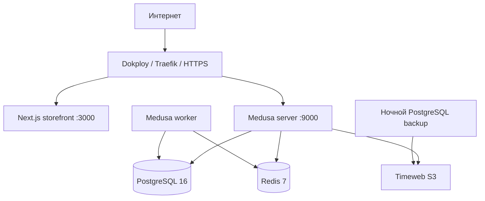

# План production-деплоя Sunluk на Timeweb Cloud

Дата фиксации: 18 июля 2026 года.

Статус: согласованный план для предстоящей подготовки и деплоя. Изменения production-конфигурации ещё не выполнены.

## 1. Принятые решения

- Платформа: Timeweb Cloud.
- Сервер: Ubuntu 24.04 LTS, 4 vCPU, 8 ГБ RAM, 80 ГБ NVMe, публичный IPv4.
- Windows не используется: проект уже собирается из Linux-образов `node:20-alpine`, `postgres:16-alpine` и `redis:7-alpine`.
- Начальная архитектура: один VPS с Docker, Dokploy и Traefik.
- Docker-образы на первом этапе собираются непосредственно на VPS. Отдельная CI-сборка не обязательна при 8 ГБ RAM.
- GitHub удобен, но не является обязательной зависимостью деплоя.
- PostgreSQL 16 первоначально работает в Docker с постоянным volume на VPS.
- Redis 7 работает в Docker с постоянным volume.
- Medusa разделяется на server и worker, использующие общие PostgreSQL и Redis.
- Изображения товаров и другие uploads хранятся в Timeweb S3, а не внутри контейнера Medusa.
- Резервные копии PostgreSQL выгружаются за пределы VPS, предпочтительно в Timeweb S3.
- Kubernetes, multi-server, blue/green и собственная container registry пока не нужны.

Ориентир тарифа Timeweb на дату фиксации: 4 vCPU / 8 ГБ / 80 ГБ — 1 782 ₽/мес без учёта IPv4, S3 и резервных копий. Перед заказом цену необходимо проверить повторно.

## 2. Целевая архитектура



Публичные маршруты:

```text
https://<storefront-domain>  → Next.js
https://<api-domain>         → Medusa API и Admin
```

Публично открываются только порты `80`, `443` и ограниченный SSH `22`. PostgreSQL, Redis, `3000` и `9000` не должны быть доступны напрямую из интернета.

## 3. Текущее состояние репозитория

Существующая база для деплоя:

- `docker-compose.prod.yml` рассчитан на Dokploy и один VPS.
- `storefront/Dockerfile` собирает Next.js на Node 20 Alpine.
- `backend/apps/backend/Dockerfile` собирает Medusa на Node 20 Alpine.
- PostgreSQL уже использует named volume `postgres_data`.
- Backend имеет health check и выполняет миграции перед запуском.

Что требуется изменить до production-запуска:

1. `docker-compose.prod.yml` пока содержит только PostgreSQL, один backend и storefront; Redis отсутствует намеренно.
2. `backend/apps/backend/medusa-config.ts` не задаёт `workerMode` и не регистрирует production Redis-модули.
3. Зависимость `@medusajs/file-s3` установлена, но S3 provider не подключён в `medusa-config.ts`.
4. Миграции сейчас запускаются вместе с каждым backend startup. После разделения server/worker миграции должен выполнять только один release/migration step.
5. `JWT_SECRET` и `COOKIE_SECRET` имеют небезопасный fallback `supersecret`; production должен падать при отсутствии реальных секретов.
6. Storefront получает `NEXT_PUBLIC_MEDUSA_BACKEND_URL` и `NEXT_PUBLIC_MEDUSA_PUBLISHABLE_KEY` во время сборки. Их изменение требует пересборки frontend.
7. `scripts/sync-publishable-key.js` является Windows-only локальным helper и содержит тестовые credentials `admin@test.com / supersecret`; на production он не используется.

## 4. Обязательные production-компоненты

### PostgreSQL

- Образ: PostgreSQL 16.
- Данные: отдельный named volume.
- Порт `5432` не публикуется наружу.
- Перед опасными миграциями создаётся dump.
- Ночной dump копируется в S3.
- После настройки выполняется пробное восстановление.

### Redis

- Образ: Redis 7 Alpine.
- Доступ только по внутренней Docker-сети.
- Используется Medusa server и worker.
- Настраивается persistence, чтобы перезапуск контейнера не обнулял рабочее состояние очередей без необходимости.

### Medusa

Два процесса из одного образа:

- `medusa-server`: API и Medusa Admin;
- `medusa-worker`: subscribers, scheduled jobs и фоновые workflows.

Оба процесса используют одинаковые `DATABASE_URL`, `REDIS_URL`, интеграционные ключи и версию приложения. Только server получает публичный маршрут.

### Timeweb S3

Используется для:

- изображений товаров;
- загруженных файлов;
- PostgreSQL backups.

Приложение не полагается на файловую систему контейнера для постоянных данных.

## 5. Порядок выполнения

### Этап A. Подготовка инфраструктуры

1. Создать VPS с Ubuntu 24.04 LTS, 4 vCPU, 8 ГБ RAM и 80 ГБ NVMe.
2. Выбрать локацию около основной аудитории: Москва/Санкт-Петербург для РФ, Франкфурт/Нидерланды для ЕС.
3. Добавить SSH public key. Пароли и private key в документы или чат не передавать.
4. Создать Timeweb S3 bucket для uploads и backups.
5. Определить storefront и API/Admin домены.
6. Направить DNS A-записи на IPv4 VPS.

### Этап B. Подготовка Ubuntu

1. Установить обновления безопасности.
2. Создать отдельного административного пользователя.
3. Настроить key-only SSH и ограничить root/password login после проверки нового пользователя.
4. Настроить firewall: публичны только `22`, `80`, `443`.
5. Добавить 2–4 ГБ swap как защиту от кратковременного пика сборки, не как замену RAM.
6. Установить Docker Engine и Docker Compose из официального Docker repository.
7. Установить Dokploy и проверить доступ к панели.

### Этап C. Gate перед изменением приложения

Перед кодовыми изменениями обновить `flows/integrations/ci-cd.md` под новую production-схему, пройти flow review и только затем делегировать реализацию. После реализации выполнить `sync-flows`.

### Этап D. Подготовка production-конфигурации

1. Добавить Redis service и volume.
2. Добавить отдельные Medusa server и worker services.
3. Вынести миграции в однократный migration/release step.
4. Подключить Redis caching, event bus, workflow engine и locking modules согласно установленной версии Medusa.
5. Подключить S3 File Module Provider.
6. Удалить production fallback для JWT/cookie secrets.
7. Закрыть прямую публикацию внутренних портов или ограничить её сетью Traefik/Dokploy.
8. Добавить ограничение размера и rotation Docker logs.
9. Сохранить health checks для storefront, Medusa и PostgreSQL/Redis.

### Этап E. Production environment

В Dokploy или защищённом server-side env задаются:

```text
POSTGRES_DB
POSTGRES_USER
POSTGRES_PASSWORD
DATABASE_URL
REDIS_URL
JWT_SECRET
COOKIE_SECRET
AUTH_MFA_ENCRYPTION_KEY
STORE_CORS
ADMIN_CORS
AUTH_CORS
MEDUSA_BACKEND_URL
NEXT_PUBLIC_MEDUSA_BACKEND_URL
NEXT_PUBLIC_MEDUSA_PUBLISHABLE_KEY
S3_URL
S3_BUCKET
S3_REGION
S3_ACCESS_KEY_ID
S3_SECRET_ACCESS_KEY
```

Платёжные, email и Sentry secrets добавляются только при подключении соответствующих интеграций. Секреты не коммитятся, не встраиваются в Dockerfile и не пересылаются в чат.

### Этап F. Инициализация Medusa

Порядок первого запуска:

1. Запустить PostgreSQL и Redis.
2. Выполнить Medusa migrations один раз.
3. Выполнить initial data seed один раз.
4. Создать production администратора с уникальным паролем.
5. Получить publishable API key и связать его с нужным sales channel.
6. Передать publishable key в build environment storefront.
7. Собрать и запустить storefront, Medusa server и worker.

Локальный `scripts/sync-publishable-key.js` на сервере не запускается.

### Этап G. Домены и TLS

1. Подключить storefront domain к порту контейнера `3000` через Traefik.
2. Подключить API/Admin domain к Medusa server `9000` через Traefik.
3. Включить Let's Encrypt HTTPS.
4. Указать точные HTTPS origins в `STORE_CORS`, `ADMIN_CORS` и `AUTH_CORS`.
5. Проверить, что HTTP перенаправляется на HTTPS.
6. Проверить извне, что `3000`, `9000`, `5432` и `6379` закрыты.

### Этап H. Бэкапы и эксплуатация

1. Настроить ежедневный `pg_dump` в Timeweb S3.
2. Настроить срок хранения и удаление старых dumps.
3. Создавать VPS snapshot перед крупными обновлениями.
4. Проверить восстановление PostgreSQL из S3 dump.
5. Настроить мониторинг CPU, RAM, диска и Docker logs.
6. Настроить внешний uptime check storefront и `/health` Medusa.
7. Подключить Sentry после проверки основных маршрутов.

## 6. Варианты доставки кода

### Основной вариант: GitHub работает

```text
GitHub repository → Dokploy clone/build → Docker Compose deploy
```

GitHub Actions может выполнять CI checks, но Docker-образы первоначально собираются на 8-гигабайтном VPS.

### Резервный вариант: GitHub недоступен или не используется

```text
Windows PC → archive/SCP/WinSCP → /opt/sunluk → docker compose build/up
```

В архив не включаются:

```text
node_modules/
.next/
.medusa/
.git/
.env*
```

Production env остаётся только на сервере. Локальный Git желательно сохранить для истории и откатов, даже если удалённого GitHub нет.

## 7. Известные риски

| Риск | Мера |
|---|---|
| Потеря VPS или Docker volume | PostgreSQL dumps и uploads в Timeweb S3 |
| Одновременные миграции server/worker | Отдельный однократный migration step |
| Потеря изображений после redeploy | S3 provider вместо container filesystem |
| Публичный Redis/PostgreSQL | Только внутренняя Docker-сеть |
| Docker обходит UFW для published ports | Проверка `DOCKER-USER`/Traefik-сети и тест извне |
| Закончился диск из-за images/cache/logs | Log rotation, мониторинг, контролируемая очистка |
| Неизвестный publishable key до первого build | Seed → key → storefront build |
| Утечка production secrets | Dokploy/server env, key-only SSH, отсутствие секретов в Git |
| Неудачная миграция | Pre-migration dump, остановка deploy, проверяемый rollback |
| GitHub недоступен | SCP/WinSCP и сборка на VPS |

## 8. Проверка готовности

Деплой считается завершённым только после проверки:

- storefront открывается по HTTPS;
- Medusa `/health` отвечает по HTTPS;
- Medusa Admin принимает production credentials;
- каталог читается storefront через production API;
- publishable key связан с правильным sales channel;
- загрузка изображения сохраняет файл в Timeweb S3;
- PostgreSQL и Redis недоступны извне;
- server и worker запущены и используют общие PostgreSQL/Redis;
- повторный deploy не удаляет каталог, пользователей, заказы и uploads;
- PostgreSQL dump создаётся в S3 и восстанавливается в тестовую базу;
- после reboot VPS все контейнеры возвращаются в healthy state;
- свободное место, RAM и логи видны оператору.

Перед открытием реальных продаж отдельно проверяются payment webhooks, повторная доставка webhook, возвраты, transactional email и уведомления о заказах.

## 9. Открытые решения перед началом

- Точные storefront и API/Admin домены.
- Основная аудитория и локация Timeweb.
- Доступность GitHub с VPS и выбранный способ доставки кода.
- Нужны ли платежи и transactional email уже в первом публичном запуске.
- Срок хранения PostgreSQL backups.
- Требуется ли managed PostgreSQL после появления реальной нагрузки.

## 10. Связанные файлы

- `docker-compose.prod.yml`
- `backend/apps/backend/Dockerfile`
- `backend/apps/backend/medusa-config.ts`
- `backend/apps/backend/.env.template`
- `storefront/Dockerfile`
- `scripts/sync-publishable-key.js`
- `docs/ci-cd.md`
- `flows/integrations/ci-cd.md`
