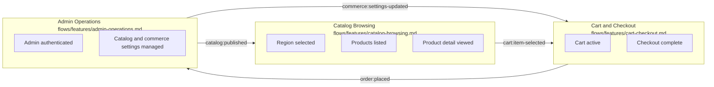

# Flow Architecture

## Project shape

Sunluk Commerce is a Medusa + Next.js commerce project.

- `backend/apps/backend` is the Medusa backend and admin surface.
- `storefront` is the Next.js customer storefront.
- Current storefront implementation is still the default Next.js landing page; the commerce behavior below is the intended project flow baseline for implementing the storefront against Medusa.

## Flow map

## Cross-flow contracts

| Source | Event/data | Target | Notes |
|---|---|---|---|
| Admin Operations | `catalog:published` | Catalog Browsing | Payload: `{ productIds?, categoryIds?, regionIds?, salesChannelIds? }`. Medusa is the authority; storefront reads only published, sales-channel-visible data. |
| Admin Operations | `commerce:settings-updated` | Cart and Checkout | Payload: `{ regionIds?, shippingOptionIds?, paymentProviderIds?, priceListIds? }`. Cart and checkout revalidate through Medusa before mutation/completion. |
| Catalog Browsing | `cart:item-selected` | Cart and Checkout | Payload: `{ productId, variantId, quantity, regionId }`. |
| Cart and Checkout | `order:placed` | Admin Operations | Payload: `{ orderId, cartId, customerId? }`; order appears in Medusa admin/order management. |

## Non-negotiables

- Backend-owned commerce state is authoritative: products, prices, regions, carts, orders, payments, fulfillment.
- Storefront must not calculate final totals independently; it can display totals returned by Medusa.
- Region and sales channel must be selected before price-sensitive product/cart operations.
- Checkout must reject incomplete or stale cart state instead of silently creating incorrect orders.

## Current implementation trace

- Backend config: `backend/apps/backend/medusa-config.ts`.
- Seeded commerce data: `backend/apps/backend/src/migration-scripts/initial-data-seed.ts`.
- Placeholder custom routes: `backend/apps/backend/src/api/store/custom/route.ts`, `backend/apps/backend/src/api/admin/custom/route.ts`.
- Storefront entry point: `storefront/src/app/page.tsx` currently contains the default Next.js starter page.
