# Flow Architecture

## Project shape

Sunluk Commerce is a Medusa + Next.js commerce project.

- `backend/apps/backend` is the Medusa backend and admin surface.
- `storefront` is the Next.js customer storefront.
- Current storefront implementation includes the SUNLUK landing page, Medusa-backed product list/detail routes, and implemented cart/checkout (see `flows/features/cart-checkout.md`).

## Flow map

```mermaid
flowchart LR
  subgraph Catalog["Catalog Browsing\nflows/features/catalog-browsing.md"]
    C0[Region selected]
    C1[Products listed]
    C2[Product detail viewed]
  end

  subgraph Localization["Catalog Localization\nflows/features/catalog-localization.md"]
    L0[Locale selected]
    L1[Localized content requested]
    L2[Fallback or localized content rendered]
  end

  subgraph Cart["Cart and Checkout\nflows/features/cart-checkout.md"]
    K0[Cart active]
    K1[Checkout complete]
  end

  subgraph Addons["Product Add-ons\nflows/features/product-addons.md"]
    O0[Packaging options resolved]
    O1[cart:line-item-add-requested emitted]
  end

  subgraph Admin["Admin Operations\nflows/features/admin-operations.md"]
    A0[Admin authenticated]
    A1[Catalog and commerce settings managed]
  end

  subgraph SiteContent["Site Content\nflows/features/site-content.md"]
    T0[Checked-in defaults]
    T1[Localized override persisted]
    T2[Merged storefront projection]
  end
  subgraph Cabinet["Customer Cabinet\nflows/features/customer-cabinet.md"]
    U0[Customer authenticated]
    U1[Cabinet dashboard viewed]
    U2[Order history browsed]
  end

  subgraph CICD["CI/CD\nflows/integrations/ci-cd.md"]
    D0[Checks passed]
    D1[VPS deployment complete]
  end

  subgraph SEO["SEO Readiness\nflows/features/seo-readiness.md"]
    S0[Public route classified]
    S1[Metadata and sitemap projected]
    S2[Search crawler response]
  end
  subgraph Navigation["Storefront Navigation\nflows/features/storefront-navigation.md"]
    N0[Mobile menu closed]
    N1[Mobile menu open]
  end

  subgraph AnalyticsConsent["Analytics Consent\nflows/features/analytics-consent.md"]
    Y0[Consent unknown]
    Y1[Consent granted or denied]
    Y2[Telemetry gated by consent]
  end

  Admin -- "catalog:published" --> Catalog
  Admin -- "catalog:published" --> Localization
  Admin -- "catalog:translation-published" --> Localization
  Localization -- "catalog:localized-content-ready" --> Catalog
  Admin -- "commerce:settings-updated" --> Cart
  Catalog -- "cart:item-selected" --> Addons
  Addons -- "cart:line-item-add-requested" --> Cart
  Catalog -- "catalog:product-detail-observed" --> AnalyticsConsent
  Addons -- "cart:item-added" --> AnalyticsConsent
  Cart -- "order:ecommerce-purchase-confirmed" --> AnalyticsConsent
  Cart -- "order:placed" --> Admin
  Cart -- "order:placed" --> Cabinet
  Catalog -. "catalog:indexable-route-projection" .-> SEO
  Localization -. "catalog:locale-routing-map" .-> SEO
  T0 -. "fallback content" .-> T2
  T1 -. "site-content:projection-selected" .-> T2
```

## Cross-flow contracts
| Source | Event/data | Target | Notes |
|---|---|---|---|
| Admin Operations | `catalog:published` | Catalog Browsing | Payload: `{ productIds?, categoryIds?, regionIds?, salesChannelIds? }`. Medusa is the authority; storefront reads only published, sales-channel-visible data. |
| Admin Operations | `catalog:published` | Catalog Localization | Payload: `{ productIds?, categoryIds?, regionIds?, salesChannelIds? }`. Publishing product source content makes it eligible for localized storefront reads. |
| Admin Operations | `catalog:translation-published` | Catalog Localization | Payload: `{ productIds, locales }`. Admin saves localized product content in Medusa for supported storefront locales. |
| Catalog Localization | `catalog:localized-content-ready` | Catalog Browsing | Payload: `{ locale, medusaLocale, fallbackProductIds? }`. Catalog UI renders localized product content or explicit source fallback. |
| Admin Operations | `commerce:settings-updated` | Cart and Checkout | Payload: `{ regionIds?, shippingOptionIds?, paymentProviderIds?, priceListIds? }`. Cart and checkout revalidate through Medusa before mutation/completion. |
| Catalog Browsing | `cart:item-selected` | Product Add-ons | Payload: `{ productId, variantId, quantity, regionId }`. Catalog resolves the available main variant; Product Add-ons resolves the preselected or visitor-selected packaging variant. |
| Product Add-ons | `cart:line-item-add-requested` | Cart and Checkout | Payload: `{ variantId, quantity, metadata? }`. Product Add-ons calls once for the main line and, after resolving its returned parent id, optionally again for linked packaging; Cart owns each Medusa mutation and authoritative response. |
| Product Add-ons | `cart:item-added` | Analytics Consent | Payload: `{ productId, sku?, name, price, currencyCode, quantity }`. Emitted once after Medusa accepts the primary product mutation and before optional linked packaging; Analytics forwards it only with granted consent and never changes cart state. |
| Catalog Browsing | `catalog:product-detail-observed` | Analytics Consent | Payload: `{ productId, sku?, name, price, currencyCode, quantity: 1 }`. Exposed once for each distinct resolved SKU in a mounted PDP; Analytics forwards Yandex `detail` only with granted consent and never changes catalog/cart state. |
| Cart and Checkout | `order:ecommerce-purchase-confirmed` | Analytics Consent | Payload: `{ orderId, currencyCode, revenue, products: [{ productId?, sku?, name, price, quantity }] }`. Exposed only from a valid Medusa completed-order response whose lines all have SKU or product id, before local clear/navigation; Analytics forwards one Yandex `purchase` per immutable order id only with granted consent. |
| Cart and Checkout | `order:placed` | Customer Cabinet | Payload: `{ orderId, cartId, customerId? }`. Placing an order registers it in the customer's account orders list. |
| Cart and Checkout | `order:placed` | Admin Operations | Payload: `{ orderId, cartId, customerId? }`; order appears in Medusa admin/order management. |
| CI/CD | None | Commerce flows | Infrastructure-only v0; it does not emit or consume commerce domain events. |
| Catalog Browsing | `catalog:indexable-route-projection` | SEO Readiness | Read-only shared data: `{ locale, path, productHandle?, product? }`. Public, published, sales-channel-visible products remain indexable when zero stock; availability is projected separately. |
| Catalog Localization | `catalog:locale-routing-map` | SEO Readiness | Read-only shared data: `{ locales, defaultLocale, localeMarketDefaults, stableProductHandles }`. Canonical/language alternates use configured prefixes; v0 locale market defaults affect catalog region resolution only when no explicit country is supplied. |
| Site Content | None | Commerce flows | Presentation-only localized overrides; checked-in defaults remain available and no commerce-domain event is emitted. |
| Storefront Navigation | None | Commerce flows | Local presentation/navigation state only; locale-prefixed destinations remain code-owned and no commerce-domain event is emitted. |
| Analytics Consent | None | Commerce flows | Receives `catalog:product-detail-observed`, `cart:item-added`, and `order:ecommerce-purchase-confirmed` only as observational inputs; browser-local consent gates Yandex `detail`, `add`, `purchase`, and the existing add goal, while analytics never blocks or mutates commerce state. |

## Non-negotiables

- Backend-owned commerce state is authoritative: products, prices, regions, carts, orders, payments, fulfillment.
- Storefront must not calculate final totals independently; it can display totals returned by Medusa.
- Region and sales channel must be selected before price-sensitive product/cart operations.
- Checkout must reject incomplete or stale cart state instead of silently creating incorrect orders.
- Site-content overrides may change presentation strings only; route destinations, executable markup, and commerce state remain code/backend-owned.

## Current implementation trace

- Backend config: `backend/apps/backend/medusa-config.ts`.
- Seeded commerce data: `backend/apps/backend/src/scripts/initial-data-seed.ts`.
- Storefront locale routing: `storefront/src/proxy.ts` (next-intl proxy; Next 16 successor to the deprecated `middleware.ts` convention).
- Storefront entry points: `storefront/src/app/[locale]/page.tsx`, `storefront/src/app/[locale]/products/page.tsx`, `storefront/src/app/[locale]/products/[handle]/page.tsx`.
- CI/CD automation: `flows/integrations/ci-cd.md`.
- Storefront SEO readiness: `flows/features/seo-readiness.md`.
- Localized site-content overrides: `flows/features/site-content.md`.
- Mobile menu navigation behavior: `flows/features/storefront-navigation.md`.
- Optional analytics consent and Yandex Metrika lifecycle: `flows/features/analytics-consent.md`.
- 2026-08-11 release: Catalog emits `cart:item-selected` to Product Add-ons, Product Add-ons emits one or two `cart:line-item-add-requested` calls to Cart, visible zero-stock products remain indexable, and Storefront Navigation has no commerce boundary. Final storefront suite (128 tests), storefront/backend builds, global lint with zero warnings, production robots smoke, and mobile Chrome smoke passed for locally reachable routes.
