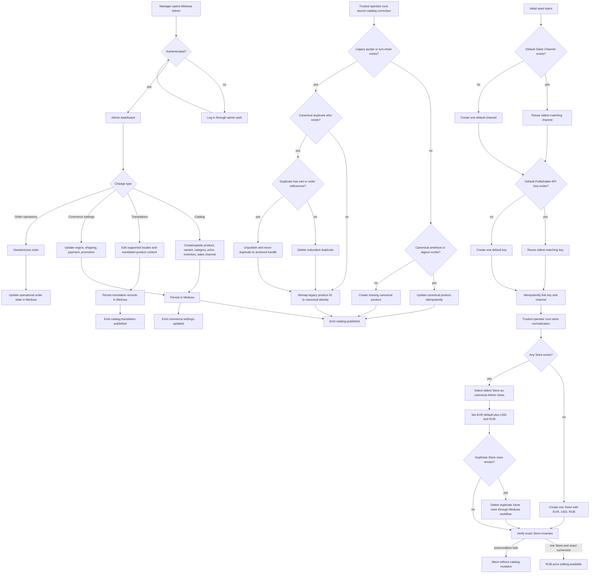
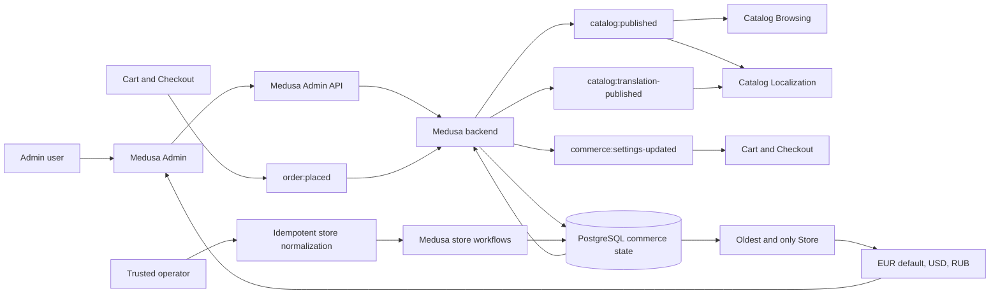

# Admin Operations Flow

## 1. Intent

Let authorized managers configure Sunluk Commerce in Medusa Admin, publish catalog and commerce settings for the storefront, maintain localized product content, and manage orders created by checkout.

Success criteria:

- Only authenticated admin users can change catalog, translations, region, shipping, payment, promotion, inventory, and order state.
- Published catalog/configuration changes are consumed by storefront catalog and checkout flows through Medusa APIs.
- Product translations for supported storefront locales are stored in Medusa and become available to localized storefront catalog reads.
- Orders created by checkout become visible and actionable in admin order management.
- Storefront does not bypass admin-configured Medusa state.
- A trusted one-time migration reuses existing `purple` and `sun-chain` product identities for Amethyst and Lagoon, removing only redundant unreferenced duplicates.
- Store initialization and repair converge to one Medusa Store whose supported currencies are `EUR` (default), `USD`, and `RUB`, so managers can edit RUB variant prices in the default Admin price grid.
- Re-running the initial seed reuses the oldest default sales channel and oldest default publishable API key instead of creating new bootstrap records; historical duplicates outside the Store invariant are left untouched unless separately proven safe to remove.

## 2. Scope

In scope:

- Admin authentication boundary.
- Product/category/variant/price/inventory/sales-channel management.
- Product locale and translation management for supported storefront languages.
- Region, shipping, payment, and promotion configuration.
- Order visibility and operational follow-up after checkout.
- Idempotent operator-run catalog migrations that preserve commerce references while correcting product identity.
- Idempotent store normalization that reuses the oldest Medusa Store, repairs its supported currencies, and removes only duplicate Store rows through Medusa's store workflows.
- Idempotent reuse of the seed's default sales channel and default publishable API key; deletion or consolidation of historical channel/key duplicates is excluded.

Out of scope:

- Custom admin UI extensions beyond Medusa Admin defaults.
- Warehouse operations details outside Medusa stock/fulfillment state.
- Accounting, ERP, and shipment-carrier integrations.

Deferred decisions:

- Exact admin roles/permissions beyond Medusa defaults.
- Launch payment provider selection per market.
- Whether order fulfillment/refund/return flows need separate dedicated flow documents before implementation.

## 3. Actors and Permissions

| Actor | Permissions | Authority source |
|---|---|---|
| Admin user | Manage products, prices, regions, shipping, payments, promotions, orders according to assigned admin role | Medusa Admin authentication/authorization |
| Storefront visitor/customer | No admin access; consumes published state only through Store API | Medusa Store API publishable key/session |
| Medusa backend | Enforces admin/store API boundaries and persists commerce state | Medusa modules/workflows/database |
| Trusted operator | Run reviewed Medusa execution scripts against the configured database; cannot bypass referential-safety checks | Deployment/runtime access + Medusa execution context |

## 4. Diagrams

### User flow

### State machine

```mermaid
stateDiagram-v2
  [*] --> Unauthenticated
  Unauthenticated --> Authenticated: valid admin login
  Authenticated --> EditingCatalog: admin edits product/catalog data
  Authenticated --> EditingTranslations: admin edits localized product content
  Authenticated --> EditingSettings: admin edits commerce settings
  Authenticated --> ManagingOrders: admin opens order management
  EditingCatalog --> Published: Medusa persists publishable catalog state
  EditingCatalog --> CatalogSaveRejected: validation failure, stale edit, or auth expiry
  EditingTranslations --> TranslationsPublished: Medusa persists translation records
  EditingTranslations --> TranslationSaveRejected: invalid locale, stale edit, or auth expiry
  EditingSettings --> SettingsActive: Medusa persists active commerce settings
  EditingSettings --> SettingsRejected: validation failure or auth expiry
  ManagingOrders --> OrderUpdated: admin updates operational order state
  ManagingOrders --> OrderUpdateRejected: illegal transition or stale order state
  Published --> Authenticated
  TranslationsPublished --> Authenticated
  SettingsActive --> Authenticated
  OrderUpdated --> Authenticated
  CatalogSaveRejected --> Authenticated
  TranslationSaveRejected --> Authenticated
  SettingsRejected --> Authenticated
  OrderUpdateRejected --> Authenticated
  Authenticated --> Unauthenticated: logout/session expires
  [*] --> CatalogMigrationResolving: trusted operator executes migration
  CatalogMigrationResolving --> CanonicalUpdated: canonical product exists without legacy product
  CatalogMigrationResolving --> LegacyRemapped: legacy product exists without duplicate
  CatalogMigrationResolving --> DuplicateDeleting: duplicate has no cart/order references
  CatalogMigrationResolving --> DuplicateArchiving: duplicate has commerce references
  CatalogMigrationResolving --> CanonicalCreated: neither identity exists
  DuplicateDeleting --> LegacyRemapped: delete duplicate then remap legacy ID
  DuplicateArchiving --> LegacyRemapped: unpublish/archive duplicate then remap legacy ID
  CanonicalUpdated --> [*]
  CanonicalCreated --> [*]
  LegacyRemapped --> [*]
  [*] --> SeedBootstrapResolving: initial seed queries default channel and key
  SeedBootstrapResolving --> BootstrapRecordsReused: both records exist
  SeedBootstrapResolving --> BootstrapRecordCreating: channel or key is missing
  BootstrapRecordCreating --> BootstrapRecordsReady: missing record created once
  BootstrapRecordsReused --> BootstrapRecordsReady
  BootstrapRecordsReady --> StoreNormalizationResolving: key/channel link is ensured
  SeedBootstrapResolving --> StoreNormalizationRejected: query, create, or link fails
  [*] --> StoreNormalizationResolving: trusted operator executes normalization
  StoreNormalizationResolving --> StoreCreating: no Store exists
  StoreNormalizationResolving --> CanonicalStoreUpdating: oldest Store exists
  CanonicalStoreUpdating --> DuplicateStoresDeleting: supported currencies updated and duplicates exist
  CanonicalStoreUpdating --> StoreNormalized: supported currencies updated and no duplicates exist
  DuplicateStoresDeleting --> StoreNormalized: Medusa delete workflow succeeds
  StoreCreating --> StoreNormalized: one Store created with exact currencies
  StoreNormalizationResolving --> StoreNormalizationRejected: Store query or update fails
  CanonicalStoreUpdating --> StoreNormalizationRejected: currency update fails before duplicate deletion
  DuplicateStoresDeleting --> StoreNormalizationRejected: deletion or postcondition fails
  StoreNormalizationRejected --> [*]
  StoreNormalized --> [*]
```

### Data/event flow

## 5. State and Projections

Authoritative state:

- Admin users, products, categories, variants, prices, price lists, regions, tax regions, sales channels, stock locations, inventory, shipping options, payment providers, promotions, customers, carts, orders, fulfillments, returns/refunds are Medusa-owned.
- PostgreSQL is the durable store configured through Medusa.
- During launch-collection correction, the legacy product IDs (`purple`, `sun-chain`) are authoritative predecessors for Amethyst and Lagoon because reusing them preserves cart/order references.
- Medusa Admin's active-store projection is the first Store returned by the Admin Store API; normalization therefore preserves the oldest Store ID and makes it the sole Store.

Admin projection:

- Medusa Admin dashboard views over backend state.
- Forms for editing commerce records.
- Order management screens.
- The product variant price grid derives currency columns from the active Store's `supported_currencies`; after normalization it exposes EUR, USD, and RUB without a custom Admin extension.

Storefront projection:

- Storefront receives only Store API-visible published data; it must not read admin-only state directly.

## 6. Events/Actions

| Direction | Name | Target flow | Payload | Allowed when | Reject reason |
|---|---|---|---|---|---|
| Outgoing | `catalog:published` | Catalog Browsing | `{ productIds?, categoryIds?, regionIds?, salesChannelIds? }` | Authenticated admin persists publishable catalog/product/price/inventory/sales-channel changes | Admin auth failure, validation failure, unpublished/non-storefront-visible state |
| Outgoing | `catalog:published` | Catalog Localization | `{ productIds?, categoryIds?, regionIds?, salesChannelIds? }` | Authenticated admin persists publishable source product content | Admin auth failure, validation failure, unpublished/non-storefront-visible state |
| Outgoing | `catalog:translation-published` | Catalog Localization | `{ productIds, locales }` | Authenticated admin saves translations for supported storefront locales | Admin auth failure, validation failure, unsupported locale mapping, conflicting translation state |
| Outgoing | `commerce:settings-updated` | Cart and Checkout | `{ regionIds?, shippingOptionIds?, paymentProviderIds?, priceListIds? }` | Authenticated admin persists checkout-affecting settings | Admin auth failure, validation failure, provider/configuration error |
| Incoming | `order:placed` | Admin Operations | `{ orderId, cartId, customerId? }` | Medusa checkout creates an order | Not applicable to admin; absent if checkout fails |
| Internal | `admin:login` | None | `{ email }` | Credentials/session accepted by Medusa | Invalid credentials/session |
| Internal | `admin:catalog-saved` | None | `{ entityType, entityIds }` | Admin role can edit entity and validation passes | Forbidden, invalid schema, conflicting state |
| Internal | `admin:translation-saved` | None | `{ productIds, locales }` | Admin role can edit translations and locale configuration is valid | Forbidden, invalid locale, missing source product, conflicting translation state |
| Internal | `admin:catalog-migration-run` | None | `{ mappings: [{ oldHandle, newHandle }], dryRun?: false }` | Trusted operator runs the reviewed script in Medusa execution context | Missing prerequisites, unsafe duplicate references, or unresolved handle collision |
| Internal | `admin:store-normalized` | None | `{ storeId, currencyCodes: ["eur", "usd", "rub"], removedDuplicateStoreIds }` | Trusted operator or seed runs through Medusa workflows and the exact postcondition passes | Store query/update/delete failure or postcondition mismatch |
| Internal | `admin:seed-bootstrap-reused` | None | `{ salesChannelId, publishableApiKeyId }` | Existing oldest matching records are reused or a missing record is created once, then their link is ensured | Query, create, or link failure |
| Internal | `admin:order-updated` | None | `{ orderId, operation }` | Admin role can perform operation and order is in a legal state | Forbidden, stale order state, invalid transition |

## 7. Edge Cases

- Admin session expires while editing: save must be rejected; admin reauthenticates before retry.
- Product is published without valid variant/pricing for a storefront region: catalog flow must not expose it as purchasable until Medusa returns valid sellable data.
- Shipping/payment setting changes while a shopper is checking out: cart flow revalidates before mutation/completion.
- Order is placed while admin order list is open: admin projection refresh/polling/manual reload must reveal the new order before operational action.
- Two admins edit the same entity: Medusa validation/state wins; stale admin forms must not overwrite newer authoritative state silently.
- Admin attempts an illegal order transition: reject through Medusa; do not invent storefront-side compensating state.
- Admin publishes a product before RU/EN translations are complete: source product may be sellable, but localization flow must decide whether storefront shows fallback content or release QA blocks publication.
- Admin saves translations for a locale that storefront does not route (`ru`/`en` only in v1): Medusa may store the translation, but storefront ignores it until routing is expanded.
- Both legacy and canonical handles exist: prefer the legacy product ID, delete the canonical duplicate only when it has no cart or order references, then remap the legacy product.
- Canonical duplicate has cart or order references: do not delete it; unpublish it and move it to an archived unique handle before remapping the legacy product to the canonical handle.
- Only the legacy handle exists: update that product, variant, prices, translations, and metadata in place.
- Only the canonical handle exists: update it idempotently; do not create another product.
- Neither handle exists: create the canonical product once.
- Re-running after any completed or partial branch converges to one published canonical product and never recreates a redundant duplicate.
- No Store exists: create exactly one Store with EUR default plus USD and RUB.
- Multiple Stores exist: preserve the oldest Store ID and its default sales-channel reference, update its supported currencies first, then delete only the extra Store rows through `deleteStoresWorkflow`.
- Currency update fails: do not start duplicate deletion; existing products, variants, prices, regions, sales channels, API keys, carts, and orders remain untouched.
- Duplicate deletion partially fails: postcondition fails and the script exits non-zero; a rerun safely retries remaining duplicates without creating another Store.
- Repeated seed or normalization run: reuse the sole Store and perform no duplicate creation or unrelated mutation.
- Existing RUB prices and region configuration: preserve them byte-for-byte; normalization changes Store records and their supported-currency rows only.
- Default sales channel or default publishable API key already exists: reuse the oldest exact-name/type match and do not create another.
- Either bootstrap record is absent: create only the missing record, link the pair idempotently, and continue.
- Historical duplicate sales channels or API keys: leave them untouched because they may carry product or publishable-key links not represented by the Store row; this repair must not widen into catalog-channel cleanup.

## 8. Side Effects

- Persist commerce configuration and translation records in Medusa/PostgreSQL.
- Storefront catalog, localization, and checkout projections change after the next Store API read/revalidation.
- Orders created by checkout become visible in Medusa Admin.
- Catalog correction preserves the legacy product/variant identity where possible, deletes only unreferenced duplicates, and hides referenced duplicates from Store API visibility.
- Store normalization updates or creates one canonical Store, removes duplicate Store rows through Medusa's supported workflow, and intentionally leaves products, variants, prices, regions, sales channels, API keys, carts, and orders unchanged.
- Seed bootstrap reuses existing default sales-channel and publishable-key records and creates only a missing prerequisite; historical duplicates remain untouched.
- Future provider integrations may create side effects with payment, storage, search, monitoring, or fulfillment systems; those require dedicated integration flows before implementation.

## 9. Schemas Touched

Expected implementation/configuration files when custom admin behavior is built:

- `backend/apps/backend/medusa-config.ts` for modules/providers/configuration.
- `backend/apps/backend/src/api/admin/**` for custom admin routes.
- `backend/apps/backend/src/admin/**` for admin extensions.
- Medusa modules/workflows/subscribers under `backend/apps/backend/src/**` if custom commerce operations are added.

Current files that inform the flow:

- The placeholder custom admin route (`api/admin/custom/route.ts`) has been removed; no Sunluk-specific custom admin HTTP routes exist yet.
- `backend/apps/backend/src/scripts/initial-data-seed.ts` seeds initial admin-managed commerce data.
- `backend/apps/backend/medusa-config.ts` configures Medusa backend environment and HTTP boundaries.
- `backend/apps/backend/src/scripts/update-product-cards.ts` performs the one-time, idempotent launch-collection catalog migration through Medusa execution context.
- `backend/apps/backend/src/scripts/normalize-store.ts` owns the reusable idempotent Store invariant and the operator-run production repair.
- The launch correction maps `purple` to `amethyst` and `sun-chain` to `lagoon`; the seed continues to create only canonical handles on fresh databases.

## 10. Targeted Tests

| Layer | Behavior | File | Status |
|---|---|---|---|
| Backend integration | Custom admin routes require admin authorization before mutating state | To add when custom admin routes are implemented | Pending implementation |
| Backend integration | Catalog/config changes are visible through Store API only when published/sellable | To add when storefront catalog integration is implemented | Pending implementation |
| Backend integration | Checkout-affecting setting changes force cart/checkout revalidation | To add when checkout integration is implemented | Pending implementation |
| Backend migration smoke | Launch-collection update is rerunnable, preserves mapped product IDs, and exposes six published products without legacy handles | `backend/apps/backend/src/scripts/update-product-cards.ts` | Passed 2026-07-15 |
| Backend migration smoke | Existing Purple and Sun Chain IDs become Amethyst and Lagoon; redundant unreferenced canonical duplicates are removed | `backend/apps/backend/src/scripts/update-product-cards.ts` | Passed 2026-07-15 |
| Backend migration safety | A duplicate with cart/order references is archived and unpublished instead of deleted; rerun remains idempotent | `backend/apps/backend/src/scripts/update-product-cards.ts` | Passed 2026-07-15 |
| Backend migration smoke | Fresh migrated state converges to one Store with EUR default plus USD and RUB | `backend/apps/backend/src/scripts/normalize-store.ts` | Passed 2026-07-28 |
| Backend migration smoke | Duplicate Store state preserves the oldest Store ID, removes only extra active Store rows, and converges identically on rerun | `backend/apps/backend/src/scripts/normalize-store.ts` | Passed locally and in production 2026-07-28 |
| Production safety | Store normalization leaves product/variant price, region, sales-channel, API-key, cart, and order identities/counts unchanged | Admin API snapshots plus PostgreSQL backup | Passed after bootstrap reuse correction 2026-07-28 |
| Admin browser smoke | Product variant price editor exposes a RUB currency column through the default Medusa Admin | Production Medusa Admin | Passed 2026-07-28 |
| Backend migration smoke | Repeated seed bootstrap reuses the same default sales-channel and publishable-key IDs without increasing either count | `backend/apps/backend/src/scripts/initial-data-seed.ts` | Passed in production 2026-07-28 |

## 11. Implementation Plan

1. Use Medusa Admin defaults for baseline admin operations.
2. Add custom admin routes/extensions only when a concrete Sunluk-specific operation cannot be represented by Medusa defaults.
3. Keep product/cart/order/payment logic in Medusa modules, workflows, subscribers, and providers.
4. Add backend integration tests for every custom admin mutation before exposing it to storefront flows.
5. Correct the launch migration mappings to `purple` -> `amethyst` and `sun-chain` -> `lagoon`, preserving legacy IDs and converging duplicate states safely.
6. Replace unconditional Store creation in the seed with the shared idempotent normalization function.
7. Back up production, run normalization once, rerun it to prove convergence, and compare protected commerce snapshots before and after.
8. Verify the default Admin product price editor exposes RUB; do not add custom UI or mutate a product price solely for the check.
9. Reuse the oldest exact-match default sales channel and default publishable API key before Store normalization; do not consolidate historical channel/key duplicates in this fix.

## 12. Implementation Trace

Current status: partial overall Admin operations; Store normalization and RUB price editing are complete. Production has one active Store, the oldest Store ID is preserved, and repeated seed bootstrap no longer creates default sales-channel or publishable-key duplicates.

Flow reviews: launch migration approved 2026-07-15; Store normalization v2 and seed-bootstrap correction v3 approved 2026-07-28 with no unresolved blocker.

Validation:

- `npx tsc --noEmit` in `backend/apps/backend` completed successfully.
- `npx medusa exec ./src/scripts/update-product-cards.ts` completed successfully twice against the local database.
- Store API returned all six launch products with localized copy/metadata and no legacy handles.
- Corrected migration completed twice. `prod_01KXD77RCZR088H58YSG2BEEK3` now owns `amethyst`; `prod_01KXDBBK6V5TXA74QWR0XXH0TY` now owns `lagoon`; redundant canonical duplicates and synthetic test data were removed; the pre-existing Purple cart reference remains valid; Store API exposes no `purple`, `sun-chain`, or archived duplicate handle.
- `npm run build --prefix backend` completed successfully; final global lint completed with no errors and five pre-existing storefront `` warnings.
- An isolated migrated PostgreSQL database converged to one Store with `eur:true,rub:false,usd:false`; two injected duplicate Stores were removed, the oldest Store ID remained, and a second run made no further change.
- Production deployed commits `e001f33` and `8f3e7db`; the Google registry mirror bypassed the VPS Docker Hub `429` without changing application behavior.
- Gzip-verified backups bracket the repair: `/opt/backups/sunluk-pre-store-normalize-20260728-022129.sql.gz` and `/opt/backups/sunluk-post-store-normalize-20260728-024558.sql.gz`.
- Production Store Admin API returns one active Store, `store_01KYJX6V22YR4827X34HVRZ1CZ`, with EUR as the sole default plus non-default USD and RUB.
- The normalization script completed twice in production. Product, variant, price, region, cart, and order fingerprints remained unchanged; after bootstrap reuse was deployed, sales-channel and API-key fingerprints and counts also remained unchanged across the next seed/deploy.
- Production Medusa Admin displayed editable `Price RUB` with the existing `4 499,00 ₽` value alongside EUR, USD, Europe, and Russia columns; no product price was mutated for verification.

## 13. Open Questions

- What admin roles are required for Sunluk launch beyond Medusa defaults?
- Which launch markets must be configured first?
- Which payment providers are required for launch per market?
- Should publication be blocked when either RU or EN translation is missing, or is source-language fallback acceptable during rollout?
- Should fulfillment, refunds, returns, and order transfer each receive dedicated flows before implementation?
- Resolved 2026-07-28: the Store currency contract is EUR default plus USD and RUB; the oldest Store is preserved because Medusa Admin projects the first Store as active.

## 14. Review Checklist

- [x] Admin/storefront permission boundary is explicit.
- [x] Cross-flow `catalog:published`, `catalog:translation-published`, `commerce:settings-updated`, and `order:placed` are declared.
- [x] Medusa remains the authority for commerce-critical state and translated product content.
- [x] Admin save rejection paths are represented for catalog, translations, settings, and orders.
- [x] Translation publication policy is surfaced as an open question instead of silently assumed.
- [x] Unsupported storefront locales remain ignored until routing explicitly enables them.
- [x] Custom provider/integration decisions are open questions, not silently assumed.
- [x] Catalog migration identity precedence and duplicate deletion/archive rules are explicit.
- [x] Store normalization preserves the active Store identity, names exact allowed mutations, and rejects postcondition drift.
- [x] Empty, duplicate, partial-failure, rerun, and protected-commerce-data paths are explicit.
- [x] Seed bootstrap names the exact channel/key reuse rule and explicitly excludes unsafe historical channel/key cleanup.

Flow review v2 (2026-07-28): **APPROVED**. The canonical Store selection, exact currency invariant, update-before-delete ordering, supported Medusa workflow boundary, protected commerce records, partial-failure/rerun behavior, concrete files, and production checks are explicit; no custom Admin UI or cross-flow event is introduced.

Flow review v3 (2026-07-28): **APPROVED** after deployment exposed the seed boundary. Reusing exact-match bootstrap records prevents future unrelated channel/key creation, while leaving historical channel/key duplicates untouched avoids widening the repair into product/API-key link migration.

Flow-code sync v2 (2026-07-28): **IN SYNC**. The shared normalization helper, seed reuse path, deployed active-Store invariant, protected-commerce checks, rerun behavior, and default Admin RUB editor match the approved v3 flow. Historical sales-channel/API-key duplicates were intentionally left untouched.
