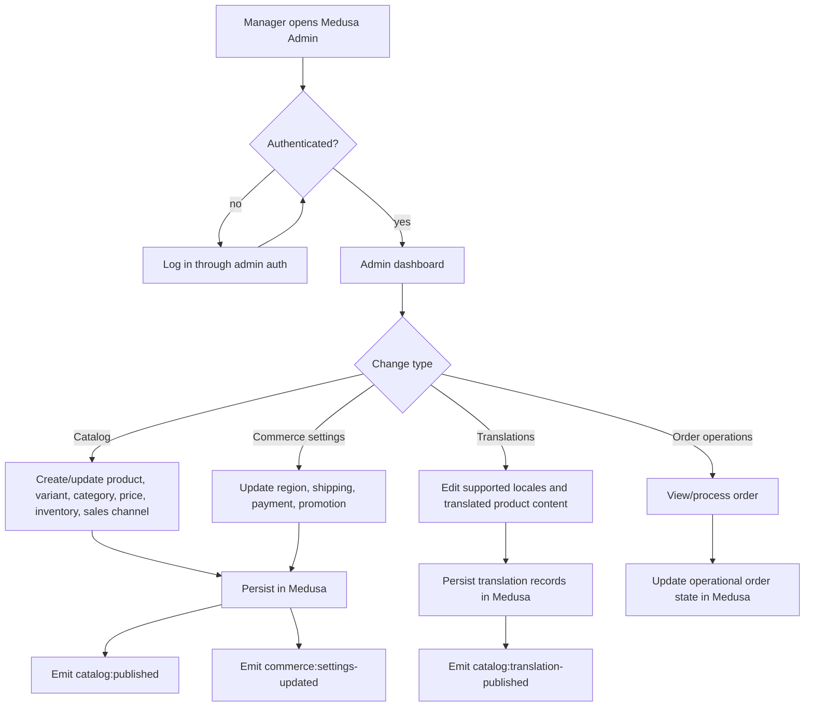
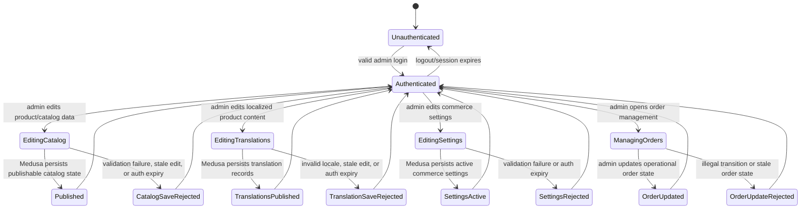
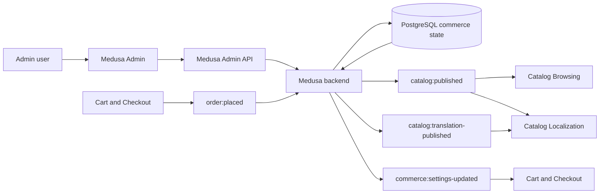

# Admin Operations Flow

## 1. Intent

Let authorized managers configure Sunluk Commerce in Medusa Admin, publish catalog and commerce settings for the storefront, maintain localized product content, and manage orders created by checkout.

Success criteria:

- Only authenticated admin users can change catalog, translations, region, shipping, payment, promotion, inventory, and order state.
- Published catalog/configuration changes are consumed by storefront catalog and checkout flows through Medusa APIs.
- Product translations for supported storefront locales are stored in Medusa and become available to localized storefront catalog reads.
- Orders created by checkout become visible and actionable in admin order management.
- Storefront does not bypass admin-configured Medusa state.

## 2. Scope

In scope:

- Admin authentication boundary.
- Product/category/variant/price/inventory/sales-channel management.
- Product locale and translation management for supported storefront languages.
- Region, shipping, payment, and promotion configuration.
- Order visibility and operational follow-up after checkout.

Out of scope:

- Custom admin UI extensions beyond Medusa Admin defaults.
- Warehouse operations details outside Medusa stock/fulfillment state.
- Accounting, ERP, and shipment-carrier integrations.

Deferred decisions:

- Exact admin roles/permissions beyond Medusa defaults.
- Launch payment provider selection per market.
- Whether order fulfillment/refund/return flows need separate dedicated flow documents before implementation.

## 3. Actors and Permissions

| Actor | Permissions | Authority source |
|---|---|---|
| Admin user | Manage products, prices, regions, shipping, payments, promotions, orders according to assigned admin role | Medusa Admin authentication/authorization |
| Storefront visitor/customer | No admin access; consumes published state only through Store API | Medusa Store API publishable key/session |
| Medusa backend | Enforces admin/store API boundaries and persists commerce state | Medusa modules/workflows/database |

## 4. Diagrams

### User flow

### State machine

### Data/event flow

## 5. State and Projections

Authoritative state:

- Admin users, products, categories, variants, prices, price lists, regions, tax regions, sales channels, stock locations, inventory, shipping options, payment providers, promotions, customers, carts, orders, fulfillments, returns/refunds are Medusa-owned.
- PostgreSQL is the durable store configured through Medusa.

Admin projection:

- Medusa Admin dashboard views over backend state.
- Forms for editing commerce records.
- Order management screens.

Storefront projection:

- Storefront receives only Store API-visible published data; it must not read admin-only state directly.

## 6. Events/Actions

| Direction | Name | Target flow | Payload | Allowed when | Reject reason |
|---|---|---|---|---|---|
| Outgoing | `catalog:published` | Catalog Browsing | `{ productIds?, categoryIds?, regionIds?, salesChannelIds? }` | Authenticated admin persists publishable catalog/product/price/inventory/sales-channel changes | Admin auth failure, validation failure, unpublished/non-storefront-visible state |
| Outgoing | `catalog:published` | Catalog Localization | `{ productIds?, categoryIds?, regionIds?, salesChannelIds? }` | Authenticated admin persists publishable source product content | Admin auth failure, validation failure, unpublished/non-storefront-visible state |
| Outgoing | `catalog:translation-published` | Catalog Localization | `{ productIds, locales }` | Authenticated admin saves translations for supported storefront locales | Admin auth failure, validation failure, unsupported locale mapping, conflicting translation state |
| Outgoing | `commerce:settings-updated` | Cart and Checkout | `{ regionIds?, shippingOptionIds?, paymentProviderIds?, priceListIds? }` | Authenticated admin persists checkout-affecting settings | Admin auth failure, validation failure, provider/configuration error |
| Incoming | `order:placed` | Admin Operations | `{ orderId, cartId, customerId? }` | Medusa checkout creates an order | Not applicable to admin; absent if checkout fails |
| Internal | `admin:login` | None | `{ email }` | Credentials/session accepted by Medusa | Invalid credentials/session |
| Internal | `admin:catalog-saved` | None | `{ entityType, entityIds }` | Admin role can edit entity and validation passes | Forbidden, invalid schema, conflicting state |
| Internal | `admin:translation-saved` | None | `{ productIds, locales }` | Admin role can edit translations and locale configuration is valid | Forbidden, invalid locale, missing source product, conflicting translation state |
| Internal | `admin:order-updated` | None | `{ orderId, operation }` | Admin role can perform operation and order is in a legal state | Forbidden, stale order state, invalid transition |

## 7. Edge Cases

- Admin session expires while editing: save must be rejected; admin reauthenticates before retry.
- Product is published without valid variant/pricing for a storefront region: catalog flow must not expose it as purchasable until Medusa returns valid sellable data.
- Shipping/payment setting changes while a shopper is checking out: cart flow revalidates before mutation/completion.
- Order is placed while admin order list is open: admin projection refresh/polling/manual reload must reveal the new order before operational action.
- Two admins edit the same entity: Medusa validation/state wins; stale admin forms must not overwrite newer authoritative state silently.
- Admin attempts an illegal order transition: reject through Medusa; do not invent storefront-side compensating state.
- Admin publishes a product before RU/EN translations are complete: source product may be sellable, but localization flow must decide whether storefront shows fallback content or release QA blocks publication.
- Admin saves translations for a locale that storefront does not route (`ru`/`en` only in v1): Medusa may store the translation, but storefront ignores it until routing is expanded.

## 8. Side Effects

- Persist commerce configuration and translation records in Medusa/PostgreSQL.
- Storefront catalog, localization, and checkout projections change after the next Store API read/revalidation.
- Orders created by checkout become visible in Medusa Admin.
- Future provider integrations may create side effects with payment, storage, search, monitoring, or fulfillment systems; those require dedicated integration flows before implementation.

## 9. Schemas Touched

Expected implementation/configuration files when custom admin behavior is built:

- `backend/apps/backend/medusa-config.ts` for modules/providers/configuration.
- `backend/apps/backend/src/api/admin/**` for custom admin routes.
- `backend/apps/backend/src/admin/**` for admin extensions.
- Medusa modules/workflows/subscribers under `backend/apps/backend/src/**` if custom commerce operations are added.

Current files that inform the flow:

- `backend/apps/backend/src/api/admin/custom/route.ts` is a placeholder custom admin route returning status 200.
- `backend/apps/backend/src/migration-scripts/initial-data-seed.ts` seeds initial admin-managed commerce data.
- `backend/apps/backend/medusa-config.ts` configures Medusa backend environment and HTTP boundaries.

## 10. Targeted Tests

| Layer | Behavior | File | Status |
|---|---|---|---|
| Backend integration | Custom admin routes require admin authorization before mutating state | To add when custom admin routes are implemented | Pending implementation |
| Backend integration | Catalog/config changes are visible through Store API only when published/sellable | To add when storefront catalog integration is implemented | Pending implementation |
| Backend integration | Checkout-affecting setting changes force cart/checkout revalidation | To add when checkout integration is implemented | Pending implementation |

## 11. Implementation Plan

1. Use Medusa Admin defaults for baseline admin operations.
2. Add custom admin routes/extensions only when a concrete Sunluk-specific operation cannot be represented by Medusa defaults.
3. Keep product/cart/order/payment logic in Medusa modules, workflows, subscribers, and providers.
4. Add backend integration tests for every custom admin mutation before exposing it to storefront flows.

## 12. Implementation Trace

Current status: flow document only. The repository contains default Medusa Admin support and placeholder custom admin route; no Sunluk-specific custom admin operations are implemented yet.

## 13. Open Questions

- What admin roles are required for Sunluk launch beyond Medusa defaults?
- Which launch markets must be configured first?
- Which payment providers are required for launch per market?
- Should publication be blocked when either RU or EN translation is missing, or is source-language fallback acceptable during rollout?
- Should fulfillment, refunds, returns, and order transfer each receive dedicated flows before implementation?

## 14. Review Checklist

- [x] Admin/storefront permission boundary is explicit.
- [x] Cross-flow `catalog:published`, `catalog:translation-published`, `commerce:settings-updated`, and `order:placed` are declared.
- [x] Medusa remains the authority for commerce-critical state and translated product content.
- [x] Admin save rejection paths are represented for catalog, translations, settings, and orders.
- [x] Translation publication policy is surfaced as an open question instead of silently assumed.
- [x] Unsupported storefront locales remain ignored until routing explicitly enables them.
- [x] Custom provider/integration decisions are open questions, not silently assumed.
