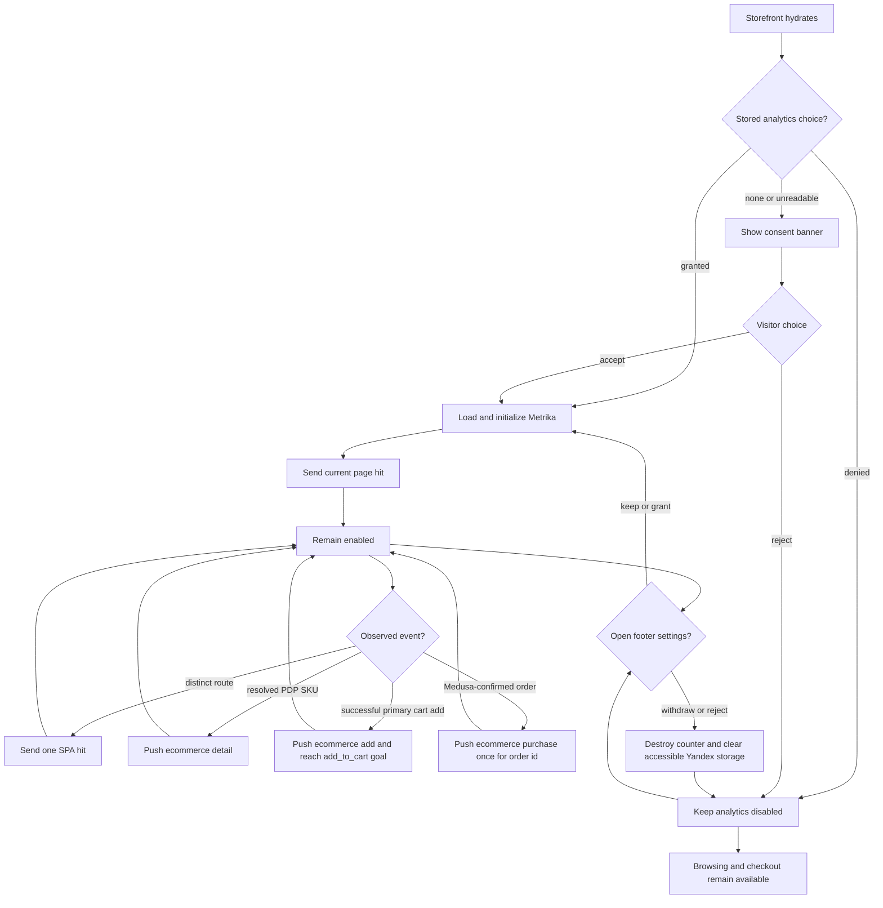
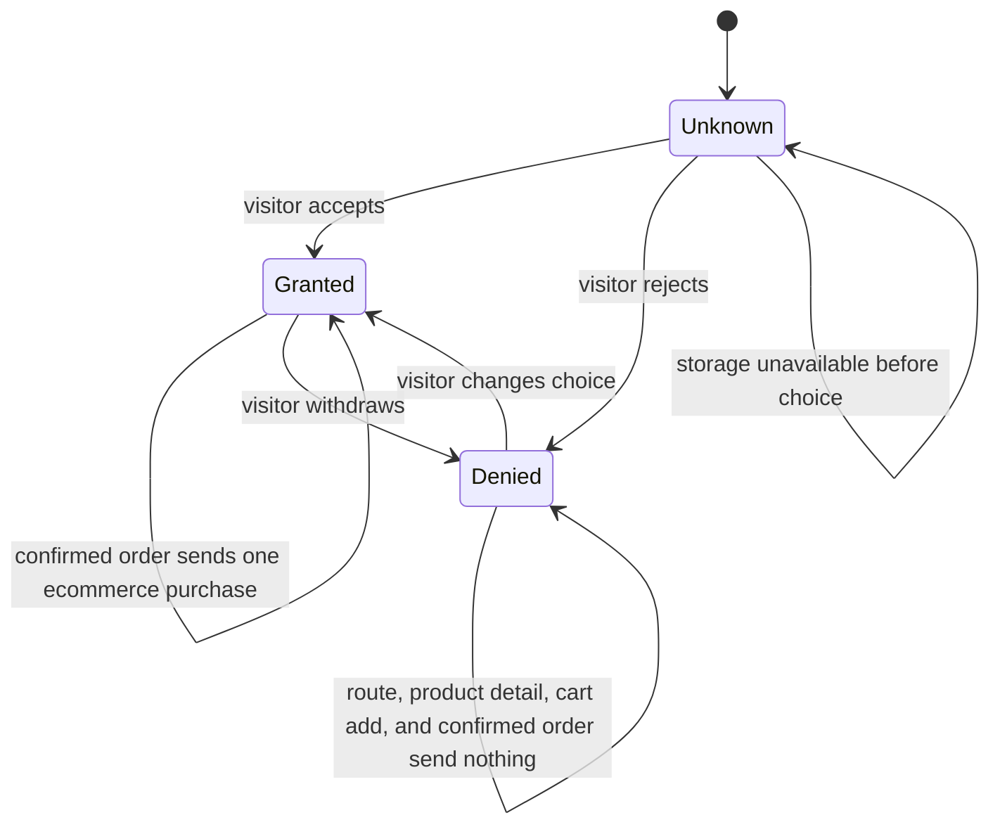
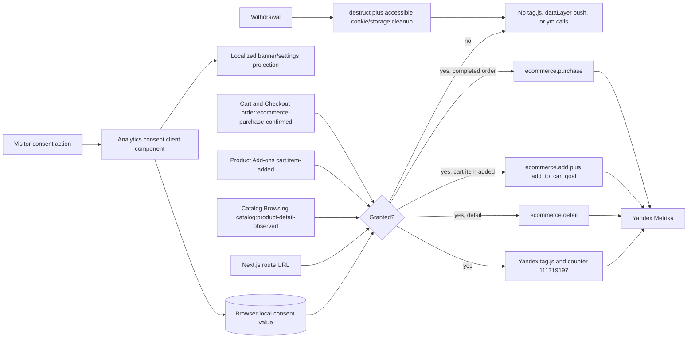

# Analytics Consent Flow

## 1. Intent

Let storefront visitors explicitly accept or reject optional Yandex Metrika analytics before counter `111719197` loads, preserve that choice across visits, and withdraw or change it later.

Success criteria:

- No Yandex script, counter initialization, page hit, Webvisor recording, or tracking cookie is created before consent is granted.
- Accept and reject actions are equally available from the first-visit banner.
- Consent copy names Yandex Metrika, Webvisor/session replay, the analytics purpose, and the existing privacy policy before acceptance.
- The visitor can reopen settings from the site footer and withdraw previously granted consent.
- Granted consent enables one initial hit and one hit per subsequent Next.js route change.
- Withdrawing consent stops the counter, removes accessible Yandex cookies/storage, and prevents further hits.
- With granted consent, each resolved product-detail SKU emits one Yandex ecommerce `detail` payload, each successful primary product add emits one `add` payload plus the existing `add_to_cart` JavaScript goal, and each Medusa-confirmed order emits one `purchase` payload.
- `detail`, `add`, and `purchase` use the same SKU-preferred product identity with name, Medusa price, currency, and quantity; `purchase` also carries the stable Medusa order id and authoritative order total as revenue.
- Browsing, cart, checkout, and authentication remain available regardless of the analytics choice.

## 2. Scope

In scope:

- A localized analytics-consent banner and privacy-policy link.
- A factual privacy-policy disclosure naming Yandex Metrika, Webvisor, analytics purpose, browser data, and the in-app withdrawal path.
- Browser-local persistence of `granted` or `denied` consent.
- A footer control that reopens consent settings.
- Consent-gated loading and lifecycle of Yandex Metrika counter `111719197`.
- SPA page hits after consent.
- Webvisor, click map, link tracking, accurate bounce tracking, and the `dataLayer` ecommerce container setting supplied for this counter.

Out of scope:

- Advertising cookies, personalization, user identity, server-side analytics, and GA4-specific duplicate events.
- Checkout-step telemetry before order confirmation.
- A general consent-management platform or multiple cookie categories.
- Retrospective deletion of data already received by Yandex before consent withdrawal.

Deferred decisions: add further ecommerce actions only when their contracts are explicitly requested.

## 3. Actors and Permissions

| Actor | Permissions | Authority source |
|---|---|---|
| Visitor | Accept, reject, reopen, or change optional analytics consent; browse and purchase in every consent state | Explicit storefront action persisted in the visitor browser |
| Storefront | Load and call Metrika only while consent is granted; observe a resolved product-detail SKU, successful primary cart add, and Medusa-confirmed order without changing commerce state; cannot infer consent from continued browsing | Persisted consent value, current in-memory choice, Medusa catalog projection, accepted cart mutation, and completed-order response |
| Yandex Metrika | Receive page analytics and consented `detail`, `add`, and `purchase` telemetry only after consent is granted | Counter `111719197` client integration |

## 4. Diagrams

### User flow

### State machine

### Data flow

## 5. State and Projections

Authoritative state:

- Browser key `sunluk_analytics_consent` contains only `granted` or `denied`.
- Missing, malformed, or unreadable storage is `unknown`; it never counts as granted consent.
- The current in-memory choice applies immediately even if browser storage rejects the write.

Projection:

- `unknown`: show the localized banner with accept, reject, and privacy-policy actions; analytics is disabled.
- `granted`: hide the banner, load the counter once, initialize with `defer: true`, and emit page hits.
- `denied`: hide the first-visit banner and keep analytics disabled.
- Footer settings action: reopen the same choice UI in any state; it does not block browsing.

## 6. Events/Actions

| Direction | Name | Target flow | Payload | Allowed when | Reject reason |
|---|---|---|---|---|---|
| Internal | `analytics:consent-accepted` | None | `{ value: "granted" }` | Consent UI is available | None |
| Internal | `analytics:consent-rejected` | None | `{ value: "denied" }` | Consent UI is available | None |
| Internal | `analytics:settings-opened` | None | `{}` | Footer is interactive | None |
| Internal | `analytics:route-hit` | None | `{ url, title, referer? }` | Consent is granted and counter is initialized | Consent absent/denied or URL already sent |
| Incoming | `cart:item-added` | Analytics Consent | `{ productId, sku?, name, price, currencyCode, quantity }` | Medusa accepted the primary product mutation and consent is granted | Consent absent/denied, primary mutation rejected, linked packaging mutation, invalid price/currency, or duplicate callback |
| Incoming | `catalog:product-detail-observed` | Analytics Consent | `{ productId, sku?, name, price, currencyCode, quantity: 1 }` | A published PDP has a resolved variant and consent is granted | Consent absent/denied, unresolved variant, invalid product fields, or the same SKU already emitted for the mounted PDP |
| Incoming | `order:ecommerce-purchase-confirmed` | Analytics Consent | `{ orderId, currencyCode, revenue, products: [{ productId?, sku?, name, price, quantity }] }` | Medusa completed the cart into an order, every line has SKU or product id, and consent is granted | Consent absent/denied, incomplete or invalid completed-order projection, failed completion, or order id already emitted |
| Internal | `analytics:consent-withdrawn` | None | `{ value: "denied" }` | Previously granted consent is changed to denied | Counter not initialized is a safe no-op |

Cross-flow boundaries: Catalog Browsing exposes the current resolved PDP SKU; Product Add-ons emits `cart:item-added` after the primary Medusa mutation succeeds; Cart and Checkout exposes only a Medusa-confirmed order. Analytics observes those results, gates telemetry by consent, and never alters catalog, navigation, cart, checkout, order, or authentication state.

## 7. Edge Cases

- First visit or malformed stored value: treat as unknown, show the banner, and make no Yandex request.
- Storage read/write is unavailable: keep the safe default before choice; apply the visitor choice for the current page in memory and ask again on a future visit.
- React development remount or repeated render: inject and initialize the counter at most once and avoid duplicate hits for the same URL.
- Route changes before consent: send nothing; acceptance later sends the current URL once.
- A product page opens before consent is granted: emit no retrospective view. If consent is granted while that same resolved PDP remains mounted, observe the current SKU once.
- Consent is withdrawn after initialization: call `ym(111719197, "destruct")`, clear accessible Yandex cookies plus `_ym*` browser storage, and block later hits. Already transmitted data cannot be recalled.
- Consent changes from denied to granted: initialize once and send the current page hit.
- A second tab has stale in-memory consent: a browser `storage` event applies the newer persisted choice and gates or revokes analytics in that tab.
- The counter-bound Yandex loader may consume and remove its temporary `window.ym` and `window.dataLayer` globals after initialization. Storefront retains the original command function and ecommerce array references; later `hit`, `reachGoal`, and ecommerce pushes use those observed references instead of recreating disconnected globals.
- Yandex script fails to load: storefront behavior remains available; do not retry beyond normal navigation/reload behavior or misreport consent as denied.
- A primary cart mutation fails: emit neither ecommerce data nor `add_to_cart`; a later successful retry may emit once.
- A linked packaging mutation succeeds or fails: do not emit another product-add event; the primary product was already reported once.
- Product detail initially resolves a variant: push one `detail` event for that SKU with `quantity: 1`. React effect replay or parent rerender sends no duplicate; selecting a different SKU sends one event for that SKU, while selecting an already observed SKU in the same mounted PDP sends none.
- Product SKU is absent: use the stable Medusa product id for ecommerce `id`; never omit both identifiers.
- Currency is normalized to uppercase ISO 4217 and Medusa's calculated amount is forwarded unchanged; storefront analytics does not recalculate price.
- Detail, add, and purchase use byte-for-byte identical SKU values when present, with stable Medusa product-id fallback. A completed line lacking both SKU and product id rejects the purchase telemetry rather than inventing another identity.
- A completion response is a cart/error rather than an order, lacks items, contains an invalid order total/currency, or has an invalid line: emit no partial purchase payload and preserve normal checkout error handling.
- A confirmed order callback repeats: deduplicate `purchase` by immutable `order.id`; do not emit from the reloadable success page.
- Consent is denied or withdrawn: the cart mutation still succeeds, but no ecommerce container or goal call is created.
- The privacy policy remains reachable at `/{locale}/info#privacy` without granting consent.
- No `<noscript>` tracking pixel is rendered because it would bypass interactive consent.

## 8. Side Effects

- After grant, initialize `window.dataLayer`, create the global `ym` queue, retain both references, inject the counter-bound `https://mc.yandex.ru/metrika/tag.js?id=111719197` loader, initialize counter `111719197` with `defer: true`, and send the current page hit.
- While granted, send one `hit` call for each distinct client-side route URL.
- When a mounted PDP resolves a SKU, push one `ecommerce.detail.products` item with `quantity: 1` through the retained ecommerce array. Re-observe once if consent becomes granted while the same PDP remains mounted.
- After a consented primary cart mutation succeeds, push one `ecommerce.add.products` item and call `reachGoal` for counter `111719197` and target `add_to_cart`.
- After Medusa confirms an order, push one `ecommerce.purchase` with `actionField.id = order.id`, `actionField.revenue = order.total`, and every completed order line before local cart clearing/navigation. No additional purchase goal is required for the Ecommerce funnel.
- Product telemetry contains no customer identity: ecommerce product `id` uses SKU with the documented Medusa fallback, plus name, Medusa price, quantity, and uppercase ISO 4217 currency code.
- After withdrawal, destroy the counter instance, remove accessible Yandex cookies/storage, and stop future calls.
- Render localized consent controls without blocking commerce flows.

## 9. Schemas Touched

- `storefront/src/components/analytics/analytics-consent.tsx`: consent state, persistence, footer settings control, counter lifecycle, and SPA hit gating.
- `storefront/src/components/product/ProductInfoBlock.tsx`: pass existing Medusa product identity/title into the add-to-cart seam.
- `storefront/src/components/product/VariantSelector.tsx`: emit each resolved product-detail SKU once per mounted PDP and preserve the successful primary-add telemetry seam.
- `storefront/src/lib/medusa/cart.ts`: request the completed-order fields required by the purchase projection.
- `storefront/src/app/[locale]/checkout/page.tsx`: emit purchase only from the successful completed-order branch before clearing cart state and redirecting.
- `storefront/src/app/[locale]/layout.tsx`: mount the site-wide analytics consent controller.
- `storefront/src/components/landing/SiteFooter.tsx`: expose the footer settings control.
- `storefront/messages/ru.json`: Russian consent labels and explanatory copy.
- `storefront/messages/en.json`: English consent labels and explanatory copy.
- `storefront/messages/info/ru.json`: Russian privacy-policy disclosure for Yandex Metrika and withdrawal.
- `storefront/messages/info/en.json`: English privacy-policy disclosure for Yandex Metrika and withdrawal.
- `storefront/src/lib/__tests__/analytics-consent.test.tsx`: focused observable consent behavior.
- `storefront/src/lib/__tests__/cart-packaging.test.tsx`: focused successful, rejected, and linked-packaging telemetry behavior.
- `storefront/src/lib/__tests__/product-detail-analytics.test.tsx`: focused resolved-SKU detail payload, consent, variant-switch, and duplicate behavior.
- `storefront/src/lib/__tests__/checkout-completion.test.tsx`: focused successful-order purchase payload, failed/incomplete result, and order-id deduplication behavior.
- `storefront/src/lib/__tests__/info-sections.test.ts`: bilingual privacy-policy structure count.

## 10. Targeted Tests

| Layer | Behavior | File | Status |
|---|---|---|---|
| Storefront component | Unknown consent shows provider, purpose, Webvisor disclosure, privacy link, and controls without a Metrika request | `storefront/src/lib/__tests__/analytics-consent.test.tsx` | Passed 2026-08-24 |
| Storefront component | Accept persists grant, loads once, and sends current route once | `storefront/src/lib/__tests__/analytics-consent.test.tsx` | Passed 2026-08-24 |
| Storefront component | Reject persists denial and route changes remain untracked | `storefront/src/lib/__tests__/analytics-consent.test.tsx` | Passed 2026-08-24 |
| Storefront component | Granted initialization loads the counter-bound tag and retains the observed command queue/ecommerce array references for later `hit`, `reachGoal`, and ecommerce pushes even if Yandex removes their globals | `storefront/src/lib/__tests__/analytics-consent.test.tsx` | Passed 2026-08-28 |
| Storefront integration | Successful primary add emits exactly one ecommerce product payload and one `add_to_cart` goal with SKU/product id, name, Medusa price, currency, and quantity | `storefront/src/lib/__tests__/cart-packaging.test.tsx` | Passed 2026-08-28 |
| Storefront integration | Rejected primary add and linked packaging add emit no extra telemetry; denied consent leaves commerce successful and untracked | `storefront/src/lib/__tests__/cart-packaging.test.tsx` | Passed 2026-08-28 |
| Storefront integration | Resolved PDP SKU emits one `detail` product with SKU-preferred id, name, Medusa price, uppercase currency, and `quantity: 1`; rerenders do not duplicate it and a newly selected SKU emits once | `storefront/src/lib/__tests__/product-detail-analytics.test.tsx` | Passed 2026-08-28 |
| Storefront integration | Denied consent emits no PDP detail; persisted or in-place granted consent emits the current resolved SKU once without replaying prior selections | `storefront/src/lib/__tests__/product-detail-analytics.test.tsx` | Passed 2026-08-28 |
| Storefront integration | Successful completion emits one `purchase` before cart clearing/navigation with `order.id`, authoritative total/currency, and every completed order line; repeated callback is deduplicated by order id | `storefront/src/lib/__tests__/checkout-completion.test.tsx` | Passed 2026-08-28 |
| Storefront integration | Invalid completed-order analytics data emits no partial purchase payload while the already-confirmed order still clears local cart state and navigates to success | `storefront/src/lib/__tests__/checkout-completion.test.tsx` | Passed 2026-08-28 |
| Browser smoke | Production requests `mc.yandex.ru` only after accept and stops after withdrawal | `https://sunluk.ru` | Passed 2026-08-24 |

## 11. Implementation Plan

1. Add one client module containing the consent controller/banner and small footer settings control; use browser storage and a single custom reopen event instead of a global state dependency.
2. Mount the controller once in the locale layout and add the settings control to the existing shared footer.
3. Add informed localized banner copy, link the existing privacy-policy anchor, and extend the policy with the provider, Webvisor, purpose, browser data, and withdrawal path.
4. Add one focused component test file for pre-consent, accept, reject, SPA-hit, and withdrawal behavior.
5. Run storefront checks, browser smoke, and the existing Dokploy deployment path.
6. Use the counter-bound loader, retain the command/dataLayer references observed by Yandex, and export one consent-aware add-to-cart telemetry helper from the existing analytics module.
7. Call it once at the successful primary product seam and cover success, rejection, packaging, and denied-consent paths.
8. Add Yandex-native `detail` and `purchase` helpers to the existing consent-gated analytics module; do not add GA4 `view_item` or a purchase `reachGoal`.
9. Observe each resolved PDP SKU once per mounted product page, including a current-SKU observation when consent is granted in place.
10. Request the completed-order projection once, emit one purchase before local cart clearing/navigation, and deduplicate by immutable order id.
11. Add the two focused integration checks, then run storefront checks and browser network smoke for the Ecommerce funnel payloads.

## 12. Implementation Trace

Current status: Complete locally. Product-detail `detail`, existing cart `add`, and completed-order `purchase` telemetry are implemented for counter `111719197`; deployment and report population remain outside this change.

Implementation files:

- `storefront/src/components/analytics/analytics-consent.tsx`
- `storefront/src/components/product/ProductInfoBlock.tsx`
- `storefront/src/components/product/VariantSelector.tsx`
- `storefront/src/lib/medusa/cart.ts`
- `storefront/src/app/[locale]/checkout/page.tsx`
- `storefront/src/app/[locale]/layout.tsx`
- `storefront/src/components/landing/SiteFooter.tsx`
- `storefront/messages/ru.json`
- `storefront/messages/en.json`
- `storefront/messages/info/ru.json`
- `storefront/messages/info/en.json`
- `flows/ARCHITECTURE.md`

Test files:

- `storefront/src/lib/__tests__/analytics-consent.test.tsx`
- `storefront/src/lib/__tests__/cart-packaging.test.tsx`
- `storefront/src/lib/__tests__/product-detail-analytics.test.tsx`
- `storefront/src/lib/__tests__/checkout-completion.test.tsx`
- `storefront/src/lib/__tests__/info-sections.test.ts`

Validation:

- `npm run lint --prefix storefront` passed with zero warnings and errors.
- `npm run build --prefix storefront` completed successfully.
- `npm run test --prefix storefront` passed 22 files / 143 tests.
- `npm run lint --prefix backend` passed the global lint gate.
- Local production-build browser smoke confirmed zero Yandex requests before consent, tag loading after acceptance, footer withdrawal, and no later route hit.
- GitHub Actions Storefront CI run `32734085520` passed for deployment commit `afb42e5`.
- Production browser smoke at `https://sunluk.ru` confirmed zero Yandex requests before consent; after acceptance `tag.js?id=111719197` and `watch/111719197` returned HTTP 200; withdrawal removed the counter and a later route change made no Yandex request.
- 2026-08-28 focused tests: `npm test -- --run src/lib/__tests__/analytics-consent.test.tsx src/lib/__tests__/cart-packaging.test.tsx` passed 2 files / 20 tests.
- 2026-08-28 production build with the deployed Medusa endpoint and publishable key passed compilation, TypeScript, and page generation.
- 2026-08-28 local production browser smoke used the real Medusa Store API through a CORS-only test proxy: primary Lagoon quantity 2 and linked packaging both returned HTTP 200; Metrika sent one ecommerce request containing `{ id: "LAGOON-CHAIN", name: "Lagoon", price: 54, quantity: 2, currencyCode: "EUR" }` and one goal request with `page-url=goal://172.18.0.1/add_to_cart`.
- 2026-08-28 final global storefront/backend lint passed with zero errors after the retained-reference correction.
- 2026-08-28 Ecommerce funnel focused tests: `npm test -- --run src/lib/__tests__/analytics-consent.test.tsx src/lib/__tests__/cart-packaging.test.tsx src/lib/__tests__/product-detail-analytics.test.tsx src/lib/__tests__/checkout-completion.test.tsx` passed 4 files / 25 tests.
- 2026-08-28 final global storefront/backend lint passed.
- 2026-08-28 storefront production build compiled, passed TypeScript and page generation; the configured site-content endpoint was unavailable during static generation, and the existing fallback completed the build.

## 13. Open Questions

None. The Ecommerce funnel uses Yandex Enhanced Ecommerce `detail`, existing `add`, and `purchase`; no duplicate GA4 `view_item` or additional purchase goal is sent. Medusa `order.id` is the transaction id, `order.total` is revenue, and every valid completed order line is included.

## 14. Review Checklist

- [x] Unknown, granted, denied, reopened, and withdrawn states are explicit.
- [x] Pre-consent and rejected paths prohibit all Yandex loading and hits.
- [x] Duplicate initialization, SPA routing, storage failure, stale tabs, script failure, and withdrawal are covered.
- [x] Withdrawal limitations and accessible storage cleanup are explicit.
- [x] Successful primary add, rejected add, linked packaging, missing SKU, currency normalization, duplicate prevention, and denied-consent behavior are explicit.
- [x] Product-detail consent timing, React replay, variant switching, same-SKU deduplication, and identity continuity are explicit.
- [x] Completed-order authority, full-line validation, immutable order-id deduplication, pre-redirect timing, revenue, and failure behavior are explicit.
- [x] The counter-bound loader and retained command/dataLayer references are explicit; disconnected replacement globals are forbidden.
- [x] Browser authority, informed disclosure, localization, privacy policy, schemas, tests, and deployment smoke are named.
- [x] Catalog Browsing → Analytics Consent, Product Add-ons → Analytics Consent, and Cart and Checkout → Analytics Consent boundaries are declared and observational only.

Flow review v2 (2026-08-28): **APPROVED**. Consent-gated product telemetry has explicit success, rejection, linked-packaging, duplicate, schema, test, and cross-flow contracts; no blockers remain.

Flow review v3 (2026-08-28): **APPROVED**. The generic JavaScript API loader, persistent `ym` queue, consent gate, exact product payload, failure paths, tests, and cross-flow contracts are explicit; no blockers remain.

Flow review v4 (2026-08-28): **APPROVED**. Runtime-observed removal of temporary globals is handled by retaining the exact command queue and ecommerce array consumed by Yandex; tests and failure boundaries remain explicit.

Flow review v5 (2026-08-28): **APPROVED**. Live smoke proved the counter-bound loader initializes counter `111719197`; retaining its consumed command/dataLayer references provides the post-load API needed by goal and ecommerce events.

Flow review v6 (2026-08-28): **APPROVED**. Yandex-native `detail`/`purchase` schemas, SKU continuity, consent timing, duplicate rejection, completed-order authority, exact files/tests, and both new observational cross-flow boundaries clear the Approval Bar.
Flow-code sync v2 (2026-08-28): **IN SYNC**. The retained Yandex command/dataLayer references, consent gate, primary-add seam, exact ecommerce payload, `add_to_cart` goal, rejection/packaging behavior, focused tests, build, and browser network smoke match Sections 4–12.

Flow-code sync v3 (2026-08-28): **IN SYNC**. Persisted/in-place consent, resolved-SKU `detail`, unchanged successful-primary `add`, completed-order `purchase`, SKU continuity, whole-payload rejection, order-id deduplication, completion-before-clear ordering, focused tests, global lint, and production build match Sections 4–12.
