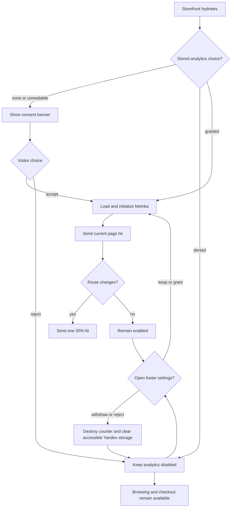
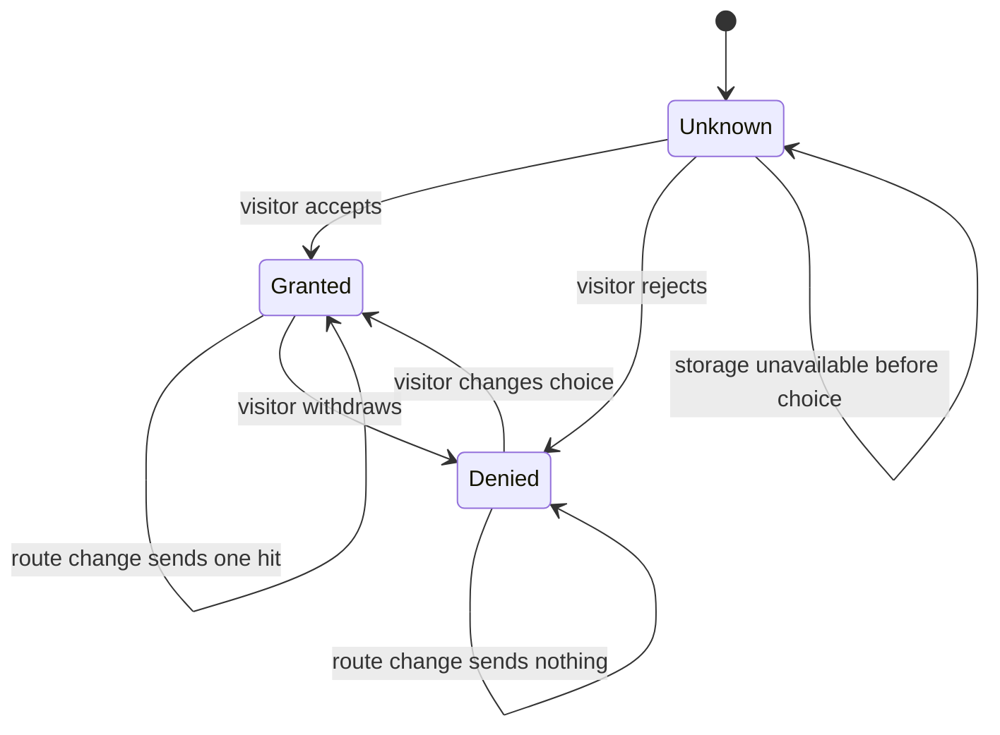
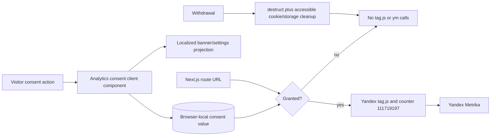

# Analytics Consent Flow

## 1. Intent

Let storefront visitors explicitly accept or reject optional Yandex Metrika analytics before counter `111719197` loads, preserve that choice across visits, and withdraw or change it later.

Success criteria:

- No Yandex script, counter initialization, page hit, Webvisor recording, or tracking cookie is created before consent is granted.
- Accept and reject actions are equally available from the first-visit banner.
- Consent copy names Yandex Metrika, Webvisor/session replay, the analytics purpose, and the existing privacy policy before acceptance.
- The visitor can reopen settings from the site footer and withdraw previously granted consent.
- Granted consent enables one initial hit and one hit per subsequent Next.js route change.
- Withdrawing consent stops the counter, removes accessible Yandex cookies/storage, and prevents further hits.
- Browsing, cart, checkout, and authentication remain available regardless of the analytics choice.

## 2. Scope

In scope:

- A localized analytics-consent banner and privacy-policy link.
- A factual privacy-policy disclosure naming Yandex Metrika, Webvisor, analytics purpose, browser data, and the in-app withdrawal path.
- Browser-local persistence of `granted` or `denied` consent.
- A footer control that reopens consent settings.
- Consent-gated loading and lifecycle of Yandex Metrika counter `111719197`.
- SPA page hits after consent.
- Webvisor, click map, link tracking, accurate bounce tracking, and the `dataLayer` ecommerce container setting supplied for this counter.

Out of scope:

- Emitting product, cart, checkout, order, or revenue ecommerce events.
- Advertising cookies, personalization, user identity, or server-side analytics.
- A general consent-management platform or multiple cookie categories.
- Retrospective deletion of data already received by Yandex before consent withdrawal.

Deferred decisions: add ecommerce events only when their event contract is explicitly requested.

## 3. Actors and Permissions

| Actor | Permissions | Authority source |
|---|---|---|
| Visitor | Accept, reject, reopen, or change optional analytics consent; browse and purchase in every consent state | Explicit storefront action persisted in the visitor browser |
| Storefront | Load and call Metrika only while consent is granted; cannot infer consent from continued browsing | Persisted consent value plus current in-memory choice |
| Yandex Metrika | Receive page analytics only after consent is granted | Counter `111719197` client integration |

## 4. Diagrams

### User flow

### State machine

### Data flow

## 5. State and Projections

Authoritative state:

- Browser key `sunluk_analytics_consent` contains only `granted` or `denied`.
- Missing, malformed, or unreadable storage is `unknown`; it never counts as granted consent.
- The current in-memory choice applies immediately even if browser storage rejects the write.

Projection:

- `unknown`: show the localized banner with accept, reject, and privacy-policy actions; analytics is disabled.
- `granted`: hide the banner, load the counter once, initialize with `defer: true`, and emit page hits.
- `denied`: hide the first-visit banner and keep analytics disabled.
- Footer settings action: reopen the same choice UI in any state; it does not block browsing.

## 6. Events/Actions

| Direction | Name | Target flow | Payload | Allowed when | Reject reason |
|---|---|---|---|---|---|
| Internal | `analytics:consent-accepted` | None | `{ value: "granted" }` | Consent UI is available | None |
| Internal | `analytics:consent-rejected` | None | `{ value: "denied" }` | Consent UI is available | None |
| Internal | `analytics:settings-opened` | None | `{}` | Footer is interactive | None |
| Internal | `analytics:route-hit` | None | `{ url, title, referer? }` | Consent is granted and counter is initialized | Consent absent/denied or URL already sent |
| Internal | `analytics:consent-withdrawn` | None | `{ value: "denied" }` | Previously granted consent is changed to denied | Counter not initialized is a safe no-op |

Cross-flow boundaries: none. Analytics observes public route URLs but emits no commerce-domain event and does not alter navigation, cart, checkout, or authentication state.

## 7. Edge Cases

- First visit or malformed stored value: treat as unknown, show the banner, and make no Yandex request.
- Storage read/write is unavailable: keep the safe default before choice; apply the visitor choice for the current page in memory and ask again on a future visit.
- React development remount or repeated render: inject and initialize the counter at most once and avoid duplicate hits for the same URL.
- Route changes before consent: send nothing; acceptance later sends the current URL once.
- Consent is withdrawn after initialization: call `ym(111719197, "destruct")`, clear accessible Yandex cookies plus `_ym*` browser storage, and block later hits. Already transmitted data cannot be recalled.
- Consent changes from denied to granted: initialize once and send the current page hit.
- A second tab has stale in-memory consent: a browser `storage` event applies the newer persisted choice and gates or revokes analytics in that tab.
- Yandex script fails to load: storefront behavior remains available; do not retry beyond normal navigation/reload behavior or misreport consent as denied.
- The privacy policy remains reachable at `/{locale}/info#privacy` without granting consent.
- No `<noscript>` tracking pixel is rendered because it would bypass interactive consent.

## 8. Side Effects

- Persist only the analytics consent value in visitor-controlled browser storage.
- After grant, initialize `window.dataLayer`, inject Yandex `tag.js`, initialize counter `111719197` with `defer: true`, and send the current page hit.
- While granted, send one `hit` call for each distinct client-side route URL.
- After withdrawal, destroy the counter instance, remove accessible Yandex cookies/storage, and stop future calls.
- Render localized consent controls without blocking commerce flows.

## 9. Schemas Touched

- `storefront/src/components/analytics/analytics-consent.tsx`: consent state, persistence, footer settings control, counter lifecycle, and SPA hit gating.
- `storefront/src/app/[locale]/layout.tsx`: mount the site-wide analytics consent controller.
- `storefront/src/components/landing/SiteFooter.tsx`: expose the footer settings control.
- `storefront/messages/ru.json`: Russian consent labels and explanatory copy.
- `storefront/messages/en.json`: English consent labels and explanatory copy.
- `storefront/messages/info/ru.json`: Russian privacy-policy disclosure for Yandex Metrika and withdrawal.
- `storefront/messages/info/en.json`: English privacy-policy disclosure for Yandex Metrika and withdrawal.
- `storefront/src/lib/__tests__/analytics-consent.test.tsx`: focused observable consent behavior.
- `storefront/src/lib/__tests__/info-sections.test.ts`: bilingual privacy-policy structure count.

## 10. Targeted Tests

| Layer | Behavior | File | Status |
|---|---|---|---|
| Storefront component | Unknown consent shows provider, purpose, Webvisor disclosure, privacy link, and controls without a Metrika request | `storefront/src/lib/__tests__/analytics-consent.test.tsx` | Passed 2026-08-24 |
| Storefront component | Accept persists grant, loads once, and sends current route once | `storefront/src/lib/__tests__/analytics-consent.test.tsx` | Passed 2026-08-24 |
| Storefront component | Reject persists denial and route changes remain untracked | `storefront/src/lib/__tests__/analytics-consent.test.tsx` | Passed 2026-08-24 |
| Storefront component | Footer settings can revoke grant, destruct the counter, clear storage, and block later hits | `storefront/src/lib/__tests__/analytics-consent.test.tsx` | Passed 2026-08-24 |
| Browser smoke | Production requests `mc.yandex.ru` only after accept and stops after withdrawal | `https://sunluk.ru` | Passed 2026-08-24 |

## 11. Implementation Plan

1. Add one client module containing the consent controller/banner and small footer settings control; use browser storage and a single custom reopen event instead of a global state dependency.
2. Mount the controller once in the locale layout and add the settings control to the existing shared footer.
3. Add informed localized banner copy, link the existing privacy-policy anchor, and extend the policy with the provider, Webvisor, purpose, browser data, and withdrawal path.
4. Add one focused component test file for pre-consent, accept, reject, SPA-hit, and withdrawal behavior.
5. Run storefront checks, browser smoke, and the existing Dokploy deployment path.

## 12. Implementation Trace

Current status: Complete and deployed.

Implementation files:

- `storefront/src/components/analytics/analytics-consent.tsx`
- `storefront/src/app/[locale]/layout.tsx`
- `storefront/src/components/landing/SiteFooter.tsx`
- `storefront/messages/ru.json`
- `storefront/messages/en.json`
- `storefront/messages/info/ru.json`
- `storefront/messages/info/en.json`
- `flows/ARCHITECTURE.md`

Test files:

- `storefront/src/lib/__tests__/analytics-consent.test.tsx`
- `storefront/src/lib/__tests__/info-sections.test.ts`

Validation:

- `npm run lint --prefix storefront` passed with zero warnings and errors.
- `npm run build --prefix storefront` completed successfully.
- `npm run test --prefix storefront` passed 22 files / 143 tests.
- `npm run lint --prefix backend` passed the global lint gate.
- Local production-build browser smoke confirmed zero Yandex requests before consent, tag loading after acceptance, footer withdrawal, and no later route hit.
- GitHub Actions Storefront CI run `32734085520` passed for deployment commit `afb42e5`.
- Production browser smoke at `https://sunluk.ru` confirmed zero Yandex requests before consent; after acceptance `tag.js?id=111719197` and `watch/111719197` returned HTTP 200; withdrawal removed the counter and a later route change made no Yandex request.

## 13. Open Questions

None. The supplied counter settings are retained, but ecommerce event emission remains out of scope; analytics is optional and rejected consent cannot block commerce.

## 14. Review Checklist

- [x] Unknown, granted, denied, reopened, and withdrawn states are explicit.
- [x] Pre-consent and rejected paths prohibit all Yandex loading and hits.
- [x] Duplicate initialization, SPA routing, storage failure, stale tabs, script failure, and withdrawal are covered.
- [x] Withdrawal limitations and accessible storage cleanup are explicit.
- [x] Browser authority, informed disclosure, localization, privacy policy, schemas, tests, and deployment smoke are named.
- [x] No commerce state or cross-flow event is introduced.
