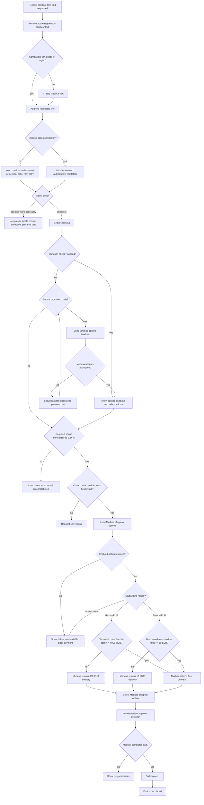
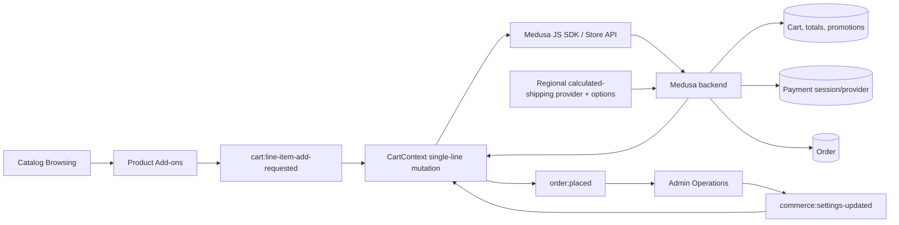

# Cart and Checkout Flow

## 1. Intent

Let a visitor add validated catalog items to a Medusa cart, keep cart totals authoritative, complete shipping/payment steps, and create an order only when Medusa accepts the final cart state.

Success criteria:

- Cart mutations revalidate product, variant, quantity, region, pricing, and inventory through Medusa.
- Storefront displays cart totals returned by Medusa and does not duplicate pricing/order logic.
- Checkout cannot complete without required customer/contact, shipping, delivery, and payment state.
- Contact cannot advance with a missing, incomplete, or malformed phone number; the storefront normalizes accepted international input before Medusa address submission.
- The active cart drawer offers a secondary locale-preserving return to the product collection without mutating cart contents.
- A successful checkout emits `order:placed` for admin operations.
- Medusa prices standard delivery from the discounted merchandise total: Russia/RUB costs 800 RUB below 4,999 RUB and is free from 4,999 RUB; Europe/EUR costs 10 EUR below 60 EUR and is free from 60 EUR.
- A visitor can submit one promotion code during the checkout address step; Medusa accepts or rejects it and the storefront renders only the returned cart totals.

## 2. Scope

In scope:

- Cart creation and item updates.
- Promotion code entry during checkout for regions where Medusa has configured promotions.
- Checkout address, shipping option, payment session/provider, and order completion.
- Required international phone validation and normalization before the contact-to-delivery transition.
- Cart-drawer continuation to `/{locale}/products`.
- Backend-authoritative regional delivery pricing based on discounted merchandise total: 800 RUB / 4,999 RUB for Russia and 10 EUR / 60 EUR for Europe.
- Cross-flow inputs from catalog and admin configuration.

Out of scope:

- Customer account order history and address book.
- Refunds, returns, exchanges, and order transfer.
- Custom payment provider implementation details.

Deferred decisions:

- Which Germany and Russia payment providers are enabled first: Mollie/Stripe/PayPal/Klarna for DE; YooKassa/CloudPayments/T-Bank/SBP for RU.
- Whether guest checkout is allowed or account checkout is required.

## 3. Actors and Permissions

| Actor | Permissions | Authority source |
|---|---|---|
| Anonymous visitor | Create and update guest cart; attempt guest checkout if enabled | Medusa Store API and cart token/cookie |
| Authenticated customer | Create/update customer cart; attach addresses/customer identity | Medusa customer session |
| Medusa backend | Authoritative cart/order/payment/fulfillment state transitions | Medusa workflows/modules |
| Admin user | Configure regions, shipping options, payment providers, prices, promotions | Medusa Admin/API |

## 4. Diagrams

### User flow

### State machine

```mermaid
stateDiagram-v2
  [*] --> NoCart
  NoCart --> CartCreating: cart:line-item-add-requested
  CartCreating --> CartActive: Medusa cart created and line accepted
  CartActive --> CartUpdating: add/update/remove one item
  CartUpdating --> CartActive: Medusa returns complete updated cart
  CartUpdating --> CartError: mutation rejected
  CartError --> CartActive: user resolves issue or retries
  CartActive --> CheckoutAddress: begin checkout
  CartActive --> CartActive: continue shopping; preserve cart and close drawer
  CheckoutAddress --> CheckoutPromotionUpdating: submit first promotion code
  CheckoutPromotionUpdating --> CheckoutAddress: accepted cart or rejected error
  CheckoutAddress --> CheckoutAddress: required phone missing or invalid
  CheckoutAddress --> CheckoutDelivery: address and normalized phone accepted
  CheckoutDelivery --> CheckoutPayment: shipping option selected
  CheckoutDelivery --> CheckoutDelivery: cart mutation recalculates shipping total
  CheckoutPayment --> Completing: payment session ready
  Completing --> OrderPlaced: Medusa completes cart
  Completing --> CheckoutPayment: completion rejected/retryable
  OrderPlaced --> [*]
```

### Data/event flow

## 5. State and Projections

Authoritative state:

- Cart, line items, totals, promotions, shipping options, payment sessions, inventory reservations, and orders live in Medusa.
- Medusa owns regional shipping prices through a calculated fulfillment provider. It evaluates the discounted merchandise total after product discounts: Russia/RUB uses 800 RUB below 4,999 RUB; Europe/EUR uses 10 EUR below 60 EUR; qualifying carts receive a calculated shipping amount of zero.
- Storefront must persist only the cart identifier/session token needed to reload the Medusa cart.

Storefront projection:

- Current cart response from Medusa.
- Local form values for contact, address, shipping selection, and payment selection before submission.
- Local promotion-code input plus pending/error state; the code is not authoritative and is cleared after Medusa accepts it.
- Shipping availability and `shipping_total` returned by Medusa. Before a shipping method is selected, the UI shows a pending state rather than inferring a price from subtotal.
- Local loading/error state for each mutation.

## 6. Events/Actions

| Direction | Name | Target flow | Payload | Allowed when | Reject reason |
|---|---|---|---|---|---|
| Incoming | `cart:line-item-add-requested` | Cart and Checkout | `{ variantId, quantity, metadata? }` | Caller supplies a valid positive line-item request; an active cart keeps its Medusa region, while Cart resolves the route-locale region only when creating/restoring/synchronizing a cart | Invalid variant, unavailable item, non-positive quantity, or Medusa rejection |
| Incoming | `commerce:settings-updated` | Cart and Checkout | `{ regionIds?, shippingOptionIds?, paymentProviderIds?, priceListIds? }` | Admin changes commerce settings in Medusa | Not applicable to storefront; next mutation revalidates |
| Internal | `cart:created` | None | `{ cartId, regionId }` | No compatible active cart exists | Medusa cart creation rejected |
| Internal | `cart:item-updated` | None | `{ cartId, lineItemId?, variantId, quantity }` | Cart exists and Medusa accepts mutation | Inventory, region, price, or validation failure |
| Internal | `cart:mutation-rejected` | None | `{ cartId?, variantId, reason }` | Medusa rejects one line mutation | Preserve the last authoritative cart projection; caller may retry |
| Internal | `checkout:address-submitted` | None | `{ cartId, email, phone, shippingAddress, billingAddress? }` | Required fields are present, phone is normalized E.164, and Medusa accepts the address | Missing/incomplete/malformed phone or invalid address/contact data |
| Internal | `cart:continue-shopping` | None | `{ cartId, locale, href }` | Active cart drawer is visible | Missing locale or non-products destination |
| Internal | `checkout:promotion-submitted` | None | `{ cartId, code }` | Checkout is on the address step, trimmed code is non-empty, cart has no applied promotion, and no cart mutation is pending | Empty code, existing promotion, duplicate submit, invalid/expired/inapplicable code, or Medusa rejection |
| Internal | `checkout:shipping-selected` | None | `{ cartId, shippingOptionId }` | Shipping option belongs to cart region and is enabled | Invalid/stale shipping option |
| Internal | `checkout:shipping-priced` | None | `{ cartId, shippingOptionId, regionId, currencyCode, discountedMerchandiseTotal, shippingTotal }` | A supported regional option is available; Medusa evaluates the current discounted merchandise total | Missing option, unsupported region/currency, or stale cart state |
| Internal | `checkout:payment-selected` | None | `{ cartId, paymentProviderId }` | Provider is enabled for cart region/currency | Provider unavailable or initialization failed |
| Outgoing | `order:placed` | Admin Operations | `{ orderId, cartId, customerId? }` | Medusa completes the cart and creates an order | Payment failure, stale cart, incomplete checkout |

## 7. Edge Cases

- Active cart region differs from the new route-locale default: attempt a Medusa region update during restore/locale synchronization; if it fails, retain the previous authoritative cart and its region rather than mixing regional state.
- Variant becomes unavailable after product detail view: Medusa mutation rejects and UI shows no cart change.
- Quantity exceeds inventory or max purchase rules: reject with Medusa error and preserve last valid cart projection.
- Product Add-ons' main line succeeds but its later packaging-line request fails: the first returned main-only cart remains authoritative and packaging is not displayed as added.
- Promotion code is blank after trimming: do not call Medusa; show the localized required-code error.
- Promotion code is invalid, expired, or inapplicable to the active cart: show a promotion-specific localized error and preserve the last authoritative cart projection.
- Promotion submission is already pending: disable the input and action; a synchronous in-flight guard prevents a second request before rerender.
- Promotion code is accepted: replace the cart projection with Medusa's returned cart, clear the input/error, and render the returned discount and totals.
- Cart already contains an applied promotion on initial load or after acceptance: show the applied code and hide the submission form; replacing, stacking, and removing promotions are out of scope for this change.
- Visitor advances beyond the address step: the promotion form is no longer actionable, preventing a late totals mutation after shipping/payment selection.
- Russia/RUB discounted merchandise total is 4,998 RUB: the calculated provider returns 800 RUB.
- Russia/RUB discounted merchandise total is exactly 4,999 RUB: the calculated provider returns 0 RUB.
- Europe/EUR discounted merchandise total is 59.99 EUR: the calculated provider returns 10 EUR.
- Europe/EUR discounted merchandise total is exactly 60 EUR: the calculated provider returns 0 EUR.
- A product discount moves the cart below or above its regional threshold: Medusa calls the calculated provider with the current discounted merchandise total and refreshes `shipping_total`; storefront replaces its projection with the returned cart.
- No shipping method selected yet: storefront displays the pending-delivery label even when the cart qualifies for free shipping.
- Unsupported region/currency or a shipping option outside its configured service zone: the regional provider does not offer a fallback tariff and payment remains blocked until Medusa returns an enabled option.
- Calculated shipping option creation has no runtime currency context: `canCalculate` reports provider capability; `calculatePrice` validates the actual checkout currency and rejects missing or unsupported values.
- Seed/setup runs more than once: it must not create duplicate regional calculated shipping options.
- Shipping option disappears after address entry: require reselection from current Medusa options.
- Payment provider initialization fails: keep checkout in payment state and allow retry/provider switch.
- Duplicate submit/double click on order completion: completion action must be idempotent from the user's perspective; UI disables repeated submit while Medusa request is in flight and reloads final cart/order state after response.
- Network failure after payment/order completion request: reload cart/order status before allowing another completion attempt.
- Phone is blank, contains fewer than 7 or more than 15 digits after normalization, omits the leading `+`, uses a zero country-code prefix, contains letters, or places `+` anywhere but first: show the localized phone error, focus the field, do not call `updateCart`, and remain in `CheckoutAddress`.
- Phone contains allowed presentation separators such as spaces, parentheses, hyphens, or dots around a valid international number: strip those separators and submit canonical `+` plus 7–15 digits to both shipping and billing address projections.
- A prefilled phone is incomplete or malformed: treat it exactly like visitor input and block contact submission until corrected.
- Visitor follows “add one more accessory” while a cart mutation is pending: close the drawer and navigate to the localized products route without changing or cancelling the authoritative mutation.

## 8. Side Effects

- Create/update Medusa cart records.
- Register the regional calculated fulfillment provider.
- Create or reuse the Russia fulfillment set/service zone and its calculated standard shipping option.
- Create or reuse the Europe fulfillment set/service zone and its calculated standard shipping option.
- Recalculate Medusa shipping totals through the provider after cart mutations or product-discount changes.
- Apply a promotion through the Medusa Store API and replace the storefront cart projection only with a response that contains the submitted promotion.
- Initialize payment sessions with configured provider.
- Complete cart into Medusa order.
- Emit `order:placed` so admin/order management can observe the new order.
- Persist cart identifier/session token in browser storage/cookie as required by the storefront implementation.
- Close the cart drawer before the secondary continue-shopping navigation; retain the Medusa cart identifier and contents.
- Normalize and submit a valid required phone only during the existing address update; invalid input causes no Store API side effect.

## 9. Schemas Touched

Expected implementation files for the regional delivery rule:

- `backend/apps/backend/src/modules/regional-fulfillment/service.ts` advertises calculated-price capability at option creation, then implements deterministic thresholds from the runtime cart context.
- `backend/apps/backend/src/modules/regional-fulfillment/index.ts` registers the fulfillment provider service.
- `backend/apps/backend/medusa-config.ts` enables both the manual provider used by flat options and the regional calculated provider.
- `backend/apps/backend/src/scripts/initial-data-seed.ts` creates the initial service zones, options, and links on a clean database; production configuration changes use Medusa Admin/API instead of rerunning the one-shot seed.
- `backend/apps/backend/src/modules/regional-fulfillment/__tests__/regional-fulfillment.unit.spec.ts` covers deterministic regional boundaries and invalid runtime currency; production Store API smoke covers configured option selection.
- `storefront/src/app/[locale]/checkout/page.tsx` displays the selected shipping method's Medusa-returned `shipping_total` and never duplicates regional thresholds.
- `storefront/messages/ru.json` and `storefront/messages/en.json` describe free delivery from 4,999 RUB / 60 EUR.
- `storefront/src/components/product/ProductInfoBlock.tsx` keeps fallback shipping copy aligned with localized copy and removes the VAT-included label.
- `storefront/src/app/[locale]/products/[handle]/page.tsx` stops supplying the removed VAT label.
- Medusa Store API cart/shipping response types remain sourced from `@medusajs/js-sdk`; no storefront-owned pricing schema is introduced.
- `storefront/src/app/[locale]/checkout/page.tsx` validates and normalizes required E.164 phone input before `updateCart`.
- `storefront/src/components/cart/CartDrawer.tsx` closes and routes the secondary action to `/{locale}/products`.
- `storefront/messages/ru.json` and `storefront/messages/en.json` provide phone-error and continue-shopping copy.
- `storefront/src/lib/medusa/cart.ts`, `storefront/src/components/cart/CartContext.tsx`, and `storefront/src/components/cart/types.ts` expose the minimum typed apply-promotion mutation and returned promotions projection.
- `storefront/src/app/[locale]/checkout/page.tsx` renders the localized promotion input, pending state, rejection feedback, applied code, and Medusa-returned discount/totals.
- `storefront/messages/ru.json` and `storefront/messages/en.json` provide promotion input, action, applied-state, and error copy.

## 10. Targeted Tests

| Layer | Behavior | File | Status |
|---|---|---|---|
| Storefront integration | Restored cart region synchronization either returns a Medusa-updated cart or retains the prior authoritative cart on rejection | To add with cart implementation | Pending implementation |
| Storefront integration | Cart displays Medusa-returned totals after line item updates | To add with cart implementation | Pending implementation |
| Storefront integration | Checkout completion blocks until address, shipping, and payment are accepted | To add with checkout implementation | Pending implementation |
| Storefront integration | Duplicate completion submit does not create duplicate user-visible order flow | To add with checkout implementation | Pending implementation |
| Backend unit | Calculated provider advertises capability without checkout currency; runtime pricing still rejects missing or unsupported currency | `backend/apps/backend/src/modules/regional-fulfillment/__tests__/regional-fulfillment.unit.spec.ts` | Implemented |
| Backend unit | Russia/RUB discounted total 4,998 returns 800 RUB shipping; 4,999 returns zero | `backend/apps/backend/src/modules/regional-fulfillment/__tests__/regional-fulfillment.unit.spec.ts` | Passed |
| Backend unit | Europe/EUR discounted total 59.99 returns 10 EUR shipping; 60 returns zero | `backend/apps/backend/src/modules/regional-fulfillment/__tests__/regional-fulfillment.unit.spec.ts` | Passed |
| Backend runtime smoke | Configured Russia options select the provider and return paid/free totals across the boundary | Medusa Store API smoke recorded in Section 12 | Passed |
| Storefront component | Checkout displays pending before selection and then renders only Medusa-returned paid/free shipping totals | `storefront/src/lib/__tests__/checkout-shipping.test.tsx` | Passed |
| Storefront integration | Missing, one-digit, and malformed phone input stays on contact and makes no cart update | `storefront/src/lib/__tests__/checkout-contact.test.tsx` | Passed 2026-08-11 |
| Storefront integration | More than 15 phone digits stays on contact and makes no cart update | `storefront/src/lib/__tests__/checkout-contact.test.tsx` | Passed 2026-08-11 |
| Storefront integration | Formatted valid international phone is normalized into both submitted addresses before delivery loads | `storefront/src/lib/__tests__/checkout-contact.test.tsx` | Passed 2026-08-11 |
| Storefront component | Secondary cart action closes the drawer, preserves cart state, and links to `/{locale}/products` | `storefront/src/lib/__tests__/cart-packaging.test.tsx` | Passed 2026-08-11 |
| Storefront integration | Empty code makes no Medusa call; rapid duplicate submission sends one request; accepted code replaces cart totals and hides the form; rejection preserves cart; existing promotion displays without a second form; promotion actions disappear after the address step | `storefront/src/lib/__tests__/checkout-promotions.test.tsx` | Passed 2026-08-16 |

## 11. Implementation Plan

1. Implement and register a regional calculated fulfillment provider that reads the current discounted merchandise total from Medusa cart context.
2. Create or reuse Russia and Europe fulfillment/service-zone configuration with calculated standard shipping options backed by that provider.
3. Remove storefront subtotal-based delivery inference and render only Medusa-returned shipping state.
4. Update localized delivery copy and remove the VAT-included product label cleanly.
5. Add targeted regional boundary, discount-transition, and cart-transition tests, then validate checkout against Medusa responses.
6. Require and normalize international phone input before the existing address submission transition.
7. Add one secondary cart-drawer link that closes the drawer and returns to the localized collection without mutating the cart.
8. Add one localized checkout promotion form that trims a non-empty code, applies it through Medusa, blocks duplicate submission, and refreshes the authoritative cart projection.

## 12. Implementation Trace

Current status: Completed. Medusa remains authoritative for cart, promotions, totals, shipping, and completion. The 2026-08-16 release adds one promotion-code mutation limited to the checkout address step.

Implementation files:
- `storefront/src/components/cart/CartContext.tsx`, `storefront/src/components/cart/CartDrawer.tsx`
- `storefront/src/lib/medusa/cart.ts`
- `storefront/src/app/[locale]/checkout/page.tsx`, `storefront/src/app/[locale]/checkout/success/page.tsx`
- `backend/apps/backend/src/modules/regional-fulfillment/service.ts` (calculated delivery capability and pricing logic)
- `backend/apps/backend/src/modules/regional-fulfillment/index.ts` (fulfillment provider definition)
- `backend/apps/backend/medusa-config.ts` (manual and regional provider registration)
- `backend/apps/backend/src/scripts/initial-data-seed.ts` (one-shot clean-database service zones, options, and links setup)
- `storefront/messages/ru.json`, `storefront/messages/en.json` (threshold localized copy & VAT clean cut)
- `storefront/src/components/product/ProductInfoBlock.tsx` (VAT label render removal)
- `storefront/src/app/[locale]/products/[handle]/page.tsx` (VAT label prop removal)
- `storefront/src/lib/__tests__/checkout-contact.test.tsx`, `storefront/src/lib/__tests__/cart-packaging.test.tsx`
- `storefront/src/components/cart/types.ts`, `storefront/src/lib/__tests__/checkout-promotions.test.tsx`, `storefront/src/lib/__tests__/checkout-shipping.test.tsx`, `storefront/messages/ru.json`, and `storefront/messages/en.json`

Release v4 implementation:

- Required phone validation and normalization are implemented in `storefront/src/app/[locale]/checkout/page.tsx`.
- The localized secondary collection action is implemented in `storefront/src/components/cart/CartDrawer.tsx`.
- Focused checkout-contact and cart-drawer assertions are implemented under `storefront/src/lib/__tests__/`.

Release v5 implementation:

- `CartContext.applyPromotion` calls the Medusa Store API, validates the returned promotion projection, serializes with cart mutations, and updates the cart only from the authoritative response.
- Checkout renders the localized form only on the address step and only when no promotion is applied; accepted/existing promotions display their code without replacement, stacking, or removal controls.
- A synchronous in-flight guard blocks rapid duplicate submissions; localized empty and backend-rejection feedback preserve the active checkout.
- Focused promotion assertions cover empty, pending/duplicate, accepted, rejected, existing-promotion, and post-address behavior.

Validation commands & results:
- Backend unit tests: `npm exec -- jest --silent --runInBand --forceExit src/modules/regional-fulfillment/__tests__/regional-fulfillment.unit.spec.ts` from `backend/apps/backend` (17/17 tests passed)
- Production seed smoke: `docker exec sunluk-backend npx medusa exec ./src/scripts/initial-data-seed.js` (completed on a clean PostgreSQL volume; regional and manual shipping options created)
- Production shipping smoke through Medusa Store API: a 3,999 RUB cart selected calculated delivery at 800 RUB; an exact 4,999 RUB cart selected calculated delivery at 0 RUB.
- Storefront unit tests: `npm run test -- src/lib/__tests__/checkout-shipping.test.tsx` (3/3 tests passed)
- Storefront production compilation: `npm run build --prefix storefront` (completed successfully)
- Backend production compilation: `npm run build --prefix backend` (completed successfully)
- 2026-08-11 final full storefront suite: `npm run test --prefix storefront` passed 20 files / 128 tests, including invalid/overlong/valid phone, normalized address payload, cart continuation, packaging metadata omission, and shipping projections.
- 2026-08-11 storefront/backend production builds passed; the final storefront rebuild and global lint rerun passed with zero errors and zero warnings.
- Chrome verified locale `/products` destinations and mobile navigation. Live cart/checkout browser interaction remains a post-deploy smoke because the workstation has no PostgreSQL 16 binaries.
- 2026-08-16 promotion tests: `npm test -- --run src/lib/__tests__/checkout-promotions.test.tsx` from `storefront` passed 1 file / 6 tests.
- 2026-08-16 storefront lint: `npm run lint --prefix storefront` passed with zero errors and zero warnings.
- 2026-08-16 storefront production build: `npm run build --prefix storefront` completed successfully.
- 2026-08-16 Chrome smoke: added an available product, opened `/ru/checkout`, confirmed localized promo input/action, verified empty-code local rejection and invalid-code Medusa rejection while retaining the entered code.

## 13. Open Questions

- Is guest checkout allowed for launch?
- Which payment providers are launch-critical for Germany and Russia?
- Should cart region changes clear the cart automatically or require explicit visitor confirmation?

## 14. Review Checklist

- [x] Cart and order state authority remains in Medusa.
- [x] Cross-flow `cart:line-item-add-requested`, `commerce:settings-updated`, and `order:placed` are declared.
- [x] Stale cart and duplicate completion risks are explicit.
- [x] Payment provider choices are open questions, not assumed implementation.
- [x] Regional delivery pricing names every boundary outcome: 4,998 RUB costs 800 RUB; 4,999 RUB is free; 59.99 EUR costs 10 EUR; 60 EUR is free.
- [x] Product discounts are applied before threshold evaluation.
- [x] Storefront does not infer or calculate delivery thresholds.
- [x] Missing shipping options, unselected shipping, threshold crossings, unsupported regions/currencies, and repeated setup are explicit.
- [x] Missing and malformed phone rejection prevents the contact-to-delivery transition and Store API mutation.
- [x] Accepted phone normalization and submitted address projection are explicit.
- [x] Continue-shopping navigation preserves cart authority and locale.
- [x] Product Add-ons to Cart `cart:line-item-add-requested` contract matches the architecture map; Cart does not consume `cart:item-selected` directly.
- [x] Promotion application remains Medusa-authoritative; address-step scope, blank, rejected, accepted, existing-promotion, and rapid duplicate-submit behavior are explicit.

Flow review v5 (2026-08-11): **APPROVED**. The single-line Cart mutation boundary, internal region resolution, exact payloads, phone validation, and focused tests clear the Approval Bar.

Flow review v6 (2026-08-16): **REJECTED**. Promotion entry was initially placed before checkout, lacked checkout-state transitions, and did not define existing-promotion behavior.

Flow review v7 (2026-08-16): **APPROVED**. Promotion entry is limited to `CheckoutAddress`; an existing or newly accepted promotion is displayed without replacement, stacking, or removal controls. Medusa remains authoritative and no cross-flow event is added.

Flow review v2 (2026-07-13): **APPROVED**. No blockers; regional thresholds, post-discount authority, provider boundary, failure paths, schemas, and targeted tests are explicit.

Flow review v3 (2026-07-27): **APPROVED**. Provider capability at option creation, runtime currency rejection, manual-provider registration, and the clean-database seed boundary are explicit; no new event, authority, permission, or cross-flow blocker was introduced.

Flow-code sync (2026-07-27): **IN SYNC**. The seeded Russia options use the regional calculated provider, production Store API boundary checks match the declared 4,999 RUB threshold, and no storefront-owned shipping calculation was introduced.

Flow-code sync v7 (2026-08-16): **IN SYNC**. Checkout promotion entry, Medusa-authoritative cart replacement, address-step scope, localized rejection states, duplicate-submit guard, returned discount rendering, focused tests, and Section 12 trace match the implementation; no cross-flow event was added.
