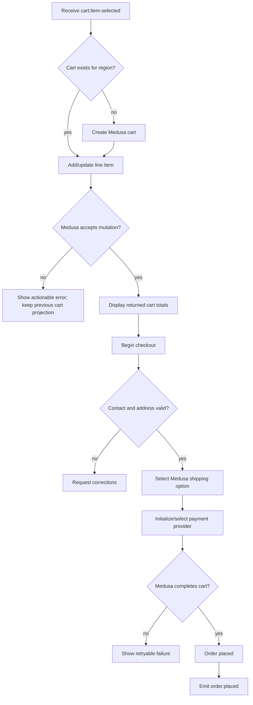
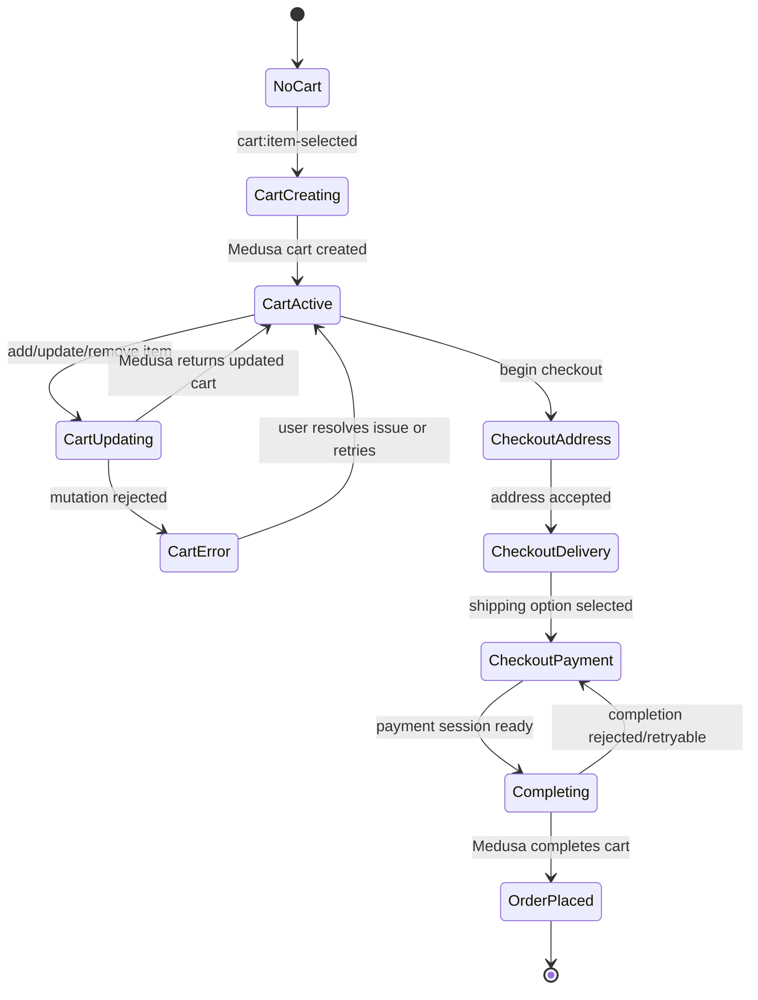
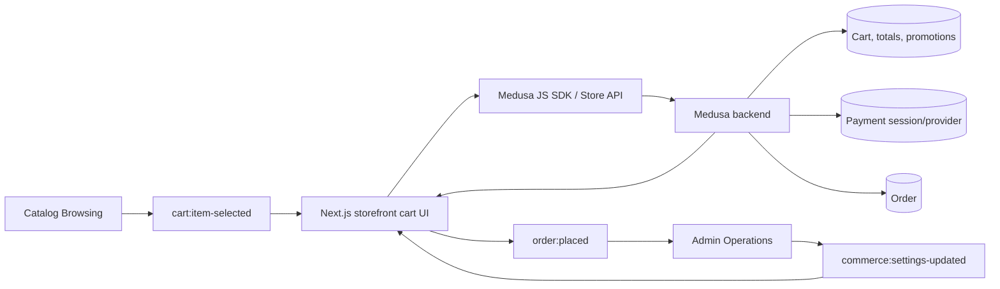

# Cart and Checkout Flow

## 1. Intent

Let a visitor add validated catalog items to a Medusa cart, keep cart totals authoritative, complete shipping/payment steps, and create an order only when Medusa accepts the final cart state.

Success criteria:

- Cart mutations revalidate product, variant, quantity, region, pricing, and inventory through Medusa.
- Storefront displays cart totals returned by Medusa and does not duplicate pricing/order logic.
- Checkout cannot complete without required customer/contact, shipping, delivery, and payment state.
- A successful checkout emits `order:placed` for admin operations.

## 2. Scope

In scope:

- Cart creation and item updates.
- Promotion code entry if Medusa supports it for the configured region.
- Checkout address, shipping option, payment session/provider, and order completion.
- Cross-flow inputs from catalog and admin configuration.

Out of scope:

- Customer account order history and address book.
- Refunds, returns, exchanges, and order transfer.
- Custom payment provider implementation details.

Deferred decisions:

- Which Germany and Russia payment providers are enabled first: Mollie/Stripe/PayPal/Klarna for DE; YooKassa/CloudPayments/T-Bank/SBP for RU.
- Whether guest checkout is allowed or account checkout is required.

## 3. Actors and Permissions

| Actor | Permissions | Authority source |
|---|---|---|
| Anonymous visitor | Create and update guest cart; attempt guest checkout if enabled | Medusa Store API and cart token/cookie |
| Authenticated customer | Create/update customer cart; attach addresses/customer identity | Medusa customer session |
| Medusa backend | Authoritative cart/order/payment/fulfillment state transitions | Medusa workflows/modules |
| Admin user | Configure regions, shipping options, payment providers, prices, promotions | Medusa Admin/API |

## 4. Diagrams

### User flow

### State machine

### Data/event flow

## 5. State and Projections

Authoritative state:

- Cart, line items, totals, promotions, shipping options, payment sessions, inventory reservations, and orders live in Medusa.
- Storefront must persist only the cart identifier/session token needed to reload the Medusa cart.

Storefront projection:

- Current cart response from Medusa.
- Local form values for contact, address, shipping selection, and payment selection before submission.
- Local loading/error state for each mutation.

## 6. Events/Actions

| Direction | Name | Target flow | Payload | Allowed when | Reject reason |
|---|---|---|---|---|---|
| Incoming | `cart:item-selected` | Cart and Checkout | `{ productId, variantId, quantity, regionId }` | Catalog validated a concrete variant and positive quantity | Missing region, invalid variant, unavailable item, non-positive quantity |
| Incoming | `commerce:settings-updated` | Cart and Checkout | `{ regionIds?, shippingOptionIds?, paymentProviderIds?, priceListIds? }` | Admin changes commerce settings in Medusa | Not applicable to storefront; next mutation revalidates |
| Internal | `cart:created` | None | `{ cartId, regionId }` | No compatible active cart exists | Medusa cart creation rejected |
| Internal | `cart:item-updated` | None | `{ cartId, lineItemId?, variantId, quantity }` | Cart exists and Medusa accepts mutation | Inventory, region, price, or validation failure |
| Internal | `checkout:address-submitted` | None | `{ cartId, email, shippingAddress, billingAddress? }` | Required fields are present and accepted by Medusa | Invalid or incomplete address/contact data |
| Internal | `checkout:shipping-selected` | None | `{ cartId, shippingOptionId }` | Shipping option belongs to cart region and is enabled | Invalid/stale shipping option |
| Internal | `checkout:payment-selected` | None | `{ cartId, paymentProviderId }` | Provider is enabled for cart region/currency | Provider unavailable or initialization failed |
| Outgoing | `order:placed` | Admin Operations | `{ orderId, cartId, customerId? }` | Medusa completes the cart and creates an order | Payment failure, stale cart, incomplete checkout |

## 7. Edge Cases

- Incoming item region differs from active cart region: require explicit cart replacement/region switch; do not mix regions in one cart.
- Variant becomes unavailable after product detail view: Medusa mutation rejects and UI shows no cart change.
- Quantity exceeds inventory or max purchase rules: reject with Medusa error and preserve last valid cart projection.
- Promotion code is invalid or expired: show promotion-specific error; keep cart active.
- Shipping option disappears after address entry: require reselection from current Medusa options.
- Payment provider initialization fails: keep checkout in payment state and allow retry/provider switch.
- Duplicate submit/double click on order completion: completion action must be idempotent from the user's perspective; UI disables repeated submit while Medusa request is in flight and reloads final cart/order state after response.
- Network failure after payment/order completion request: reload cart/order status before allowing another completion attempt.

## 8. Side Effects

- Create/update Medusa cart records.
- Initialize payment sessions with configured provider.
- Complete cart into Medusa order.
- Emit `order:placed` so admin/order management can observe the new order.
- Persist cart identifier/session token in browser storage/cookie as required by the storefront implementation.

## 9. Schemas Touched

Expected implementation files when this flow is built:

- Storefront cart state/actions and checkout routes under `storefront/src/app/**`.
- Storefront Medusa client wrapper.
- Medusa Store API cart/order/payment response types from `@medusajs/js-sdk`.
- Payment provider configuration in `backend/apps/backend/medusa-config.ts` when non-default providers are enabled.

Current files that inform the flow:

- `backend/apps/backend/src/migration-scripts/initial-data-seed.ts` creates Europe region and standard/express shipping options.
- `backend/apps/backend/medusa-config.ts` configures backend HTTP/CORS/secrets but no custom payment modules yet.

## 10. Targeted Tests

| Layer | Behavior | File | Status |
|---|---|---|---|
| Storefront integration | Adding item with missing/changed region does not mutate active cart silently | To add with cart implementation | Pending implementation |
| Storefront integration | Cart displays Medusa-returned totals after line item updates | To add with cart implementation | Pending implementation |
| Storefront integration | Checkout completion blocks until address, shipping, and payment are accepted | To add with checkout implementation | Pending implementation |
| Storefront integration | Duplicate completion submit does not create duplicate user-visible order flow | To add with checkout implementation | Pending implementation |

## 11. Implementation Plan

1. Add cart persistence boundary for Medusa cart id/session token.
2. Add cart creation and line-item mutation actions that accept `cart:item-selected` payloads.
3. Add cart projection UI using Medusa-returned totals.
4. Add checkout address, shipping, and payment steps that submit to Medusa.
5. Add guarded order completion and final order confirmation routing.

## 12. Implementation Trace

Current status: Completed. Cart id is persisted via `CartContext` (localStorage); all cart mutations and totals come from Medusa through `lib/medusa/cart.ts` (single source of cart SDK calls); the contact/shipping/payment checkout wizard lives in `app/[locale]/checkout/page.tsx`; order confirmation in `app/[locale]/checkout/success/page.tsx`. Stale carts are recreated on mutation 404.

Implementation files:
- `storefront/src/components/cart/CartContext.tsx`, `storefront/src/components/cart/CartDrawer.tsx`
- `storefront/src/lib/medusa/cart.ts`
- `storefront/src/app/[locale]/checkout/page.tsx`, `storefront/src/app/[locale]/checkout/success/page.tsx`

## 13. Open Questions

- Is guest checkout allowed for launch?
- Which payment providers are launch-critical for Germany and Russia?
- Should cart region changes clear the cart automatically or require explicit visitor confirmation?

## 14. Review Checklist

- [x] Cart and order state authority remains in Medusa.
- [x] Cross-flow `cart:item-selected`, `commerce:settings-updated`, and `order:placed` are declared.
- [x] Stale cart and duplicate completion risks are explicit.
- [x] Payment provider choices are open questions, not assumed implementation.
