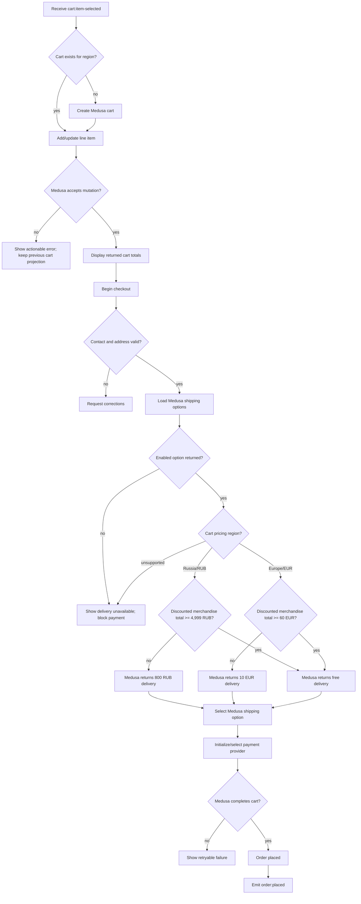
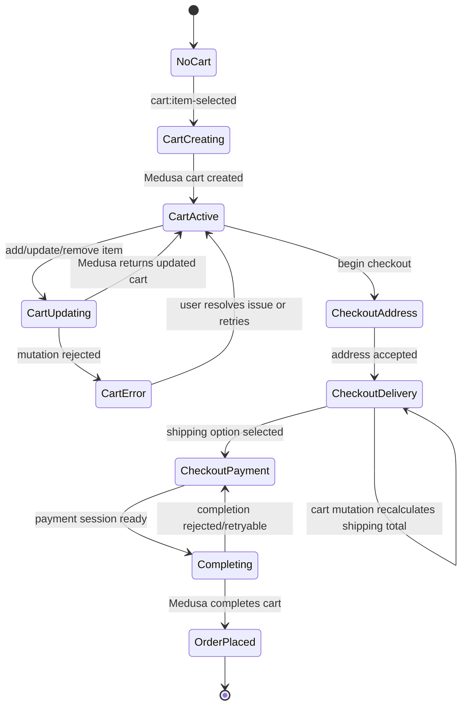
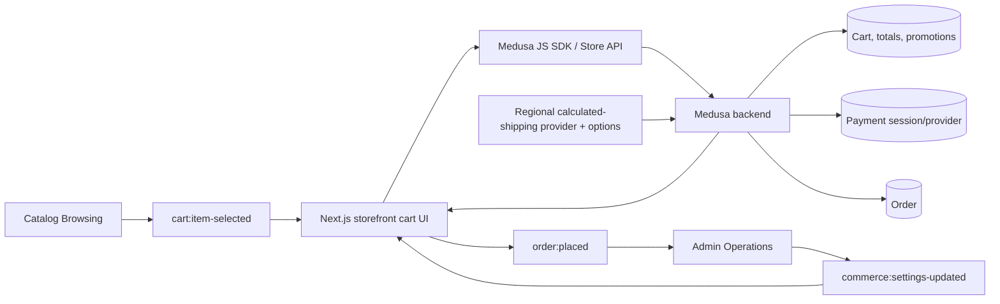

# Cart and Checkout Flow

## 1. Intent

Let a visitor add validated catalog items to a Medusa cart, keep cart totals authoritative, complete shipping/payment steps, and create an order only when Medusa accepts the final cart state.

Success criteria:

- Cart mutations revalidate product, variant, quantity, region, pricing, and inventory through Medusa.
- Storefront displays cart totals returned by Medusa and does not duplicate pricing/order logic.
- Checkout cannot complete without required customer/contact, shipping, delivery, and payment state.
- A successful checkout emits `order:placed` for admin operations.
- Medusa prices standard delivery from the discounted merchandise total: Russia/RUB costs 800 RUB below 4,999 RUB and is free from 4,999 RUB; Europe/EUR costs 10 EUR below 60 EUR and is free from 60 EUR.

## 2. Scope

In scope:

- Cart creation and item updates.
- Promotion code entry if Medusa supports it for the configured region.
- Checkout address, shipping option, payment session/provider, and order completion.
- Backend-authoritative regional delivery pricing based on discounted merchandise total: 800 RUB / 4,999 RUB for Russia and 10 EUR / 60 EUR for Europe.
- Cross-flow inputs from catalog and admin configuration.

Out of scope:

- Customer account order history and address book.
- Refunds, returns, exchanges, and order transfer.
- Custom payment provider implementation details.

Deferred decisions:

- Which Germany and Russia payment providers are enabled first: Mollie/Stripe/PayPal/Klarna for DE; YooKassa/CloudPayments/T-Bank/SBP for RU.
- Whether guest checkout is allowed or account checkout is required.

## 3. Actors and Permissions

| Actor | Permissions | Authority source |
|---|---|---|
| Anonymous visitor | Create and update guest cart; attempt guest checkout if enabled | Medusa Store API and cart token/cookie |
| Authenticated customer | Create/update customer cart; attach addresses/customer identity | Medusa customer session |
| Medusa backend | Authoritative cart/order/payment/fulfillment state transitions | Medusa workflows/modules |
| Admin user | Configure regions, shipping options, payment providers, prices, promotions | Medusa Admin/API |

## 4. Diagrams

### User flow

### State machine

### Data/event flow

## 5. State and Projections

Authoritative state:

- Cart, line items, totals, promotions, shipping options, payment sessions, inventory reservations, and orders live in Medusa.
- Medusa owns regional shipping prices through a calculated fulfillment provider. It evaluates the discounted merchandise total after product discounts: Russia/RUB uses 800 RUB below 4,999 RUB; Europe/EUR uses 10 EUR below 60 EUR; qualifying carts receive a calculated shipping amount of zero.
- Storefront must persist only the cart identifier/session token needed to reload the Medusa cart.

Storefront projection:

- Current cart response from Medusa.
- Local form values for contact, address, shipping selection, and payment selection before submission.
- Shipping availability and `shipping_total` returned by Medusa. Before a shipping method is selected, the UI shows a pending state rather than inferring a price from subtotal.
- Local loading/error state for each mutation.

## 6. Events/Actions

| Direction | Name | Target flow | Payload | Allowed when | Reject reason |
|---|---|---|---|---|---|
| Incoming | `cart:item-selected` | Cart and Checkout | `{ productId, variantId, quantity, regionId }` | Catalog validated a concrete variant and positive quantity | Missing region, invalid variant, unavailable item, non-positive quantity |
| Incoming | `commerce:settings-updated` | Cart and Checkout | `{ regionIds?, shippingOptionIds?, paymentProviderIds?, priceListIds? }` | Admin changes commerce settings in Medusa | Not applicable to storefront; next mutation revalidates |
| Internal | `cart:created` | None | `{ cartId, regionId }` | No compatible active cart exists | Medusa cart creation rejected |
| Internal | `cart:item-updated` | None | `{ cartId, lineItemId?, variantId, quantity }` | Cart exists and Medusa accepts mutation | Inventory, region, price, or validation failure |
| Internal | `checkout:address-submitted` | None | `{ cartId, email, shippingAddress, billingAddress? }` | Required fields are present and accepted by Medusa | Invalid or incomplete address/contact data |
| Internal | `checkout:shipping-selected` | None | `{ cartId, shippingOptionId }` | Shipping option belongs to cart region and is enabled | Invalid/stale shipping option |
| Internal | `checkout:shipping-priced` | None | `{ cartId, shippingOptionId, regionId, currencyCode, discountedMerchandiseTotal, shippingTotal }` | A supported regional option is available; Medusa evaluates the current discounted merchandise total | Missing option, unsupported region/currency, or stale cart state |
| Internal | `checkout:payment-selected` | None | `{ cartId, paymentProviderId }` | Provider is enabled for cart region/currency | Provider unavailable or initialization failed |
| Outgoing | `order:placed` | Admin Operations | `{ orderId, cartId, customerId? }` | Medusa completes the cart and creates an order | Payment failure, stale cart, incomplete checkout |

## 7. Edge Cases

- Incoming item region differs from active cart region: require explicit cart replacement/region switch; do not mix regions in one cart.
- Variant becomes unavailable after product detail view: Medusa mutation rejects and UI shows no cart change.
- Quantity exceeds inventory or max purchase rules: reject with Medusa error and preserve last valid cart projection.
- Promotion code is invalid or expired: show promotion-specific error; keep cart active.
- Russia/RUB discounted merchandise total is 4,998 RUB: the calculated provider returns 800 RUB.
- Russia/RUB discounted merchandise total is exactly 4,999 RUB: the calculated provider returns 0 RUB.
- Europe/EUR discounted merchandise total is 59.99 EUR: the calculated provider returns 10 EUR.
- Europe/EUR discounted merchandise total is exactly 60 EUR: the calculated provider returns 0 EUR.
- A product discount moves the cart below or above its regional threshold: Medusa calls the calculated provider with the current discounted merchandise total and refreshes `shipping_total`; storefront replaces its projection with the returned cart.
- No shipping method selected yet: storefront displays the pending-delivery label even when the cart qualifies for free shipping.
- Unsupported region/currency or a shipping option outside its configured service zone: the regional provider does not offer a fallback tariff and payment remains blocked until Medusa returns an enabled option.
- Seed/setup runs more than once: it must not create duplicate regional calculated shipping options.
- Shipping option disappears after address entry: require reselection from current Medusa options.
- Payment provider initialization fails: keep checkout in payment state and allow retry/provider switch.
- Duplicate submit/double click on order completion: completion action must be idempotent from the user's perspective; UI disables repeated submit while Medusa request is in flight and reloads final cart/order state after response.
- Network failure after payment/order completion request: reload cart/order status before allowing another completion attempt.

## 8. Side Effects

- Create/update Medusa cart records.
- Register the regional calculated fulfillment provider.
- Create or reuse the Russia fulfillment set/service zone and its calculated standard shipping option.
- Create or reuse the Europe fulfillment set/service zone and its calculated standard shipping option.
- Recalculate Medusa shipping totals through the provider after cart mutations or product-discount changes.
- Initialize payment sessions with configured provider.
- Complete cart into Medusa order.
- Emit `order:placed` so admin/order management can observe the new order.
- Persist cart identifier/session token in browser storage/cookie as required by the storefront implementation.

## 9. Schemas Touched

Expected implementation files for the regional delivery rule:

- `backend/apps/backend/src/modules/regional-fulfillment/service.ts` implements the deterministic calculated-price thresholds from the current cart context.
- `backend/apps/backend/src/modules/regional-fulfillment/index.ts` registers the fulfillment provider service.
- `backend/apps/backend/medusa-config.ts` enables the regional fulfillment provider.
- `backend/apps/backend/src/migration-scripts/initial-data-seed.ts` creates or reuses regional service zones and calculated standard shipping options.
- `backend/apps/backend/integration-tests/http/shipping.spec.ts` covers both regional boundaries and post-discount threshold transitions.
- `storefront/src/app/[locale]/checkout/page.tsx` displays the selected shipping method's Medusa-returned `shipping_total` and never duplicates regional thresholds.
- `storefront/messages/ru.json` and `storefront/messages/en.json` describe free delivery from 4,999 RUB / 60 EUR.
- `storefront/src/components/product/ProductInfoBlock.tsx` keeps fallback shipping copy aligned with localized copy and removes the VAT-included label.
- `storefront/src/app/[locale]/products/[handle]/page.tsx` stops supplying the removed VAT label.
- Medusa Store API cart/shipping response types remain sourced from `@medusajs/js-sdk`; no storefront-owned pricing schema is introduced.

## 10. Targeted Tests

| Layer | Behavior | File | Status |
|---|---|---|---|
| Storefront integration | Adding item with missing/changed region does not mutate active cart silently | To add with cart implementation | Pending implementation |
| Storefront integration | Cart displays Medusa-returned totals after line item updates | To add with cart implementation | Pending implementation |
| Storefront integration | Checkout completion blocks until address, shipping, and payment are accepted | To add with checkout implementation | Pending implementation |
| Storefront integration | Duplicate completion submit does not create duplicate user-visible order flow | To add with checkout implementation | Pending implementation |
| Backend integration | Russia/RUB discounted total 4,998 returns 800 RUB shipping; 4,999 returns zero | `backend/apps/backend/integration-tests/http/shipping.spec.ts` | Pending implementation |
| Backend integration | Europe/EUR discounted total 59.99 returns 10 EUR shipping; 60 returns zero | `backend/apps/backend/integration-tests/http/shipping.spec.ts` | Pending implementation |
| Backend integration | Product discounts and cart mutations crossing either threshold recalculate the selected method through the provider | `backend/apps/backend/integration-tests/http/shipping.spec.ts` | Pending implementation |
| Storefront component | Checkout displays pending before selection and then renders only Medusa-returned paid/free shipping totals | `storefront/src/lib/__tests__/checkout-shipping-display.test.tsx` | Pending implementation |

## 11. Implementation Plan

1. Implement and register a regional calculated fulfillment provider that reads the current discounted merchandise total from Medusa cart context.
2. Create or reuse Russia and Europe fulfillment/service-zone configuration with calculated standard shipping options backed by that provider.
3. Remove storefront subtotal-based delivery inference and render only Medusa-returned shipping state.
4. Update localized delivery copy and remove the VAT-included product label cleanly.
5. Add targeted regional boundary, discount-transition, and cart-transition tests, then validate checkout against Medusa responses.

## 12. Implementation Trace

Current status: Completed. Existing cart id persistence, cart mutations, and totals come from Medusa through `lib/medusa/cart.ts`. The delivery change preserves Medusa as the sole pricing authority and evaluates merchandise totals after product discounts.

Implementation files:
- `storefront/src/components/cart/CartContext.tsx`, `storefront/src/components/cart/CartDrawer.tsx`
- `storefront/src/lib/medusa/cart.ts`
- `storefront/src/app/[locale]/checkout/page.tsx`, `storefront/src/app/[locale]/checkout/success/page.tsx`
- `backend/apps/backend/src/modules/regional-fulfillment/service.ts` (calculated delivery logic)
- `backend/apps/backend/src/modules/regional-fulfillment/index.ts` (fulfillment provider definition)
- `backend/apps/backend/medusa-config.ts` (module registration)
- `backend/apps/backend/src/migration-scripts/initial-data-seed.ts` (idempotent service zones, options, and links setup)
- `storefront/messages/ru.json`, `storefront/messages/en.json` (threshold localized copy & VAT clean cut)
- `storefront/src/components/product/ProductInfoBlock.tsx` (VAT label render removal)
- `storefront/src/app/[locale]/products/[handle]/page.tsx` (VAT label prop removal)

Validation commands & results:
- Backend unit tests: `npm exec -- jest --silent --runInBand --forceExit src/modules/regional-fulfillment/__tests__/regional-fulfillment.unit.spec.ts` (20/20 tests passed)
- Storefront unit tests: `npm run test -- src/lib/__tests__/checkout-shipping.test.tsx` (3/3 tests passed)
- Storefront production compilation: `npm run build --prefix storefront` (completed successfully)
- Backend production compilation: `npm run build --prefix backend` (completed successfully)

## 13. Open Questions

- Is guest checkout allowed for launch?
- Which payment providers are launch-critical for Germany and Russia?
- Should cart region changes clear the cart automatically or require explicit visitor confirmation?

## 14. Review Checklist

- [x] Cart and order state authority remains in Medusa.
- [x] Cross-flow `cart:item-selected`, `commerce:settings-updated`, and `order:placed` are declared.
- [x] Stale cart and duplicate completion risks are explicit.
- [x] Payment provider choices are open questions, not assumed implementation.
- [x] Regional delivery pricing names every boundary outcome: 4,998 RUB costs 800 RUB; 4,999 RUB is free; 59.99 EUR costs 10 EUR; 60 EUR is free.
- [x] Product discounts are applied before threshold evaluation.
- [x] Storefront does not infer or calculate delivery thresholds.
- [x] Missing shipping options, unselected shipping, threshold crossings, unsupported regions/currencies, and repeated setup are explicit.

Flow review v2 (2026-07-13): **APPROVED**. No blockers; regional thresholds, post-discount authority, provider boundary, failure paths, schemas, and targeted tests are explicit.
