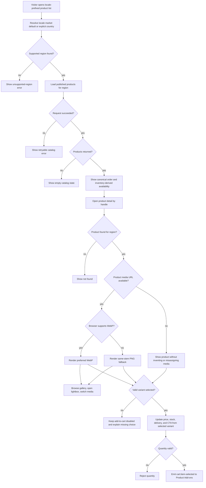
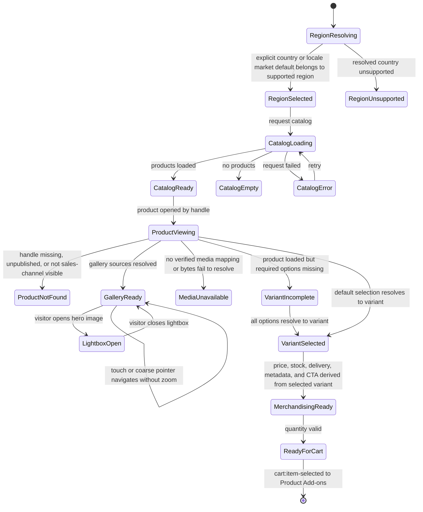
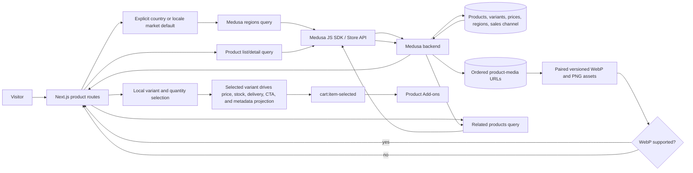

# Catalog Browsing Flow

## 1. Intent

Let a storefront visitor discover sellable products for their selected region, read the active locale's product content, inspect product details, choose a valid variant, and hand the chosen item to the cart flow.

Success criteria:

- Visitor sees only published products available through the storefront sales channel.
- Product cards and product detail pages render localized content prepared by `flows/features/catalog-localization.md`.
- Product detail headline price, stock, and delivery promise reflect the currently selected variant as a single source of truth.
- Product detail navigation, gallery, and mobile purchase controls keep the purchase path clear on desktop and mobile.
- Every recovered product-media URL and explicitly approved neutral placeholder resolves to durable bytes after backend rebuilds and clean database seeding; recovered gallery order matches the last intact local catalog.
- Product media prefers tracked WebP bytes and exposes a same-stem PNG fallback; browsers without WebP support render the PNG without a retry script.
- Catalog cards use the canonical handle order `lagoon`, `azure`, `amethyst`, `luna`, `dune`, `silk`; Dune and Silk remain visible but unavailable because Medusa inventory is zero.
- Variant selection produces a concrete `{ productId, variantId, quantity, regionId }` handoff.
- Missing region, unavailable product, or invalid variant selection is rejected before cart mutation.

## 2. Scope

In scope:

- Region-aware product listing.
- Product detail viewing from the product list.
- Rendering localized catalog content supplied by `flows/features/catalog-localization.md`.
- Variant display, product-gallery interaction, and local variant selection on product detail.
- Locale-prefixed landing CTAs route to the product list instead of an in-page collection anchor.
- Product-card title and price hierarchy, deterministic launch ordering, and inventory-derived unavailable labels.
- Product detail merchandising blocks: breadcrumb, localized merchandising metadata accordions, stock/delivery messaging, social-proof placeholder, and related products.
- Recovery and durable projection of the product media that existed in the last intact local Medusa catalog, plus an explicit neutral placeholder when the product owner approves it for a product with no source asset.
- Quantity selection and cart handoff when the cart flow is implemented.

Out of scope:

- Search ranking, wishlists, and personalization.
- Admin creation/editing of catalog data; see `flows/features/admin-operations.md`.
- Cart creation, cart persistence, checkout, and payment; see `flows/features/cart-checkout.md`.

Resolved decisions:

- Unavailable published products remain visible with disabled purchase actions. Dune and Silk have zero authoritative Medusa inventory; Lagoon, Azure, Amethyst, and Luna retain their stock.
- Final additions beyond the six canonical launch handles render after the canonical sequence in deterministic handle order.
- Localized product attributes beyond title/description remain supplied by `flows/features/catalog-localization.md`.
- The approved neutral `wooden-case` placeholder remains until an authoritative product photo is supplied.

Deferred decisions:

- Explicit region selection UI and geolocation are deferred. When no country is supplied, v0 maps `ru-RU` to Russia and resolves other locales from `NEXT_PUBLIC_DEFAULT_REGION ?? "dk"`; unsupported values render an unsupported-region state.

## 3. Actors and Permissions

| Actor | Permissions | Authority source |
|---|---|---|
| Anonymous visitor | View published storefront catalog; choose variants | Medusa store API publishable key and sales channel visibility |
| Authenticated customer | Same as anonymous visitor, plus customer-specific pricing if configured later | Medusa customer/session state |
| Admin user | Controls products, prices, categories, inventory, regions | Medusa admin API/admin dashboard |

## 4. Diagrams

### User flow

### State machine

### Data/event flow

## 5. State and Projections

Authoritative state:

- Products, categories, variants, prices, regions, inventory, sales channel membership, ordered image URLs, and thumbnails live in Medusa.
- Recovered immutable product-media bytes live in the tracked backend static directory and are copied into the production image; seed data recreates their Medusa URL/order mapping on a clean database.
- Seed data currently creates Europe and Russia regions, the storefront sales channel, product categories, products, variants, prices, stock location, shipping options, and recovered product media in `backend/apps/backend/src/migration-scripts/initial-data-seed.ts`.

Storefront projection:

- Selected region/country resolved from an explicit country, otherwise `ru-RU -> ru` or `NEXT_PUBLIC_DEFAULT_REGION ?? "dk"`.
- Product list response for that region and locale.
- Catalog list, landing collection, and related-product responses ordered by the canonical launch-handle rank, with unknown handles following in deterministic handle order.
- Inventory-derived product-card availability; published zero-stock products remain visible and cannot be purchased unless Medusa allows backorder.
- Local gallery state, selected variant option state, lightbox visibility, and mouse-only zoom on product detail. Changing media resets zoom; touch and coarse pointers never activate hover zoom.
- Local quantity input before cart handoff.

## 6. Events/Actions

| Direction | Name | Target flow | Payload | Allowed when | Reject reason |
|---|---|---|---|---|---|
| Incoming | `catalog:published` | Catalog Browsing | `{ productIds?, categoryIds?, regionIds?, salesChannelIds? }` | Admin publishes catalog data in Medusa | Not applicable to storefront |
| Incoming | `catalog:localized-content-ready` | Catalog Browsing | `{ locale, medusaLocale, fallbackProductIds? }` | Catalog localization has resolved locale-aware content for rendering | Localized read failed upstream |
| Internal | `catalog:region-selected` | None | `{ regionId, countryCode, medusaLocale? }` | Explicit country or locale market default belongs to a supported region | Unsupported country |
| Internal | `catalog:product-opened` | None | `{ productHandle, regionId }` | Region known and published product handle is sales-channel visible | Missing region, unpublished product, or product not sales-channel visible |
| Internal | `catalog:variant-projected` | None | `{ productId, variantId, price, currencyCode, availability, deliveryPromise }` | Variant selection resolves to a sellable or backorderable variant | Missing variant |
| Outgoing | `cart:item-selected` | Product Add-ons | `{ productId, variantId, quantity, regionId }` | Variant is valid, quantity is positive, and cart UI is enabled | Missing variant, invalid quantity, unavailable product |
| Outgoing shared data | `catalog:indexable-route-projection` | SEO Readiness | `{ locale, path, productHandle?, product? }` | The route is public and the product, when present, is published and sales-channel visible; zero stock does not remove indexability | Private route, unpublished/missing product, or unresolved region |

## 7. Edge Cases

- Explicit country is missing: use `ru` for `ru-RU`; otherwise use `NEXT_PUBLIC_DEFAULT_REGION ?? "dk"`.
- Resolved country is unsupported: show a clear unsupported-region state; do not fall back silently to another region after a failed lookup.
- Product exists but is unpublished or not in storefront sales channel: treat as not found for visitors.
- Product detail handle does not exist: render Next.js not-found state.
- Variant options do not resolve to a variant: keep add-to-cart disabled.
- Quantity is zero, negative, or not an integer: reject locally before any cart handoff.
- Selected variant is out of stock but backorderable: show backorder messaging, keep CTA enabled, and surface the delivery promise near the CTA.
- Selected variant has low stock: show urgency messaging near the CTA without changing price behavior.
- Product/variant becomes unavailable between detail load and cart handoff: cart flow must revalidate through Medusa.
- Store API request fails: show retryable error without mutating cart state.
- Gallery has one image only: hide non-functional gallery controls and lightbox rail affordances.
- Requested locale has partial or missing translations: render the fallback content produced by catalog-localization and keep catalog pricing/variant behavior unchanged.
- Related-product navigation from a supported locale must preserve that locale prefix; changing the product handle must not silently change `/en` to `/ru`.
- A stored media URL points at an ephemeral/deleted container path: production verification fails; do not publish the broken URL.
- The recovered thumbnail also appears in `images`: preserve the database mapping; storefront source collection de-duplicates the repeated URL.
- No source database row or matching byte proves an image belongs to a product: do not guess or reuse another product's media.
- A product has no historically recoverable media: assign no unrelated product image; a neutral, visibly non-photographic placeholder is allowed only after explicit product-owner approval and must be replaced when an authoritative asset is supplied.
- A WebP-capable browser selects the WebP source; a browser that cannot decode WebP selects the tracked same-stem PNG fallback. Both files must deploy atomically because `<picture>` does not retry after a selected source returns corrupt bytes or 404.
- A product URL ends in `.webp` or `.png` with a query string or encoded spaces: replace only the terminal pathname extension when deriving its pair and preserve the rest of the URL.
- A product image uses another format or has no approved paired derivative: render the original URL rather than guessing a fallback.
- Touch, swipe, or compatibility mouse events on phone/tablet must not activate the desktop 1.5x zoom. Changing gallery media clears prior zoom position.
- Canonical handles missing from a response are omitted without reordering the remaining cards; unknown handles sort after the six canonical handles.
- Dune or Silk has zero tracked inventory and backorder is disabled: show it in the collection as unavailable and reject add-to-cart through the same Medusa-derived availability projection.

## 8. Side Effects

- Storefront navigation from localized product list routes to localized product detail routes.
- Explicit country/config and the v0 locale market default affect region, prices, and cart compatibility; Medusa remains authoritative for all resulting commerce data.
- `catalog:localized-content-ready` feeds localized title/description into catalog list/detail rendering.
- Selected variant changes update the headline price, stock label, delivery promise, sticky/mobile CTA, and metadata projection from the same variant-derived source.
- Product detail renders breadcrumb context and related-product continuation without mutating catalog/cart state; related-product destinations preserve the active locale.
- Landing-page collection CTAs navigate to `/{locale}/products`; the destination breadcrumb says `КОЛЛЕКЦИЯ` / `COLLECTION`.
- Product media selection is browser-native: WebP is preferred and PNG is the capability fallback at every product rendering path, including listing, detail, packaging, cart, checkout, and order history.
- `cart:item-selected` hands the validated main selection to Product Add-ons; Product Add-ons coordinates one main and an optional linked `cart:line-item-add-requested` Cart mutation.
- Clean database seeding restores the recovered thumbnail and ordered gallery mapping, while backend rebuilds retain the tracked immutable bytes.

## 9. Schemas Touched

Expected implementation files for this release:

- `storefront/src/app/[locale]/page.tsx`.
- `storefront/src/app/[locale]/products/page.tsx`.
- `storefront/src/app/[locale]/products/[handle]/page.tsx`.
- `storefront/src/lib/medusa/products.ts`.
- `storefront/src/lib/price.ts`.
- `storefront/src/components/product/ProductImage.tsx`.
- `storefront/src/components/product/ProductCard.tsx`.
- `storefront/src/components/product/ProductGrid.tsx`.
- `storefront/src/components/product/ProductGallery.tsx`.
- `storefront/src/components/product/ProductInfoBlock.tsx`.
- `storefront/src/components/product/ProductRelatedProducts.tsx`.
- `storefront/src/components/product/VariantSelector.tsx`.
- `storefront/src/components/product/PriceDisplay.tsx`.
- `storefront/src/components/landing/CollectionSection.tsx`.
- `storefront/src/components/cart/CartDrawer.tsx`.
- `storefront/src/app/[locale]/checkout/page.tsx`.
- `storefront/src/app/[locale]/cabinet/orders/[id]/page.tsx`.
- `storefront/messages/ru.json` and `storefront/messages/en.json`.
- `storefront/public/images/` paired launch-product WebP/PNG assets, enumerated by `storefront/src/lib/__tests__/product-media-assets.test.ts`.
- `backend/apps/backend/static/` paired current product/packaging WebP/PNG assets, enumerated by `storefront/src/lib/__tests__/product-media-assets.test.ts`.
- `backend/apps/backend/src/migration-scripts/initial-data-seed.ts`.
- `backend/apps/backend/src/migration-scripts/update-launch-inventory.ts`.
- Medusa Store API product, region, pricing, and inventory response types from `@medusajs/js-sdk`.

Current files that inform the flow:

- `backend/apps/backend/src/migration-scripts/initial-data-seed.ts`.
- `backend/apps/backend/medusa-config.ts`.

- `backend/apps/backend/Dockerfile` copies the tracked `backend/apps/backend/static/` media into the production runtime image.
- `docker-compose.prod.yml` supplies the public backend base URL used to build absolute product-media URLs.

## 10. Targeted Tests

| Layer | Behavior | File | Status |
|---|---|---|---|
| Storefront unit | Explicit country wins; omitted country resolves `ru-RU -> ru`, otherwise configured/default supported country | `storefront/src/lib/__tests__/region-resolution.test.ts` | Passed 2026-08-11 |
| Storefront unit | Product price projection derives headline price from the selected variant and shares one formatter/source across PDP callers | `storefront/src/lib/price.test.ts` or nearest project test equivalent | Pending implementation |
| Storefront UI/integration | Product list links each product card to `/products/[handle]` | To add with storefront catalog implementation | Pending implementation |
| Storefront UI/integration | Product detail for unknown/unpublished handle renders not found/error state | To add with product detail implementation | Pending implementation |
| Storefront UI/integration | Variant selection updates headline price, stock, and CTA state from the same variant source | To add with product detail implementation | Pending implementation |
| Storefront UI/integration | Product gallery thumbnails switch the hero image and lightbox navigation remains available on mobile/desktop | To add with product detail implementation | Pending implementation |
| Storefront UI/integration | Sticky mobile CTA reflects selected variant price/availability and remains disabled for invalid selections | To add with product detail implementation | Pending implementation |
| Storefront UI/integration | Product detail renders breadcrumb and related products when catalog context is available | To add with product detail implementation | Pending implementation |
| Storefront browser smoke | Product detail renders localized subtitle plus Wear It Your Way and included-kit metadata accordions | `/ru/products/azure` and `/en/products/azure` | Passed 2026-07-15 |
| Storefront browser smoke | Related-product continuation preserves `/en` and `/ru` while changing the handle | `/en/products/azure` and `/ru/products/azure` | Passed 2026-07-15 |
| Backend/Store API smoke | Every recovered media URL returns HTTP 200 and each seeded handle exposes the recovered thumbnail/gallery order | Production Store API plus `/static/*` responses | Passed 2026-07-27 |
| Storefront browser smoke | Product cards and detail galleries render the correct recovered hero for every product with authoritative media | `/ru/products` and each mapped `/ru/products/[handle]` | Passed 2026-07-27 |
| Backend/Store API smoke | The approved `wooden-case` placeholder URL returns an image and is the product's sole thumbnail/image mapping | Production Store API plus `/static/*` response | Passed 2026-07-28 |
| Storefront browser smoke | Wooden case card/detail renders the neutral placeholder without broken media | `/ru/products/wooden-case` | Passed 2026-07-28 |
| Storefront unit | Canonical handles sort in launch order and unknown handles follow deterministically | `storefront/src/lib/__tests__/products-order.test.ts` | Passed 2026-08-11 |
| Storefront unit | Product picture resolver prefers WebP, falls back to same-stem PNG, and preserves query strings | `storefront/src/lib/__tests__/product-image.test.tsx` | Passed 2026-08-11 |
| Storefront UI/integration | Touch navigation never zooms; mouse zoom resets whenever gallery media changes | `storefront/src/lib/__tests__/product-gallery.test.ts` | Passed 2026-08-11 |
| Storefront UI/integration | Zero-stock Dune and Silk cards remain visible as unavailable and cannot enter cart | `storefront/src/lib/__tests__/product-availability.test.tsx` | Passed 2026-08-11 |
| Backend script smoke | `update-launch-inventory.ts` changes only Dune and Silk to zero and is convergent on rerun | `npx medusa exec ./src/migration-scripts/update-launch-inventory.ts` from `backend/apps/backend` against an isolated database, twice | Pending deployment |
| Storefront asset audit | Every current storefront and backend product/packaging media stem has both WebP and PNG bytes before deployment | `storefront/src/lib/__tests__/product-media-assets.test.ts` | Passed 2026-08-11 |
| Storefront rendering | Shared product-picture path renders listing, PDP gallery, packaging, cart, checkout, and cabinet order images; no-WebP capability selects PNG | `product-image.test.tsx`, `product-media-assets.test.ts`, and named ProductImage callsites | Passed; live transactional-route smoke pending deployment |
| Storefront smoke | Hero, editorial, and about CTAs route to locale products; breadcrumb reads `КОЛЛЕКЦИЯ` / `COLLECTION`; card title is Medium and price is normal weight | Chrome landing smoke plus focused component assertions | Passed 2026-08-11 |

## 11. Implementation Plan

1. Extract shared price/availability projection helpers so PDP headline, selector, and cards consume the same source.
2. Upgrade `/products/[handle]` to render breadcrumb, interactive gallery, richer stock/delivery messaging, and locale-aware product metadata accordions.
3. Add sticky mobile purchase controls driven by the selected variant projection.
4. Add related products with active-locale destinations and social-proof placeholder blocks without coupling PDP to checkout state.
5. Add localized metadata/JSON-LD and targeted tests for variant-driven PDP behavior.
6. Copy tracked recovered media into the backend runtime image and seed absolute, ordered product thumbnail/gallery URLs from one public backend base URL.
7. Update the live production catalog without resetting commerce data, then verify every mapped asset through Store API and browser rendering.
8. Add the product-owner-approved neutral `wooden-case` placeholder to durable backend assets, seed it, update the live product non-destructively, and deploy.
9. Apply one canonical handle-order helper to catalog, homepage, and related-product projections.
10. Keep Dune and Silk published, seed their inventory at zero, and add a focused idempotent production updater that changes no other commerce state.
11. Add tracked same-stem PNG derivatives for WebP product media and WebP counterparts for currently selected PNG product media.
12. Route every product image renderer through one native `<picture>` component; retain the original URL for unpaired formats.
13. Restrict gallery zoom to mouse input, reset zoom when media changes, and show the complete image on phone/tablet.
14. Route landing CTAs to localized product lists and update the catalog breadcrumb and card typography.

## 12. Implementation Trace

Current status: base catalog/PDP/media recovery and the 2026-08-11 release code are implemented. The Dune/Silk production inventory mutation remains an explicit post-deploy data operation; it is not run by CI or application startup.

Current implementation files:

- `storefront/src/app/[locale]/products/[handle]/page.tsx`
- `storefront/src/lib/medusa/products.ts`
- `storefront/src/lib/price.ts`
- `storefront/src/components/product/ProductGallery.tsx`
- `storefront/src/components/product/ProductInfoBlock.tsx`
- `storefront/src/components/product/VariantSelector.tsx`
- `storefront/src/components/product/PriceDisplay.tsx`
- `storefront/src/components/product/types.ts`
- `storefront/src/components/product/index.ts`
- `storefront/src/components/product/ProductRelatedProducts.tsx`
- `storefront/src/components/product/ProductJsonLd.tsx`
- `backend/apps/backend/static/` (24 recovered immutable media files plus `wooden-case-placeholder.webp`)
- `backend/apps/backend/Dockerfile` (runtime media copy)
- `backend/apps/backend/src/migration-scripts/initial-data-seed.ts` (durable public URL, ordered product mapping, and `wooden-case` placeholder mapping)
- `storefront/src/components/product/ProductImage.tsx`, `storefront/src/components/product/ProductCard.tsx`
- `storefront/src/components/landing/HeroSection.tsx`, `storefront/src/components/landing/EditorialSection.tsx`, `storefront/src/components/landing/AboutSection.tsx`, `storefront/src/components/landing/CollectionSection.tsx`
- `storefront/src/components/cart/CartDrawer.tsx`
- `storefront/src/app/[locale]/checkout/page.tsx`, `storefront/src/app/[locale]/cabinet/orders/[id]/page.tsx`
- `storefront/messages/ru.json`, `storefront/messages/en.json`
- `storefront/public/images/` and `backend/apps/backend/static/` paired product-media assets
- `backend/apps/backend/src/migration-scripts/update-launch-inventory.ts`
- `storefront/src/lib/__tests__/products-order.test.ts`, `storefront/src/lib/__tests__/product-availability.test.tsx`, `storefront/src/lib/__tests__/product-image.test.tsx`, `storefront/src/lib/__tests__/product-media-assets.test.ts`, `storefront/src/lib/__tests__/product-gallery.test.ts`

Release v3 implementation:

- Deterministic launch ordering and inventory-derived unavailable cards are implemented.
- Paired WebP/PNG assets and the shared product-picture renderer cover catalog, PDP, packaging, cart, checkout, and order history.
- Gallery zoom is mouse-only, resets on media changes, and uses complete-image framing below `lg`.
- Landing CTAs, localized catalog breadcrumb, Instagram destination, and card typography are updated.
- Fresh seed and the focused idempotent updater set Dune/Silk inventory to zero; executing the updater against production is a deployment operation.

Validation:

- `npm run build --prefix storefront` completed successfully.
- Browser smoke passed for `/ru/products/azure` and `/en/products/azure`, including localized subtitle and both metadata accordions.
- Browser navigation passed from `/en/products/azure` to `/en/products/dune` and from `/ru/products/azure` to `/ru/products/dune`.
- `npm run build --prefix backend` completed successfully.
- `docker build -f backend/apps/backend/Dockerfile -t sunluk-backend:media-restore .` completed successfully; all 24 mapped bytes were present in `/app/static`.
- Isolated clean-database migration and seed completed successfully: 12 products, 11 products with authoritative media, 23 image rows plus the separate Lagoon thumbnail.
- Local runtime smoke returned `200 image/webp` for the recovered static route.
- Production asset audit returned HTTP 200 with image content types for all 24 recovered files.
- Production Store API audit matched exact thumbnail/gallery ordering for all 11 recovered-media handles.
- Browser smoke loaded the exact recovered hero and all gallery images for all 11 recovered-media product pages with non-zero natural dimensions.
- `npm run build --prefix backend`, the production Docker build, and the global lint gate completed successfully for the placeholder change; lint retained five pre-existing storefront image warnings and no errors.
- The deployed placeholder returned `200 image/webp`, 10,984 bytes, and the live `wooden-case` Store API product returned the same URL as its thumbnail and sole gallery image.
- Browser smoke for `/ru/products/wooden-case` rendered both the optimized gallery image and source asset with non-zero natural dimensions.
- Gzip-verified production backups bracket the live update: `/opt/backups/sunluk-pre-wooden-placeholder-20260728-001528.sql.gz` and `/opt/backups/sunluk-post-wooden-placeholder-20260728-001619.sql.gz`.
- 2026-08-11 final full storefront suite: `npm run test --prefix storefront` passed 20 files / 128 tests.
- 2026-08-11 final focused packaging suite passed 2 files / 12 tests; the earlier release-correction suite passed 5 files / 29 tests.
- 2026-08-11 `npm run build:storefront` and `npm run build:backend` completed successfully.
- 2026-08-11 `npm run lint` completed with zero errors and zero warnings.
- Chrome production-build smoke at 375x667 passed for RU/EN hero layout and punctuation, all four localized `/products` CTAs, canonical Instagram URL, mobile menu outside/inside/Escape behavior, and four loaded WebP-preferred/PNG-fallback landing product pictures.
- Live catalog/PDP/cart/checkout browser smoke could not run locally because PostgreSQL 16 binaries are absent and the checked-in local publishable key is not valid for production. The corresponding ordering, availability, gallery, cart, and phone contracts passed the full component suite; repeat live routes after deployment.
- Production data command pending deployment: `npx medusa exec ./src/migration-scripts/update-launch-inventory.js` from the built backend runtime, followed by Store API/PDP checks for visible unavailable Dune/Silk.

Notes:

- `/` landing remains active.
- `/products` resolves the explicit country or locale market default and lists Medusa Store API products.
- `/products/[handle]` resolves the same route-derived region, loads product detail by handle, and renders not-found for missing products.
- Cart mutation is implemented and documented in `flows/features/cart-checkout.md`; Catalog emits the validated main selection to Product Add-ons before Cart owns each authoritative line mutation.
- A pre-restoration production PostgreSQL backup was created and gzip-verified at `/opt/backups/sunluk-pre-media-20260727-234439.sql.gz`.

## 13. Open Questions

- Should the v0 locale market defaults be replaced by explicit country selection before enabling more storefront locales?
- Should region selection later be explicit, inferred, or both? v0 defers selector UI.

## 14. Review Checklist

- [x] Region boundary is explicit before catalog/cart operations.
- [x] Product visibility depends on Medusa published/sales-channel state.
- [x] Variant and quantity are validated before cart handoff.
- [x] `cart:item-selected` matches Catalog Browsing → Product Add-ons and `cart:line-item-add-requested` matches Product Add-ons → Cart and Checkout in architecture and receiving flows.
- [x] Product list -> detail route is explicit for the current implementation slice.
- [x] v0 region fallback is explicit and does not silently mask unsupported configured regions.
- [x] Localized product content dependency is explicit via `catalog:localized-content-ready`.
- [x] Missing or unverified media never triggers guessed cross-product assignment.
- [x] Media durability across backend rebuild and clean database seed is explicit.

- [x] Canonical launch ordering and the visible unavailable projection for Dune/Silk are explicit.
- [x] WebP preference, PNG capability fallback, atomic paired deployment, and non-paired formats are explicit.
- [x] Touch/coarse-pointer rejection and zoom reset paths are explicit.
- [x] Catalog-to-add-on cross-flow payload matches the architecture map.

Flow review v3 (2026-08-11): **APPROVED**. Canonical ordering, visible zero-stock products, paired WebP/PNG media, touch-safe gallery behavior, localized catalog navigation, exact schemas/tests, SEO projection, and cross-flow payloads clear the Approval Bar.
Flow review v1 (2026-07-27): **APPROVED**. Media authority, durability, missing-source rejection, exact schemas, non-destructive production update, and Store API/browser verification are explicit; no cross-flow event or permission boundary changes.

Prior flow-code sync (2026-07-27): **IN SYNC** before the approved `wooden-case` placeholder change. Production served all 24 recovered bytes durably with no unrelated image assigned to `wooden-case`.

Flow review v2 (2026-07-27): **APPROVED**. The explicit owner decision, neutral/non-photographic constraint, durable asset path, non-destructive update, replacement boundary, and API/browser checks are concrete; no blocker remains before implementation.

Flow-code sync v2 (2026-07-28): **IN SYNC**. Commit `ebe5af9` is deployed; the approved 1200x1200 neutral placeholder is durable in the runtime image and clean seed, the live product references it non-destructively, and Store API plus browser rendering checks passed.
