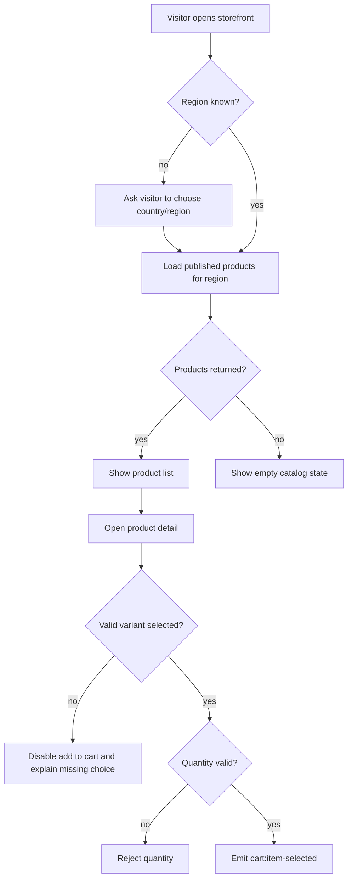
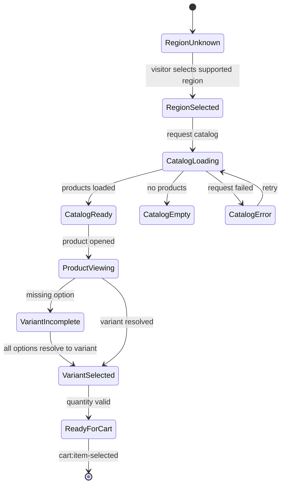
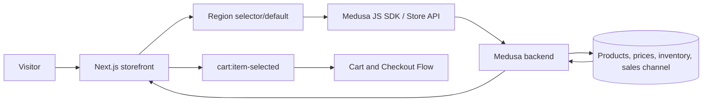

# Catalog Browsing Flow

## 1. Intent

Let a storefront visitor discover sellable products for their selected region, inspect product details, choose a valid variant, and hand the chosen item to the cart flow.

Success criteria:

- Visitor sees only published products available through the storefront sales channel.
- Prices and availability are region-aware.
- Variant selection produces a concrete `{ productId, variantId, quantity, regionId }` handoff.
- Missing region, unavailable product, or invalid variant selection is rejected before cart mutation.

## 2. Scope

In scope:

- Region-aware catalog listing.
- Product detail viewing.
- Variant selection and quantity selection.
- Handoff to `flows/features/cart-checkout.md`.

Out of scope:

- Search ranking, recommendations, reviews, wishlists, and personalization.
- Admin creation/editing of catalog data; see `flows/features/admin-operations.md`.

Deferred decisions:

- Whether country/region is selected explicitly by the visitor or inferred from geolocation/locale.
- Whether out-of-stock products are hidden or displayed as unavailable.

## 3. Actors and Permissions

| Actor | Permissions | Authority source |
|---|---|---|
| Anonymous visitor | View published storefront catalog; choose variants | Medusa store API publishable key and sales channel visibility |
| Authenticated customer | Same as anonymous visitor, plus customer-specific pricing if configured later | Medusa customer/session state |
| Admin user | Controls products, prices, categories, inventory, regions | Medusa admin API/admin dashboard |

## 4. Diagrams

### User flow

### State machine

### Data/event flow

## 5. State and Projections

Authoritative state:

- Products, categories, variants, prices, regions, inventory and sales channel membership live in Medusa.
- Seed data currently creates Europe region, default sales channel, product categories, products, variants, prices, stock location, and shipping options in `backend/apps/backend/src/migration-scripts/initial-data-seed.ts`.

Storefront projection:

- Selected region/country.
- Product list response for that region.
- Product detail response.
- Local variant option selection before a concrete variant exists.
- Local quantity input before cart handoff.

## 6. Events/Actions

| Direction | Name | Target flow | Payload | Allowed when | Reject reason |
|---|---|---|---|---|---|
| Incoming | `catalog:published` | Catalog Browsing | `{ productIds?, categoryIds?, regionIds?, salesChannelIds? }` | Admin publishes catalog data in Medusa | Not applicable to storefront |
| Internal | `catalog:region-selected` | None | `{ regionId, countryCode }` | Country belongs to supported region | Unsupported country |
| Internal | `catalog:product-opened` | None | `{ productHandleOrId, regionId }` | Region known | Missing region or product not sellable |
| Outgoing | `cart:item-selected` | Cart and Checkout | `{ productId, variantId, quantity, regionId }` | Variant is valid and quantity is positive | Missing variant, invalid quantity, unavailable product |

## 7. Edge Cases

- Region is missing: block price-sensitive product display or prompt for region before fetching prices.
- Region is unsupported: show a clear unsupported-region state; do not fall back silently to another region.
- Product exists but is unpublished or not in storefront sales channel: treat as not found for visitors.
- Variant options do not resolve to a variant: keep add-to-cart disabled.
- Product/variant becomes unavailable between detail load and cart handoff: cart flow must revalidate through Medusa.
- Store API request fails: show retryable error without mutating cart state.

## 8. Side Effects

- Storefront navigation from list to detail.
- Region selection may affect product prices and cart compatibility.
- `cart:item-selected` begins cart mutation in the cart flow.

## 9. Schemas Touched

Expected implementation files when this flow is built:

- `storefront/src/app/**` routes/pages for catalog and product detail.
- Storefront Medusa client wrapper.
- Medusa Store API product, region, and pricing response types from `@medusajs/js-sdk`.

Current files that inform the flow:

- `backend/apps/backend/src/migration-scripts/initial-data-seed.ts`.
- `backend/apps/backend/medusa-config.ts`.

## 10. Targeted Tests

| Layer | Behavior | File | Status |
|---|---|---|---|
| Storefront integration | Region must be known before price-sensitive catalog display | To add with storefront catalog implementation | Pending implementation |
| Storefront integration | Variant cannot be added until all required options resolve to a real variant | To add with product detail implementation | Pending implementation |
| Storefront integration | Unpublished/unavailable product does not produce `cart:item-selected` | To add with product detail implementation | Pending implementation |

## 11. Implementation Plan

1. Add a Medusa Store API client wrapper using configured backend URL and publishable key.
2. Add region loading/selection before catalog requests.
3. Add catalog listing filtered by region and sales channel.
4. Add product detail with variant resolution.
5. Emit only validated `cart:item-selected` payloads to cart code.

## 12. Implementation Trace

Current status: flow document only. Storefront commerce pages are not implemented yet; `storefront/src/app/page.tsx` is the default Next.js starter page.

## 13. Open Questions

- Should the default region be configured as Denmark (`dk`) as documented in the starter README, or another market for Sunluk?
- Should region selection be explicit, inferred, or both?
- Should unavailable products be hidden or shown with disabled purchase actions?

## 14. Review Checklist

- [x] Region boundary is explicit before catalog/cart operations.
- [x] Product visibility depends on Medusa published/sales-channel state.
- [x] Variant and quantity are validated before cart handoff.
- [x] Cross-flow `cart:item-selected` appears in architecture and cart flow.
