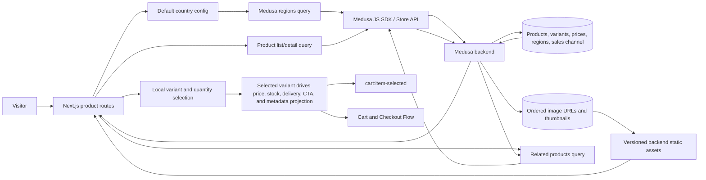

# Catalog Browsing Flow

## 1. Intent

Let a storefront visitor discover sellable products for their selected region, read the active locale's product content, inspect product details, choose a valid variant, and hand the chosen item to the cart flow.

Success criteria:

- Visitor sees only published products available through the storefront sales channel.
- Product cards and product detail pages render localized content prepared by `flows/features/catalog-localization.md`.
- Product detail headline price, stock, and delivery promise reflect the currently selected variant as a single source of truth.
- Product detail navigation, gallery, and mobile purchase controls keep the purchase path clear on desktop and mobile.
- Every recovered product-media URL and explicitly approved neutral placeholder resolves to durable bytes after backend rebuilds and clean database seeding; recovered gallery order matches the last intact local catalog.
- Variant selection produces a concrete `{ productId, variantId, quantity, regionId }` handoff.
- Missing region, unavailable product, or invalid variant selection is rejected before cart mutation.

## 2. Scope

In scope:

- Region-aware product listing.
- Product detail viewing from the product list.
- Rendering localized catalog content supplied by `flows/features/catalog-localization.md`.
- Variant display, product-gallery interaction, and local variant selection on product detail.
- Product detail merchandising blocks: breadcrumb, localized merchandising metadata accordions, stock/delivery messaging, social-proof placeholder, and related products.
- Recovery and durable projection of the product media that existed in the last intact local Medusa catalog, plus an explicit neutral placeholder when the product owner approves it for a product with no source asset.
- Quantity selection and cart handoff when the cart flow is implemented.

Out of scope:

- Search ranking, wishlists, and personalization.
- Admin creation/editing of catalog data; see `flows/features/admin-operations.md`.
- Cart creation, cart persistence, checkout, and payment; see `flows/features/cart-checkout.md`.

Deferred decisions:

- Explicit region selection UI and geolocation-based region inference. v0 still uses `NEXT_PUBLIC_DEFAULT_REGION` and falls back to `dk`; unsupported configured values render an unsupported-region state. Locale-prefixed routing is covered separately by `flows/features/catalog-localization.md`.
- Whether out-of-stock products are hidden or displayed as unavailable. v0 displays Store API sellable products returned by Medusa and disables purchase actions when a selected variant is not available.
- Final SUNLUK production product data. v0 renders whatever published Store API products Medusa returns for the configured region/sales channel.

## 3. Actors and Permissions

| Actor | Permissions | Authority source |
|---|---|---|
| Anonymous visitor | View published storefront catalog; choose variants | Medusa store API publishable key and sales channel visibility |
| Authenticated customer | Same as anonymous visitor, plus customer-specific pricing if configured later | Medusa customer/session state |
| Admin user | Controls products, prices, categories, inventory, regions | Medusa admin API/admin dashboard |

## 4. Diagrams

### User flow

```mermaid
flowchart TD
  Start[Visitor opens product list] --> ConfigRegion[Read configured default country]
  ConfigRegion --> Region{Supported region found?}
  Region -->|no| Unsupported[Show unsupported-region error]
  Region -->|yes| LoadCatalog[Load published products for region]
  LoadCatalog --> Loaded{Request succeeded?}
  Loaded -->|no| CatalogError[Show retryable catalog error]
  Loaded -->|yes| Products{Products returned?}
  Products -->|no| Empty[Show empty catalog state]
  Products -->|yes| List[Show product list]
  List --> Detail[Open product detail by handle]
  Detail --> DetailLoad{Product found for region?}
  DetailLoad -->|no| NotFound[Show not found]
  DetailLoad -->|yes| Media{At least one valid product-media source?}
  Media -->|yes| ProductView[Show product detail with ordered gallery]
  Media -->|no| Placeholder[Show product without inventing or misassigning media]
  ProductView --> Gallery[Browse gallery, open lightbox, switch media]
  Placeholder --> Variant{Valid variant selected?}
  ProductView --> Variant
  Variant -->|no| DisableAdd[Keep add-to-cart disabled and explain missing choice]
  Variant -->|yes| MerchState[Update price, stock, delivery, and CTA from selected variant]
  MerchState --> Quantity{Quantity valid?}
  Quantity -->|no| RejectQty[Reject quantity]
  Quantity -->|yes| Handoff[Emit cart:item-selected when cart flow is wired]

### State machine

```mermaid
stateDiagram-v2
  [*] --> RegionResolving
  RegionResolving --> RegionSelected: default country belongs to supported region
  RegionResolving --> RegionUnsupported: default country unsupported
  RegionSelected --> CatalogLoading: request catalog
  CatalogLoading --> CatalogReady: products loaded
  CatalogLoading --> CatalogEmpty: no products
  CatalogLoading --> CatalogError: request failed
  CatalogReady --> ProductViewing: product opened by handle
  ProductViewing --> ProductNotFound: handle missing, unpublished, or not sellable in region
  ProductViewing --> GalleryReady: gallery sources resolved
  GalleryReady --> LightboxOpen: visitor opens hero image
  ProductViewing --> MediaUnavailable: no verified media mapping or bytes fail to resolve
  LightboxOpen --> GalleryReady: visitor closes lightbox
  ProductViewing --> VariantIncomplete: product loaded but required options missing
  VariantIncomplete --> VariantSelected: all options resolve to variant
  ProductViewing --> VariantSelected: default selection resolves to variant
  VariantSelected --> MerchandisingReady: price, stock, delivery, metadata, and CTA derived from selected variant
  MerchandisingReady --> ReadyForCart: quantity valid
  ReadyForCart --> [*]: cart:item-selected when cart flow is wired
  CatalogError --> CatalogLoading: retry
```

### Data/event flow



## 5. State and Projections

Authoritative state:

- Products, categories, variants, prices, regions, inventory, sales channel membership, ordered image URLs, and thumbnails live in Medusa.
- Recovered immutable product-media bytes live in the tracked backend static directory and are copied into the production image; seed data recreates their Medusa URL/order mapping on a clean database.
- Seed data currently creates Europe and Russia regions, the storefront sales channel, product categories, products, variants, prices, stock location, shipping options, and recovered product media in `backend/apps/backend/src/migration-scripts/initial-data-seed.ts`.

Storefront projection:

- Selected default region/country resolved from configuration.
- Product list response for that region.
- Product detail response selected by product handle.
- Local gallery state, selected variant option state, and lightbox visibility on product detail.
- Variant-derived price, stock, delivery promise, breadcrumb, and related-products projection before cart handoff.
- Local quantity input before cart handoff.

## 6. Events/Actions

| Direction | Name | Target flow | Payload | Allowed when | Reject reason |
|---|---|---|---|---|---|
| Incoming | `catalog:published` | Catalog Browsing | `{ productIds?, categoryIds?, regionIds?, salesChannelIds? }` | Admin publishes catalog data in Medusa | Not applicable to storefront |
| Incoming | `catalog:localized-content-ready` | Catalog Browsing | `{ locale, medusaLocale, fallbackProductIds? }` | Catalog localization has resolved locale-aware content for rendering | Localized read failed upstream |
| Internal | `catalog:region-selected` | None | `{ regionId, countryCode }` | Configured country belongs to supported region | Unsupported country |
| Internal | `catalog:product-opened` | None | `{ productHandle, regionId }` | Region known and product handle exists | Missing region or product not sellable |
| Internal | `catalog:variant-projected` | None | `{ productId, variantId, price, currencyCode, availability, deliveryPromise }` | Variant selection resolves to a sellable or backorderable variant | Missing variant |
| Outgoing | `cart:item-selected` | Cart and Checkout | `{ productId, variantId, quantity, regionId }` | Variant is valid, quantity is positive, and cart UI is enabled | Missing variant, invalid quantity, unavailable product |
| Outgoing shared data | `catalog:indexable-route-projection` | SEO Readiness | `{ locale, path, productHandle?, product? }` | The route is public and the product, when present, is published and sellable in the resolved region | Private route, unpublished/missing product, or unresolved region |

## 7. Edge Cases

- Configured default country is missing: use `dk` for v0 and keep the selected region visible in code/config, not hardcoded in UI copy.
- Configured/default country is unsupported: show a clear unsupported-region state; do not fall back silently to another region after a failed lookup.
- Product exists but is unpublished or not in storefront sales channel: treat as not found for visitors.
- Product detail handle does not exist: render Next.js not-found state.
- Variant options do not resolve to a variant: keep add-to-cart disabled.
- Quantity is zero, negative, or not an integer: reject locally before any cart handoff.
- Selected variant is out of stock but backorderable: show backorder messaging, keep CTA enabled, and surface the delivery promise near the CTA.
- Selected variant has low stock: show urgency messaging near the CTA without changing price behavior.
- Product/variant becomes unavailable between detail load and cart handoff: cart flow must revalidate through Medusa.
- Store API request fails: show retryable error without mutating cart state.
- Gallery has one image only: hide non-functional gallery controls and lightbox rail affordances.
- Requested locale has partial or missing translations: render the fallback content produced by catalog-localization and keep catalog pricing/variant behavior unchanged.
- Related-product navigation from a supported locale must preserve that locale prefix; changing the product handle must not silently change `/en` to `/ru`.
- A stored media URL points at an ephemeral/deleted container path: production verification fails; do not publish the broken URL.
- The recovered thumbnail also appears in `images`: preserve the database mapping; storefront source collection de-duplicates the repeated URL.
- No source database row or matching byte proves an image belongs to a product: do not guess or reuse another product's media.
- A product has no historically recoverable media: assign no unrelated product image; a neutral, visibly non-photographic placeholder is allowed only after explicit product-owner approval and must be replaced when an authoritative asset is supplied.

## 8. Side Effects

- Storefront navigation from localized product list routes to localized product detail routes.
- Region selection/config affects product prices and cart compatibility, while locale affects only content projection.
- `catalog:localized-content-ready` feeds localized title/description into catalog list/detail rendering.
- Selected variant changes update the headline price, stock label, delivery promise, sticky/mobile CTA, and metadata projection from the same variant-derived source.
- Product detail renders breadcrumb context and related-product continuation without mutating catalog/cart state; related-product destinations preserve the active locale.
- `cart:item-selected` begins cart mutation in the cart flow once the cart UI is wired; current product-screen slice may render disabled/pending add-to-cart if cart flow is not yet implemented.
- Clean database seeding restores the recovered thumbnail and ordered gallery mapping, while backend rebuilds retain the tracked immutable bytes.

## 9. Schemas Touched

Expected implementation files for the product-list-to-product-detail slice:

- `storefront/src/app/products/page.tsx`.
- `storefront/src/app/products/[handle]/page.tsx`.
- `storefront/src/lib/medusa.ts`.
- `storefront/src/lib/medusa/regions.ts`.
- `storefront/src/lib/medusa/products.ts`.
- `storefront/src/lib/price.ts`.
- `storefront/src/components/product/ProductCard.tsx`.
- `storefront/src/components/product/ProductGrid.tsx`.
- `storefront/src/components/product/ProductGallery.tsx`.
- `storefront/src/components/product/ProductRelatedProducts.tsx`.
- `storefront/src/components/product/VariantSelector.tsx`.
- `storefront/src/components/product/PriceDisplay.tsx`.
- Medusa Store API product, region, and pricing response types from `@medusajs/js-sdk`.

Current files that inform the flow:

- `backend/apps/backend/src/migration-scripts/initial-data-seed.ts`.
- `backend/apps/backend/medusa-config.ts`.

- `backend/apps/backend/Dockerfile` copies the tracked `backend/apps/backend/static/` media into the production runtime image.
- `docker-compose.prod.yml` supplies the public backend base URL used to build absolute product-media URLs.

## 10. Targeted Tests

| Layer | Behavior | File | Status |
|---|---|---|---|
| Storefront unit | Region resolver chooses configured/default country only when Medusa returns a supported region | `storefront/src/lib/medusa/regions.test.ts` or nearest project test equivalent | Pending implementation |
| Storefront unit | Product price projection derives headline price from the selected variant and shares one formatter/source across PDP callers | `storefront/src/lib/price.test.ts` or nearest project test equivalent | Pending implementation |
| Storefront UI/integration | Product list links each product card to `/products/[handle]` | To add with storefront catalog implementation | Pending implementation |
| Storefront UI/integration | Product detail for unknown/unpublished handle renders not found/error state | To add with product detail implementation | Pending implementation |
| Storefront UI/integration | Variant selection updates headline price, stock, and CTA state from the same variant source | To add with product detail implementation | Pending implementation |
| Storefront UI/integration | Product gallery thumbnails switch the hero image and lightbox navigation remains available on mobile/desktop | To add with product detail implementation | Pending implementation |
| Storefront UI/integration | Sticky mobile CTA reflects selected variant price/availability and remains disabled for invalid selections | To add with product detail implementation | Pending implementation |
| Storefront UI/integration | Product detail renders breadcrumb and related products when catalog context is available | To add with product detail implementation | Pending implementation |
| Storefront browser smoke | Product detail renders localized subtitle plus Wear It Your Way and included-kit metadata accordions | `/ru/products/azure` and `/en/products/azure` | Passed 2026-07-15 |
| Storefront browser smoke | Related-product continuation preserves `/en` and `/ru` while changing the handle | `/en/products/azure` and `/ru/products/azure` | Passed 2026-07-15 |
| Backend/Store API smoke | Every recovered media URL returns HTTP 200 and each seeded handle exposes the recovered thumbnail/gallery order | Production Store API plus `/static/*` responses | Passed 2026-07-27 |
| Storefront browser smoke | Product cards and detail galleries render the correct recovered hero for every product with authoritative media | `/ru/products` and each mapped `/ru/products/[handle]` | Passed 2026-07-27 |
| Backend/Store API smoke | The approved `wooden-case` placeholder URL returns an image and is the product's sole thumbnail/image mapping | Production Store API plus `/static/*` response | Pending implementation |
| Storefront browser smoke | Wooden case card/detail renders the neutral placeholder without broken media | `/ru/products/wooden-case` | Pending implementation |

## 11. Implementation Plan

1. Extract shared price/availability projection helpers so PDP headline, selector, and cards consume the same source.
2. Upgrade `/products/[handle]` to render breadcrumb, interactive gallery, richer stock/delivery messaging, and locale-aware product metadata accordions.
3. Add sticky mobile purchase controls driven by the selected variant projection.
4. Add related products with active-locale destinations and social-proof placeholder blocks without coupling PDP to checkout state.
5. Add localized metadata/JSON-LD and targeted tests for variant-driven PDP behavior.
6. Copy tracked recovered media into the backend runtime image and seed absolute, ordered product thumbnail/gallery URLs from one public backend base URL.
7. Update the live production catalog without resetting commerce data, then verify every mapped asset through Store API and browser rendering.
8. Add the product-owner-approved neutral `wooden-case` placeholder to durable backend assets, seed it, update the live product non-destructively, and deploy.

## 12. Implementation Trace

Current status: base product-list-to-product-detail slice, PDP merchandising blocks, and durable recovery of all authoritative product media are implemented.

Current implementation files:

- `storefront/src/app/[locale]/products/[handle]/page.tsx`
- `storefront/src/lib/medusa/products.ts`
- `storefront/src/lib/price.ts`
- `storefront/src/components/product/ProductGallery.tsx`
- `storefront/src/components/product/ProductInfoBlock.tsx`
- `storefront/src/components/product/VariantSelector.tsx`
- `storefront/src/components/product/PriceDisplay.tsx`
- `storefront/src/components/product/types.ts`
- `storefront/src/components/product/index.ts`
- `storefront/src/components/product/ProductRelatedProducts.tsx`
- `storefront/src/components/product/ProductJsonLd.tsx`
- `backend/apps/backend/static/` (24 recovered immutable media files used by the current catalog)
- `backend/apps/backend/Dockerfile` (runtime media copy)
- `backend/apps/backend/src/migration-scripts/initial-data-seed.ts` (durable public URL and ordered product mapping)
- `docker-compose.prod.yml` (`MEDUSA_BACKEND_URL` production base)

Validation:

- `npm run build --prefix storefront` completed successfully.
- Browser smoke passed for `/ru/products/azure` and `/en/products/azure`, including localized subtitle and both metadata accordions.
- Browser navigation passed from `/en/products/azure` to `/en/products/dune` and from `/ru/products/azure` to `/ru/products/dune`.
- `npm run build --prefix backend` completed successfully.
- `docker build -f backend/apps/backend/Dockerfile -t sunluk-backend:media-restore .` completed successfully; all 24 mapped bytes were present in `/app/static`.
- Isolated clean-database migration and seed completed successfully: 12 products, 11 products with authoritative media, 23 image rows plus the separate Lagoon thumbnail.
- Local runtime smoke returned `200 image/webp` for the recovered static route.
- Production asset audit returned HTTP 200 with image content types for all 24 recovered files.
- Production Store API audit matched exact thumbnail/gallery ordering for all 11 mapped handles; `wooden-case` remained intentionally unmapped.
- Browser smoke loaded the exact recovered hero and all gallery images for all 11 mapped product pages with non-zero natural dimensions.

Notes:

- `/` landing remains active.
- `/products` resolves the configured/default region and lists Medusa Store API products.
- `/products/[handle]` resolves the same region, loads product detail by handle, and renders not-found for missing products.
- Cart mutation remains deferred to `flows/features/cart-checkout.md`; variant UI resolves a valid variant but leaves the cart CTA disabled with pending copy.
- A pre-restoration production PostgreSQL backup was created and gzip-verified at `/opt/backups/sunluk-pre-media-20260727-234439.sql.gz`.

## 13. Open Questions

- Should production default region remain Denmark (`dk`) or use a different first market for Sunluk? v0 proceeds with `NEXT_PUBLIC_DEFAULT_REGION ?? "dk"` until product chooses otherwise.
- Should region selection later be explicit, inferred, or both? v0 defers selector UI.
- Localized product attributes beyond title/description are implemented through `flows/features/catalog-localization.md`: material names use message catalogs and merchandising metadata carries explicit `ru`/`en` values.
- Should unavailable products be hidden or shown with disabled purchase actions? v0 follows Store API product visibility and disables impossible variant/cart actions.
- Resolved 2026-07-27: the product owner selected a temporary neutral placeholder for `wooden-case`; replace it when the real product photo is supplied.

## 14. Review Checklist

- [x] Region boundary is explicit before catalog/cart operations.
- [x] Product visibility depends on Medusa published/sales-channel state.
- [x] Variant and quantity are validated before cart handoff.
- [x] Cross-flow `cart:item-selected` appears in architecture and cart flow.
- [x] Product list -> detail route is explicit for the current implementation slice.
- [x] v0 region fallback is explicit and does not silently mask unsupported configured regions.
- [x] Localized product content dependency is explicit via `catalog:localized-content-ready`.
- [x] Missing or unverified media never triggers guessed cross-product assignment.
- [x] Media durability across backend rebuild and clean database seed is explicit.

Flow review v1 (2026-07-27): **APPROVED**. Media authority, durability, missing-source rejection, exact schemas, non-destructive production update, and Store API/browser verification are explicit; no cross-flow event or permission boundary changes.

Prior flow-code sync (2026-07-27): **IN SYNC** before the approved `wooden-case` placeholder change. Production served all 24 recovered bytes durably with no unrelated image assigned to `wooden-case`.

Flow review v2 (2026-07-27): **APPROVED**. The explicit owner decision, neutral/non-photographic constraint, durable asset path, non-destructive update, replacement boundary, and API/browser checks are concrete; no blocker remains before implementation.
