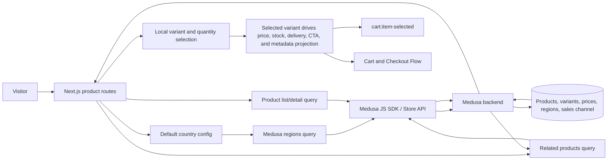

# Catalog Browsing Flow

## 1. Intent

Let a storefront visitor discover sellable products for their selected region, read the active locale's product content, inspect product details, choose a valid variant, and hand the chosen item to the cart flow.

Success criteria:

- Visitor sees only published products available through the storefront sales channel.
- Product cards and product detail pages render localized content prepared by `flows/features/catalog-localization.md`.
- Product detail headline price, stock, and delivery promise reflect the currently selected variant as a single source of truth.
- Product detail navigation, gallery, and mobile purchase controls keep the purchase path clear on desktop and mobile.
- Variant selection produces a concrete `{ productId, variantId, quantity, regionId }` handoff.
- Missing region, unavailable product, or invalid variant selection is rejected before cart mutation.

## 2. Scope

In scope:

- Region-aware product listing.
- Product detail viewing from the product list.
- Rendering localized catalog content supplied by `flows/features/catalog-localization.md`.
- Variant display, product-gallery interaction, and local variant selection on product detail.
- Product detail merchandising blocks: breadcrumb, structured product facts, stock/delivery messaging, social-proof placeholder, and related products.
- Quantity selection and cart handoff when the cart flow is implemented.

Out of scope:

- Search ranking, wishlists, and personalization.
- Admin creation/editing of catalog data; see `flows/features/admin-operations.md`.
- Cart creation, cart persistence, checkout, and payment; see `flows/features/cart-checkout.md`.

Deferred decisions:

- Explicit region selection UI and geolocation-based region inference. v0 still uses `NEXT_PUBLIC_DEFAULT_REGION` and falls back to `dk`; unsupported configured values render an unsupported-region state. Locale-prefixed routing is covered separately by `flows/features/catalog-localization.md`.
- Whether out-of-stock products are hidden or displayed as unavailable. v0 displays Store API sellable products returned by Medusa and disables purchase actions when a selected variant is not available.
- Final SUNLUK production product data. v0 renders whatever published Store API products Medusa returns for the configured region/sales channel.

## 3. Actors and Permissions

| Actor | Permissions | Authority source |
|---|---|---|
| Anonymous visitor | View published storefront catalog; choose variants | Medusa store API publishable key and sales channel visibility |
| Authenticated customer | Same as anonymous visitor, plus customer-specific pricing if configured later | Medusa customer/session state |
| Admin user | Controls products, prices, categories, inventory, regions | Medusa admin API/admin dashboard |

## 4. Diagrams

### User flow

```mermaid
flowchart TD
  Start[Visitor opens product list] --> ConfigRegion[Read configured default country]
  ConfigRegion --> Region{Supported region found?}
  Region -->|no| Unsupported[Show unsupported-region error]
  Region -->|yes| LoadCatalog[Load published products for region]
  LoadCatalog --> Loaded{Request succeeded?}
  Loaded -->|no| CatalogError[Show retryable catalog error]
  Loaded -->|yes| Products{Products returned?}
  Products -->|no| Empty[Show empty catalog state]
  Products -->|yes| List[Show product list]
  List --> Detail[Open product detail by handle]
  Detail --> DetailLoad{Product found for region?}
  DetailLoad -->|no| NotFound[Show not found]
  DetailLoad -->|yes| ProductView[Show product detail]
  ProductView --> Gallery[Browse gallery, open lightbox, switch media]
  ProductView --> Variant{Valid variant selected?}
  Variant -->|no| DisableAdd[Keep add-to-cart disabled and explain missing choice]
  Variant -->|yes| MerchState[Update price, stock, delivery, and CTA from selected variant]
  MerchState --> Quantity{Quantity valid?}
  Quantity -->|no| RejectQty[Reject quantity]
  Quantity -->|yes| Handoff[Emit cart:item-selected when cart flow is wired]

### State machine

```mermaid
stateDiagram-v2
  [*] --> RegionResolving
  RegionResolving --> RegionSelected: default country belongs to supported region
  RegionResolving --> RegionUnsupported: default country unsupported
  RegionSelected --> CatalogLoading: request catalog
  CatalogLoading --> CatalogReady: products loaded
  CatalogLoading --> CatalogEmpty: no products
  CatalogLoading --> CatalogError: request failed
  CatalogReady --> ProductViewing: product opened by handle
  ProductViewing --> ProductNotFound: handle missing, unpublished, or not sellable in region
  ProductViewing --> GalleryReady: gallery sources resolved
  GalleryReady --> LightboxOpen: visitor opens hero image
  LightboxOpen --> GalleryReady: visitor closes lightbox
  ProductViewing --> VariantIncomplete: product loaded but required options missing
  VariantIncomplete --> VariantSelected: all options resolve to variant
  ProductViewing --> VariantSelected: default selection resolves to variant
  VariantSelected --> MerchandisingReady: price, stock, delivery, metadata, and CTA derived from selected variant
  MerchandisingReady --> ReadyForCart: quantity valid
  ReadyForCart --> [*]: cart:item-selected when cart flow is wired
  CatalogError --> CatalogLoading: retry
```

### Data/event flow



## 5. State and Projections

Authoritative state:

- Products, categories, variants, prices, regions, inventory and sales channel membership live in Medusa.
- Seed data currently creates Europe region, default sales channel, product categories, products, variants, prices, stock location, and shipping options in `backend/apps/backend/src/migration-scripts/initial-data-seed.ts`.

Storefront projection:

- Selected default region/country resolved from configuration.
- Product list response for that region.
- Product detail response selected by product handle.
- Local gallery state, selected variant option state, and lightbox visibility on product detail.
- Variant-derived price, stock, delivery promise, breadcrumb, and related-products projection before cart handoff.
- Local quantity input before cart handoff.

## 6. Events/Actions

| Direction | Name | Target flow | Payload | Allowed when | Reject reason |
|---|---|---|---|---|---|
| Incoming | `catalog:published` | Catalog Browsing | `{ productIds?, categoryIds?, regionIds?, salesChannelIds? }` | Admin publishes catalog data in Medusa | Not applicable to storefront |
| Incoming | `catalog:localized-content-ready` | Catalog Browsing | `{ locale, medusaLocale, fallbackProductIds? }` | Catalog localization has resolved locale-aware content for rendering | Localized read failed upstream |
| Internal | `catalog:region-selected` | None | `{ regionId, countryCode }` | Configured country belongs to supported region | Unsupported country |
| Internal | `catalog:product-opened` | None | `{ productHandle, regionId }` | Region known and product handle exists | Missing region or product not sellable |
| Internal | `catalog:variant-projected` | None | `{ productId, variantId, price, currencyCode, availability, deliveryPromise }` | Variant selection resolves to a sellable or backorderable variant | Missing variant |
| Outgoing | `cart:item-selected` | Cart and Checkout | `{ productId, variantId, quantity, regionId }` | Variant is valid, quantity is positive, and cart UI is enabled | Missing variant, invalid quantity, unavailable product |

## 7. Edge Cases

- Configured default country is missing: use `dk` for v0 and keep the selected region visible in code/config, not hardcoded in UI copy.
- Configured/default country is unsupported: show a clear unsupported-region state; do not fall back silently to another region after a failed lookup.
- Product exists but is unpublished or not in storefront sales channel: treat as not found for visitors.
- Product detail handle does not exist: render Next.js not-found state.
- Variant options do not resolve to a variant: keep add-to-cart disabled.
- Quantity is zero, negative, or not an integer: reject locally before any cart handoff.
- Selected variant is out of stock but backorderable: show backorder messaging, keep CTA enabled, and surface the delivery promise near the CTA.
- Selected variant has low stock: show urgency messaging near the CTA without changing price behavior.
- Product/variant becomes unavailable between detail load and cart handoff: cart flow must revalidate through Medusa.
- Store API request fails: show retryable error without mutating cart state.
- Gallery has one image only: hide non-functional gallery controls and lightbox rail affordances.
- Requested locale has partial or missing translations: render the fallback content produced by catalog-localization and keep catalog pricing/variant behavior unchanged.

## 8. Side Effects

- Storefront navigation from localized product list routes to localized product detail routes.
- Region selection/config affects product prices and cart compatibility, while locale affects only content projection.
- `catalog:localized-content-ready` feeds localized title/description into catalog list/detail rendering.
- Selected variant changes update the headline price, stock label, delivery promise, sticky/mobile CTA, and metadata projection from the same variant-derived source.
- Product detail renders breadcrumb context and related-product continuation without mutating catalog or cart state.
- `cart:item-selected` begins cart mutation in the cart flow once the cart UI is wired; current product-screen slice may render disabled/pending add-to-cart if cart flow is not yet implemented.

## 9. Schemas Touched

Expected implementation files for the product-list-to-product-detail slice:

- `storefront/src/app/products/page.tsx`.
- `storefront/src/app/products/[handle]/page.tsx`.
- `storefront/src/lib/medusa.ts`.
- `storefront/src/lib/medusa/regions.ts`.
- `storefront/src/lib/medusa/products.ts`.
- `storefront/src/lib/price.ts`.
- `storefront/src/components/product/ProductCard.tsx`.
- `storefront/src/components/product/ProductGrid.tsx`.
- `storefront/src/components/product/ProductGallery.tsx`.
- `storefront/src/components/product/ProductFacts.tsx`.
- `storefront/src/components/product/ProductRelatedProducts.tsx`.
- `storefront/src/components/product/VariantSelector.tsx`.
- `storefront/src/components/product/PriceDisplay.tsx`.
- Medusa Store API product, region, and pricing response types from `@medusajs/js-sdk`.

Current files that inform the flow:

- `backend/apps/backend/src/migration-scripts/initial-data-seed.ts`.
- `backend/apps/backend/medusa-config.ts`.

## 10. Targeted Tests

| Layer | Behavior | File | Status |
|---|---|---|---|
| Storefront unit | Region resolver chooses configured/default country only when Medusa returns a supported region | `storefront/src/lib/medusa/regions.test.ts` or nearest project test equivalent | Pending implementation |
| Storefront unit | Product price projection derives headline price from the selected variant and shares one formatter/source across PDP callers | `storefront/src/lib/price.test.ts` or nearest project test equivalent | Pending implementation |
| Storefront UI/integration | Product list links each product card to `/products/[handle]` | To add with storefront catalog implementation | Pending implementation |
| Storefront UI/integration | Product detail for unknown/unpublished handle renders not found/error state | To add with product detail implementation | Pending implementation |
| Storefront UI/integration | Variant selection updates headline price, stock, and CTA state from the same variant source | To add with product detail implementation | Pending implementation |
| Storefront UI/integration | Product gallery thumbnails switch the hero image and lightbox navigation remains available on mobile/desktop | To add with product detail implementation | Pending implementation |
| Storefront UI/integration | Sticky mobile CTA reflects selected variant price/availability and remains disabled for invalid selections | To add with product detail implementation | Pending implementation |
| Storefront UI/integration | Product detail renders breadcrumb and related products when catalog context is available | To add with product detail implementation | Pending implementation |
## 11. Implementation Plan

1. Extract shared price/availability projection helpers so PDP headline, selector, and cards consume the same source.
2. Upgrade `/products/[handle]` to render breadcrumb, interactive gallery, richer stock/delivery messaging, and structured product facts.
3. Add sticky mobile purchase controls driven by the selected variant projection.
4. Add related products and social-proof placeholder blocks without coupling PDP to checkout state.
5. Add localized metadata/JSON-LD and targeted tests for variant-driven PDP behavior.

## 12. Implementation Trace

Current status: base product-list-to-product-detail slice implemented; PDP merchandising overhaul specified and pending implementation.

Current implementation files:

- `storefront/src/app/[locale]/products/[handle]/page.tsx`
- `storefront/src/lib/medusa/products.ts`
- `storefront/src/lib/price.ts`
- `storefront/src/components/product/ProductGallery.tsx`
- `storefront/src/components/product/ProductInfoBlock.tsx`
- `storefront/src/components/product/VariantSelector.tsx`
- `storefront/src/components/product/PriceDisplay.tsx`
- `storefront/src/components/product/types.ts`
- `storefront/src/components/product/index.ts`

Pending implementation files:

- `storefront/src/components/product/ProductFacts.tsx`
- `storefront/src/components/product/ProductRelatedProducts.tsx`

Validation:

- Pending after PDP merchandising implementation.

Notes:

- `/` landing remains active.
- `/products` resolves the configured/default region and lists Medusa Store API products.
- `/products/[handle]` resolves the same region, loads product detail by handle, and renders not-found for missing products.
- Cart mutation remains deferred to `flows/features/cart-checkout.md`; variant UI resolves a valid variant but leaves the cart CTA disabled with pending copy.

## 13. Open Questions

- Should production default region remain Denmark (`dk`) or use a different first market for Sunluk? v0 proceeds with `NEXT_PUBLIC_DEFAULT_REGION ?? "dk"` until product chooses otherwise.
- Should region selection later be explicit, inferred, or both? v0 defers selector UI.
- Should localized product attributes beyond title/description (for example option labels or merchandising copy) be part of catalog browsing v1 or remain in `flows/features/catalog-localization.md` as a follow-up?
- Should unavailable products be hidden or shown with disabled purchase actions? v0 follows Store API product visibility and disables impossible variant/cart actions.

## 14. Review Checklist

- [x] Region boundary is explicit before catalog/cart operations.
- [x] Product visibility depends on Medusa published/sales-channel state.
- [x] Variant and quantity are validated before cart handoff.
- [x] Cross-flow `cart:item-selected` appears in architecture and cart flow.
- [x] Product list -> detail route is explicit for the current implementation slice.
- [x] v0 region fallback is explicit and does not silently mask unsupported configured regions.
- [x] Localized product content dependency is explicit via `catalog:localized-content-ready`.
