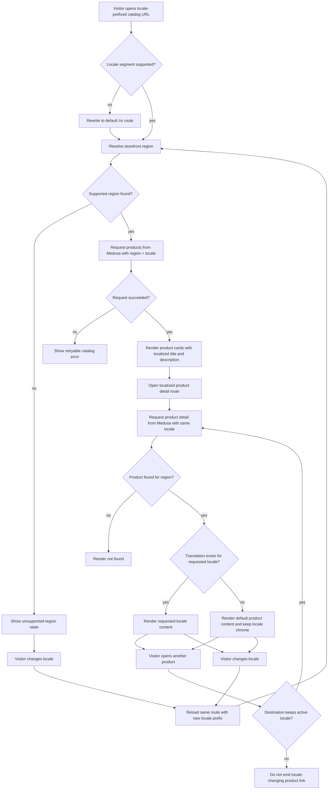
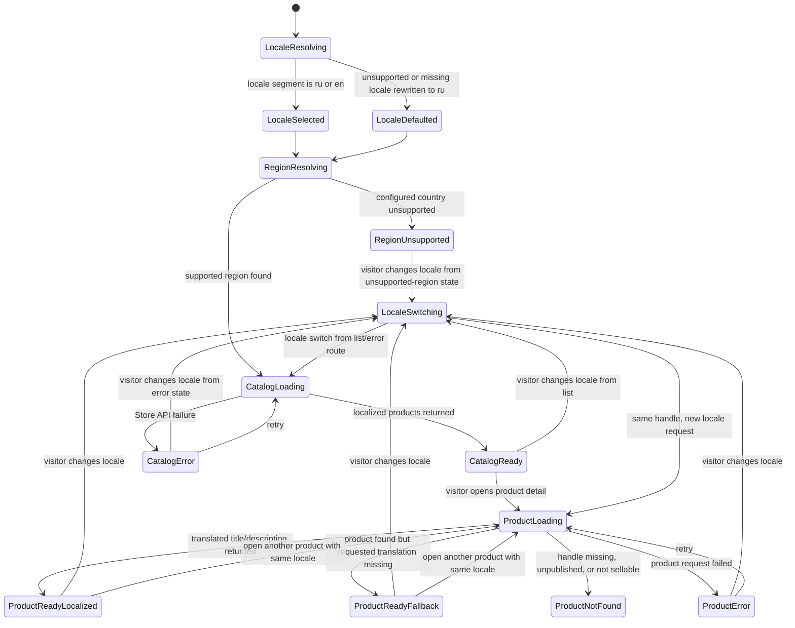

# Catalog Localization Flow

## 1. Intent

Let a storefront visitor read product content in Russian or English while v0 uses the route locale as a market default only when no explicit country is supplied; Medusa remains authoritative for the resolved region, currency, pricing, and availability.

Success criteria:

- Storefront supports exactly two customer-facing locales for v1: `ru` -> `ru-RU` and `en` -> `en-US`.
- Product list and product detail pages request Medusa product content in the active locale on every server render.
- Product `title` and `description` fall back to the product's default Medusa content when a requested translation is missing.
- With no explicit country, `ru-RU` resolves Russia and other locales resolve `NEXT_PUBLIC_DEFAULT_REGION ?? "dk"`; an explicit country always takes precedence.
- Admin-managed translations become visible in storefront without requiring storefront-side product duplication.
- Every product-to-product navigation link preserves the active supported locale; opening a related product from `/en/...` stays under `/en/...`, and `/ru/...` stays under `/ru/...`.

## 2. Scope

In scope:

- Locale-aware routing for storefront catalog pages.
- Locale-aware Store API product list/detail reads.
- Rendering localized `title` and `description` on product cards and product detail views.
- Translating catalog-page UI copy needed for the localized product experience.
- Admin workflow for maintaining product translations in Medusa.
- Locale-preserving product links in catalog grids and related-product sections.

Out of scope:

- Localized product handles, category slugs, or separate SEO slugs per language.
- Full-store translation of checkout, cabinet, landing page, or admin chrome outside the catalog slice.
- Automatic machine translation or AI-generated translations.
- Explicit country/region selection UI and geolocation.

Deferred decisions:

- Whether to localize additional product attributes (material labels, option names, variant labels, shipping copy) in the same slice or a follow-up slice.
- Whether to add browser-language auto-redirect on first visit. v1 supports explicit locale-prefixed URLs only.

Chosen v1 decisions:

- Storefront routes are locale-prefixed: `/ru/...` and `/en/...`.
- Product handles remain stable across locales.
- Medusa Store API locale values are `ru-RU` and `en-US`.
- Locale-to-market default is `ru-RU -> ru`; `en-US` uses `NEXT_PUBLIC_DEFAULT_REGION ?? "dk"` until explicit country selection exists.

## 3. Actors and Permissions

| Actor | Permissions | Authority source |
|---|---|---|
| Anonymous visitor | Open localized catalog URLs, switch between supported locales, view localized published product content | Next.js locale routing + Medusa Store API publishable access |
| Authenticated customer | Same as anonymous visitor; locale choice does not grant extra catalog access | Next.js locale routing + Medusa customer/session state |
| Admin user | Configure supported store locales and maintain product translations | Medusa Admin authentication/authorization |
| Medusa backend | Stores source product data and translations; applies locale fallback for Store API responses | Medusa modules and translation subsystem |

## 4. Diagrams

### User flow



### State machine


### Data/event flow

```mermaid
flowchart LR
  Visitor[Visitor] --> Route[Next.js /[locale]/products routes]
  Route --> LocaleMap[Locale routing map ru->ru-RU en->en-US]
  Route --> RegionResolver[Region resolver]
  LocaleMap --> ProductQuery[Request-scoped product query]
  RegionResolver --> ProductQuery
  ProductQuery --> SDK[Medusa Store SDK / API]
  SDK --> Backend[Medusa backend]
  Backend --> ProductStore[(Products + translations + region pricing)]
  ProductStore --> Backend
  Backend --> LocalizedProjection[Localized Store API response or source fallback]
  LocalizedProjection --> Route
  Admin[Medusa Admin user] --> AdminUI[Medusa Admin translations/settings]
  AdminUI --> Backend
  Backend --> PublishEvent[catalog:published]
  Backend --> TranslationEvent[catalog:translation-published]
  PublishEvent --> Localization[Catalog Localization Flow]
  TranslationEvent --> Localization
  Localization --> Catalog[Catalog Browsing Flow]
```

## 5. State and Projections

Authoritative state:

- Product source content, translation records, supported store locales, and fallback behavior live in Medusa.
- Region, currency, pricing, inventory, and publishability remain Medusa-owned; locale supplies only the v0 default country when no explicit country is present.

Storefront projection:

- Active route locale (`ru` or `en`).
- Derived Medusa locale code (`ru-RU` or `en-US`).
- Region resolved from explicit country first, otherwise the locale market default.
- Localized product list/detail response for the current locale.
- Fallback rendering state when the product exists but requested translation fields are absent.
- Every catalog card and related-product link derives its locale prefix from the active route projection; components must not default a supported `en` route back to `ru`.

Admin projection:

- Medusa Admin locale configuration.
- Product translation editing surface for translated `title` and `description`.

## 6. Events/Actions

| Direction | Name | Target flow | Payload | Allowed when | Reject reason |
|---|---|---|---|---|---|
| Incoming | `catalog:published` | Catalog Localization | `{ productIds?, categoryIds?, regionIds?, salesChannelIds? }` | Admin publishes products that the storefront may read | None; publishing is authoritative input from Medusa admin state |
| Incoming | `catalog:translation-published` | Catalog Localization | `{ productIds, locales }` | Admin saves product translations for supported locales | Unsupported locales are ignored by storefront routing until explicitly enabled |
| Internal | `catalog:locale-selected` | None | `{ locale: "ru" | "en", medusaLocale: "ru-RU" | "en-US", localeDefaultCountry: string, source: "ru-locale" | "configured" | "dk-fallback" }` | Route locale is supported or rewritten to default; `localeDefaultCountry` follows the named source | Unsupported locale outside configured set |
| Internal | `catalog:localized-products-requested` | None | `{ regionId, locale, medusaLocale }` | Locale and its resolved region are both known | Missing locale or unresolved region |
| Internal | `catalog:product-navigation-requested` | None | `{ locale: "ru" | "en", handle }` | Destination link uses the active supported route locale | Link omits locale or changes a supported active locale |
| Outgoing | `catalog:localized-content-ready` | Catalog Browsing | `{ locale, medusaLocale, fallbackProductIds? }` | Localized catalog or product detail payload is ready for rendering | Store API request failed |
| Outgoing shared data | `catalog:locale-routing-map` | SEO Readiness | `{ locales, defaultLocale, localeMarketDefaults, stableProductHandles }` | Storefront routing configuration is loaded | Unsupported locale or localized handle divergence |

## 7. Edge Cases

- Visitor requests `/de/products`: storefront rewrites to `/ru/products`; it does not guess or preserve an unsupported locale.
- Locale market default and an explicit country disagree: explicit country wins. Until a country selector exists, `ru` routes use Russia while `en` routes use the configured/default non-Russia country.
- Medusa product exists but requested translation is missing: render default product `title`/`description` and keep the rest of the page in the requested UI locale.
- Translation exists for title but not description: field-level fallback applies only to the missing field; do not blank the field.
- Product detail route handle is stable across locales; switching locale on a valid handle must keep the same handle.
- Language switch occurs while using a singleton SDK with stale locale headers: forbidden implementation; requests must be request-scoped or explicitly locale-scoped to avoid cross-request leakage.
- Visitor opens a related product from `/en/products/[handle]`: destination must remain `/en/products/[nextHandle]`; silently defaulting to `/ru/...` is forbidden.
- Seed data contains mixed-language source titles/descriptions: until translations are populated, fallback content may remain mixed; rollout must treat this as incomplete merchandising data, not a storefront bug.
- Admin saves translation for a locale that storefront does not support: Medusa may store it, but storefront ignores it until the locale is added to routing.
- Store API localization request fails while base catalog would otherwise load: show retryable error; do not silently retry without locale because that would hide a backend misconfiguration.

## 8. Side Effects

- Storefront navigation uses locale-prefixed catalog URLs.
- Language switch reloads the same catalog route under a different locale prefix.
- Product cards and related-product links preserve the active locale prefix while changing only the product handle.
- Store API requests include locale alongside region for every catalog/product read.
- Admin translation edits become visible on the next storefront revalidation/request.
- Fallback rendering may expose source-language product copy until translations are filled; merchandising operations must monitor this during rollout.

## 9. Schemas Touched

Expected implementation files for this slice:

- `storefront/src/middleware.ts`.
- `storefront/src/i18n/routing.ts`.
- `storefront/src/i18n/request.ts`.
- `storefront/messages/ru.json`.
- `storefront/messages/en.json`.
- `storefront/src/app/[locale]/layout.tsx`.
- `storefront/src/app/[locale]/products/page.tsx`.
- `storefront/src/app/[locale]/products/[handle]/page.tsx`.
- `storefront/src/lib/medusa.ts` or a request-scoped Store API client helper replacing the current locale-unsafe singleton path.
- `storefront/src/lib/medusa/products.ts`.
- `storefront/src/components/product/ProductCard.tsx`.
- `storefront/src/components/product/ProductInfoBlock.tsx`.
- `storefront/src/components/product/ProductGrid.tsx`.
- `storefront/src/components/product/ProductRelatedProducts.tsx`.
- `storefront/src/components/cart/CartDrawer.tsx`.
- `storefront/src/components/product/types.ts`.
- `backend/apps/backend/medusa-config.ts`.
- `backend/apps/backend/src/scripts/initial-data-seed.ts`.
- `backend/apps/backend/src/scripts/update-product-cards.ts`.
- `backend/apps/backend/src/admin/i18n/index.ts` if custom admin translation helpers are needed.

Current files that inform the flow:

- `flows/features/catalog-browsing.md`.
- `flows/features/admin-operations.md`.
- `storefront/src/app/layout.tsx`.
- `storefront/src/app/products/page.tsx`.
- `storefront/src/app/products/[handle]/page.tsx`.
- `storefront/src/lib/medusa.ts`.
- `storefront/src/lib/medusa/products.ts`.
- `storefront/src/lib/medusa/regions.ts`.
- `storefront/src/lib/__tests__/region-resolution.test.ts`.

## 10. Targeted Tests

| Layer | Behavior | File | Status |
|---|---|---|---|
| Storefront unit | Locale router maps `ru`/`en` to `ru-RU`/`en-US` and rejects unsupported locale prefixes | `storefront/src/i18n/routing.test.ts` or nearest project test equivalent | Pending implementation |
| Storefront unit | Explicit country wins; omitted country maps `ru-RU -> ru`, otherwise configured country or `dk` | `storefront/src/lib/__tests__/region-resolution.test.ts` | Passed 2026-08-11 |
| Storefront integration | Product list sends both `region_id` and locale to Medusa on `/[locale]/products` | `storefront/src/lib/medusa/products.test.ts` or nearest project test equivalent | Pending implementation |
| Storefront integration | Product detail keeps same handle when switching between `/ru/products/[handle]` and `/en/products/[handle]` | To add with localized route implementation | Pending implementation |
| Storefront integration | Missing translation falls back to source content for only the missing field | `storefront/src/lib/medusa/products.test.ts` or nearest project test equivalent | Pending implementation |
| Backend integration | Store API returns translated `title`/`description` for populated locales and source fallback otherwise | `backend/integration-tests/http/store/product-localization.spec.ts` or nearest project test equivalent | Pending implementation |
| Manual/admin QA | Updating a product translation in Medusa Admin is reflected in storefront after revalidation | Manual admin QA checklist for launch | Pending implementation |
| Storefront browser smoke | RU/EN product detail renders localized title, subtitle, Wear It Your Way metadata, and included-kit metadata | `/ru/products/azure` and `/en/products/azure` | Passed 2026-07-15 |
| Backend migration smoke | Product-card migration is rerunnable and Store API exposes all six localized launch products without legacy handles | `backend/apps/backend/src/scripts/update-product-cards.ts` | Passed 2026-07-15 |
| Storefront browser smoke | Related-product navigation preserves `/en` and `/ru` locale prefixes | `/en/products/azure` and `/ru/products/azure` | Passed 2026-07-15 |

## 11. Implementation Plan

1. Add storefront locale routing and message catalogs for `ru` and `en` using locale-prefixed routes.
2. Replace locale-unsafe product SDK usage with request-scoped locale-aware Store API reads.
3. Localize product list/detail pages and product card/detail/cart components for UI copy, localized `title`/`subtitle`/`description`, material names, and locale-keyed product metadata.
4. Enable Medusa locales/translations configuration and seed or migrate RU/EN product translations plus locale-keyed merchandising metadata.
5. Add targeted tests for locale mapping, Medusa request payloads, field-level fallback, Store API translated responses, and metadata rendering.
6. Pass the active route locale through related-product/grid rendering so every product destination changes only the handle.
7. Add a focused region-resolution test for explicit-country precedence and both locale-default branches.

## 12. Implementation Trace

Current status: Completed. Locale routing, request-scoped Store API reads, v0 locale market defaults, localized merchandising content/material names, and locale-preserving related-product navigation are integrated.

Flow review: APPROVED 2026-07-15. The locale-preserving navigation contract has explicit rejection behavior, concrete browser checks, named files, and no new cross-flow event.

Implementation files:

- `storefront/src/proxy.ts`
- `storefront/src/i18n/routing.ts`
- `storefront/src/i18n/request.ts`
- `storefront/messages/ru.json`
- `storefront/messages/en.json`
- `storefront/src/app/[locale]/layout.tsx`
- `storefront/src/app/[locale]/products/page.tsx`
- `storefront/src/app/[locale]/products/[handle]/page.tsx`
- `storefront/src/lib/medusa.ts`
- `storefront/src/lib/medusa/products.ts`
- `storefront/src/lib/medusa/regions.ts`
- `storefront/src/components/product/ProductCard.tsx`
- `storefront/src/components/product/ProductInfoBlock.tsx`
- `storefront/src/components/cart/CartDrawer.tsx`
- `storefront/src/components/product/ProductGrid.tsx`
- `storefront/src/components/product/ProductRelatedProducts.tsx`
- `storefront/src/components/product/types.ts`
- `storefront/src/lib/__tests__/region-resolution.test.ts`
- `backend/apps/backend/medusa-config.ts`
- `backend/apps/backend/src/scripts/initial-data-seed.ts`
- `backend/apps/backend/src/scripts/update-product-cards.ts`

Validation:

- `npm run build --prefix storefront` completed successfully.
- `npx tsc --noEmit` in `backend/apps/backend` completed successfully.
- `npx medusa exec ./src/scripts/update-product-cards.ts` completed successfully twice against the local database.
- Store API returned `azure`, `dune`, `luna`, `silk`, `amethyst`, and `lagoon` with localized copy/metadata and no legacy handles.
- Browser smoke passed for `/ru/products/azure` and `/en/products/azure`, including subtitle and both metadata accordions.
- Browser navigation passed from `/en/products/azure` to `/en/products/dune` and from `/ru/products/azure` to `/ru/products/dune`.
- 2026-08-11 `region-resolution.test.ts` passed explicit-country precedence, `ru-RU -> ru`, configured-country, `dk` fallback, and unsupported-country branches; the final storefront suite passed 20 files / 128 tests.

## 13. Open Questions

- Should the storefront remember the last chosen locale in a cookie in addition to the URL prefix, or is the URL alone sufficient for v1?
- Should launch QA block publication of products that are missing either RU or EN translation, or is source-language fallback acceptable during staged rollout?

## 14. Review Checklist

- [x] Locale and its v0 market-default effect on region are explicit; Medusa remains commerce authority and explicit country takes precedence.
- [x] Missing translation fallback is explicit.
- [x] Unsupported locale handling is explicit.
- [x] Product handles remain stable across locales.

- [x] Locale-aware Store API reads and locale-unsafe singleton risk are named.
- [x] Admin translation publication boundary is declared.
- [x] Targeted tests cover both localized and fallback paths.
- [x] Product-to-product navigation preserves the active supported locale.
Flow review v2 (2026-08-11): **APPROVED**. Explicit-country precedence, locale market defaults, exact payloads, and the focused resolver test clear the Approval Bar.
