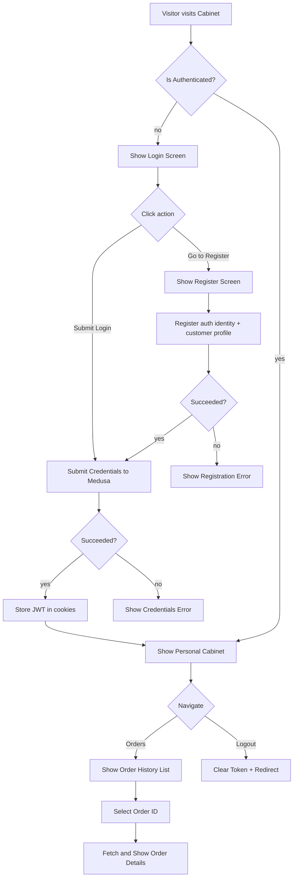
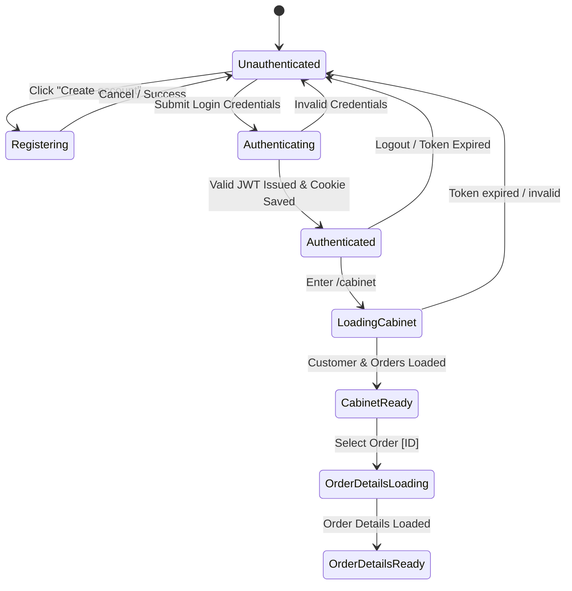
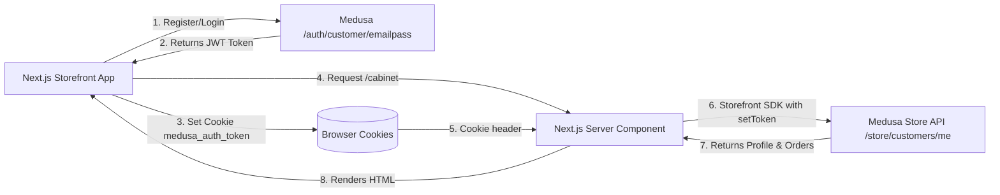

# Customer Cabinet and Authentication Flow

## 1. Intent

Let a customer register an account, log in securely using JWT tokens, view and manage their personal account (Cabinet), browse their order history, and inspect the real-time status of their past orders.

Success criteria:
- Customer can sign up with name, email, and password.
- Customer can log in with valid credentials, storing the session securely using JWT in HTTP-accessible cookies.
- Server Components and Client Components share the authentication state seamlessly.
- Authenticated users can view their profile details and a list of their past orders fetched from Medusa Store API.
- Authenticated users can view detailed information for any specific order they placed.
- Unauthenticated users trying to access `/cabinet` are gracefully redirected to the login page.
- Localization supports both English and Russian via `next-intl`.

## 2. Scope

In scope:
- Customer Registration (`/register`).
- Customer Login (`/login`).
- Personal Account Dashboard (`/cabinet` / `/account`).
- Order History listing (`/cabinet/orders` or inline on dashboard).
- Order details viewing (`/cabinet/orders/[id]`).
- Shared JWT token synchronization between client and server via Cookies (`medusa_auth_token`).
- Full localization (EN/RU).

Out of scope:
- Advanced profile management (password change, deleting account, address book).
- Password reset/forgot flow.
- Admin management of customer groups or orders (see `flows/features/admin-operations.md`).

## 3. Actors and Permissions

| Actor | Permissions | Authority source |
|---|---|---|
| Anonymous visitor | Register, login, view public landing pages | Medusa auth / store API public credentials |
| Authenticated customer | View personal cabinet, retrieve own order history, check order details | Medusa Customer Module & Store API with JWT authentication |
| Medusa backend | Validates credentials, mints JWT tokens, holds authoritative order data | Medusa auth-service & order-module |

## 4. Diagrams

### User flow

### State machine

### Data/event flow

## 5. State and Projections

Authoritative state:
- Customer auth identities, profiles, and historical orders live securely in Medusa backend.

Storefront projection:
- `medusa_auth_token` cookie containing the active customer JWT token.
- Local state for active tab (Profile vs Orders) and loading/error states in forms.

## 6. Events/Actions

| Direction | Name | Target flow | Payload | Allowed when | Reject reason |
|---|---|---|---|---|---|
| Incoming | `customer:logged-in` | Customer Cabinet | `{ jwtToken, customer }` | Valid credentials submitted | Unauthorized |
| Outgoing | `auth:session-cleared` | Global Storefront | None | User clicks Logout or session expires | None |

## 7. Edge Cases

- **Token Expiry**: If a token expires while browsing, API calls to `/store/customers/me` will return a `401 Unauthorized` error. The client/server must capture this, clear the cookie, and redirect to `/login`.
- **Order not found / doesn't belong to customer**: Medusa naturally isolates orders per customer. Querying another customer's order ID returns a 404 or empty list. The storefront must render an elegant "Order not found" error.
- **Partially completed registration**: If identity creation succeeds but customer profile creation fails, registration must catch this and offer a retry or fallback login.

## 8. Performance Constraints

- Serve the primary Cabinet view using Next.js Server Components where possible (leveraging cookie-based auth headers) to minimize layout shifts (CLS) and keep First Contentful Paint (FCP) extremely fast.

## 9. Accessibility and UX Rules

- Keep forms completely keyboard navigable (Tab navigation, automatic focus on error).
- All input fields must have appropriate labels and clear validation/error messages.
- Active states and buttons must have loading/disabled overlays during network calls.

## 10. Localization / Copy

Support English and Russian via `next-intl`.

Key namespaces:
- `Cabinet`: Profile dashboard, Greeting, "Logged in as", Logout.
- `Auth`: Email, Password, First Name, Last Name, Log In, Sign Up, "Don't have an account?", "Already have an account?", Authentication errors.
- `Orders`: "My Orders", Order ID, Date, Status, Total, "No orders placed yet", "Items in order", Delivery/Shipping Address, Payment Status.

## 11. Security Best Practices

- Store the JWT token in an `HTTP` cookie (or accessible cookie configured with secure attributes depending on hosting requirements).
- Clear the JWT token entirely on client and server upon logout.
- Protect `/cabinet` and its sub-routes with server-side middleware or route guards to prevent flashes of unauthenticated content.

## 12. Implementation Trace

- Active branch: `feat/user-cabinet`
- Next.js Router page routes:
  - `storefront/src/app/login/page.tsx` — Login form with email/password, client-side validation, loading/error states, redirects authenticated users to /cabinet
  - `storefront/src/app/register/page.tsx` — Registration form with first name, last name, email, password, client-side validation, loading/error states, redirects authenticated users to /cabinet
  - `storefront/src/app/cabinet/page.tsx` — Personal cabinet dashboard: customer profile card + order history table with status icons, payment status, totals; server component with redirect to /login when unauthenticated
  - `storefront/src/app/cabinet/LogoutButton.tsx` — Client component for logout action (clears cookie, clears SDK auth, redirects to /login)
  - `storefront/src/app/cabinet/orders/[id]/page.tsx` — Order detail view: items table, subtotals, shipping/tax/discount/total, shipping/billing addresses, status badges; server component with 404 handling
- Medusa Service API extensions:
  - `storefront/src/lib/medusa/customer.ts` — `OrderSummary` type, `CookieJwtStorage` interface, `CustomerStorage` client-side cookie I/O, `getServerAuthToken()` / `createServerAuthClient()` for per-request server SDK, `getClientMedusaClient()` singleton for browser, `loginCustomer()` / `registerCustomer()` / `logoutCustomer()` auth actions, `getCustomer()` / `getCustomerOrders()` / `getCustomerOrder()` server data fetchers
- Localization: All strings are in Russian (primary), organized as `const T` objects in each page for easy future extraction to `next-intl` message files.
## 13. Open Questions

- Should guest orders be linkable to accounts retroactively? Deferred for v1.
- Do we support editing profile details? Defer to a future profile flow.

## 14. Review Checklist

- [x] JWT token cookie storage is securely managed and shared between client/server.
- [x] Profile page loading states are smooth and don't layout shift.
- [x] Russian and English localization fully integrated.
- [x] Unauthorized cabinet access results in direct route redirection.
- [x] Order list displays statuses correctly synced with Medusa backend.
