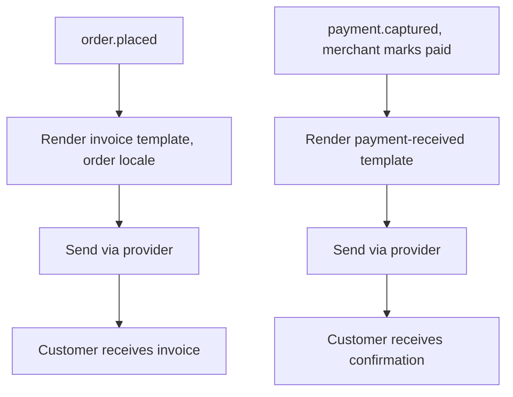
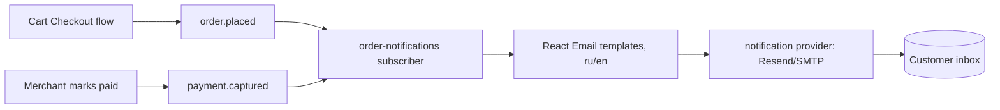

# Order Email Notifications Flow

## 1. Intent

Send the customer a branded, localized **invoice email** when they place an order (no online acquiring — payment is offline by invoice/bank transfer), and a **payment-received email** when the merchant marks the order as paid. Product photos, selected variant/options, and Medusa-returned totals are rendered in the email. No payment gateway is involved; the manual `pp_system_default` provider completes the cart into an order.

Success criteria:

- An order placed via the storefront triggers exactly one invoice email to the order's contact email.
- The invoice email lists every line item with its image, title, selected variant/options, quantity, unit price, and line total; packaging add-ons appear as their own lines.
- All monetary values in the email come from Medusa (subtotal, shipping, tax, grand total) — the email never computes totals.
- The email is rendered in the order's persisted locale (`metadata.locale`, `ru` or `en`); a missing locale falls back to `ru`.
- When the merchant marks the order paid (`payment.captured`), exactly one payment-received email is sent.
- Email sending failures are retried and never silently drop; duplicate events do not produce duplicate user-visible emails.

## 2. Scope

In scope:

- Subscriber on `order.placed` → render + send invoice email.
- Subscriber on `payment.captured` (merchant marks order paid) → render + send payment-received email.
- A notification provider module (Resend by default; SMTP-compatible) that renders React Email templates and dispatches.
- Localized (ru/en) templates driven by the order's locale.
- Invoice content: order number, date, line items with image + variant/options + qty + unit price + line total, totals (Medusa), payment instructions placeholder, link to the cabinet order page.

Out of scope:

- Online payment / acquiring (not required; manual invoice only).
- PDF invoice attachment (deferred — HTML email only for v1).
- Shipping/tracking email (deferred; can be added on `order.shipment_created` later).
- Marketing/transactional emails unrelated to order placement or payment.
- Payment instruction content (IBAN / Russian account details) — rendered from a config placeholder the client fills.

Deferred decisions:

- SMTP provider vs Resend if Resend free-tier limits are hit or a second sending domain is required.
- PDF invoice generation (v2).
- Optional payment deadline display in the invoice.

## 3. Actors and Permissions

| Actor | Permissions | Authority source |
|---|---|---|
| Customer | Receives invoice and payment-received emails at the contact address given at checkout | Medusa order `email` |
| Merchant (admin) | Marks an order paid, which triggers the payment-received email | Medusa Admin / payment capture |
| Medusa backend | Authoritative order, line items, totals, payment status, locale | Medusa modules / events |
| Email provider (Resend/SMTP) | Dispatches rendered HTML email | provider credentials in env |

## 4. Diagrams

### Email lifecycle

### Event/data flow

## 5. State and Projections

Authoritative state:

- Order, line items (with `variant.options`, `thumbnail`/product images), totals, and payment status live in Medusa; the customer locale is persisted in `order.metadata.locale` (written by the storefront at checkout — `x-medusa-locale` is request-time only and not stored on the order).
- Email send results are recorded by Medusa's notification module (provider + status + timestamp).

Storefront/edge projection:

- None. This flow is backend-only; at checkout the storefront writes the customer `email` and active `locale` into the cart/order `metadata`.

## 6. Events/Actions

| Direction | Name | Target | Payload | Allowed when | Reject reason |
|---|---|---|---|---|---|
| Incoming | `order.placed` | Order Email Notifications | `{ orderId }` | Cart Checkout completes the cart into an order | — |
| Incoming | `payment.captured` | Order Email Notifications | `{ orderId, paymentId }` | Merchant marks the manual order paid in Admin | Order already confirmed-paid (idempotent — do not resend) |
| Internal | `email:invoice-sent` | None | `{ orderId, to, locale }` | Provider accepts the invoice send | Provider rejection / invalid email |
| Internal | `email:payment-received-sent` | None | `{ orderId, to, locale }` | Provider accepts the confirmation send | Provider rejection / invalid email |

## 7. Edge Cases

- Customer contact email missing or invalid: do not crash the order; log the skipped notification and surface it to the merchant (Admin/order detail).
- Locale missing on the order (`metadata.locale` absent): fall back to `ru` (default storefront locale). Region is NOT a substitute — the EU region may be `en` or `de`.
- Product image (`thumbnail`/first product image) missing or non-public URL: render the line without an image rather than a broken ``.
- Email provider temporarily unavailable: the notification module retries with backoff; a failed send must not block order placement.
- Duplicate `order.placed` / `payment.captured` events (retries, double admin action): idempotent — at most one user-visible email per (orderId, emailType).
- Merchant marks paid then reverts: only the first `payment.captured` sends the confirmation; no "un-paid" email in v1.
- Concurrent sends for the same order: serialize per orderId to avoid duplicate sends racing.
- Very long carts / many line items: template must render all lines without truncation; no client-side total math.

## 8. Side Effects

- Dispatch HTML email through the notification provider (Resend/SMTP).
- Persist notification records (provider, recipient, status) via Medusa's notification module.
- Read order data (including line-item variant/options and images) from Medusa.

## 9. Schemas Touched

Expected implementation files:

- Notification provider module under `backend/apps/backend/src/modules/` (e.g. `notification-resend/`).
- Subscriber(s) under `backend/apps/backend/src/subscribers/` (order placed, payment captured).
- React Email templates under `backend/apps/backend/src/emails/` (invoice, payment-received) with a ru/en message dictionary.
- Provider registration + `RESEND_API_KEY` (or SMTP env) in `backend/apps/backend/medusa-config.ts` / env.
- Payment instructions placeholder sourced from config (env or a Medusa setting).

Current files that inform the flow:

- `backend/apps/backend/src/migration-scripts/initial-data-seed.ts` seeds regions (Europe/EUR, Russia/RUB) with `pp_system_default` — the manual provider used to complete orders without acquiring.
- The storefront persists its active locale into cart/order `metadata.locale` at checkout. `x-medusa-locale` is a request-time content-negotiation header (it returns localized product/translation data for the in-flight request) and is NOT persisted on the order, so it is not relied upon for email localization; the region cannot substitute (EU region may be `en` or `de`).
- Product photos in the invoice require a configured **public file/image provider** (S3-compatible). File storage is currently scaffolded in env (`.env.template` S3_* / MinIO) but NOT wired into `medusa-config.ts`, so `thumbnail`/product image URLs may be empty or non-public — photos will not render in the email until storage is configured. Until then the template degrades to image-less lines (see §7). Wiring S3 is a prerequisite/parallel task for the "красивые письма с фото" goal.

## 10. Targeted Tests

| Layer | Behavior | File | Status |
|---|---|---|---|
| Backend integration | Placing an order sends exactly one invoice email to the order contact | To add with implementation | Pending |
| Backend integration | Line items render image, variant/options, qty, unit price, line total from Medusa | To add | Pending |
| Backend integration | All totals in the email equal Medusa-returned totals (no local math) | To add | Pending |
| Backend integration | Invoice renders in the order locale (ru/en), defaulting to ru when missing | To add | Pending |
| Backend integration | Marking an order paid sends exactly one payment-received email; duplicate capture does not resend | To add | Pending |
| Backend integration | Provider failure retries and does not block order placement | To add | Pending |

## 11. Implementation Plan

1. Add a notification provider module (Resend default) and register it in `medusa-config.ts` with credentials in env.
2. Add React Email templates (`invoice-email`, `payment-received-email`) with a ru/en dictionary, rendering line items (image + variant/options + qty + unit/line price) and Medusa totals, plus a config-sourced payment-instructions block and a cabinet order link.
3. Add a subscriber on `order.placed` → render invoice (order locale) → send; idempotent per (orderId, "invoice").
4. Add a subscriber on `payment.captured` → render payment-received → send; idempotent per (orderId, "payment-received").
5. Add config placeholder for payment instructions (env/setting) the client fills for EU IBAN and RU account.
6. Storefront tweak at checkout completion: persist the active locale into cart/order `metadata.locale` (so the subscriber can localize), and update the success copy to tell the customer an invoice has been emailed (no payment form).

## 12. Implementation Trace

Current status: flow document only. No notification provider, subscribers, or email templates exist yet (`src/subscribers/` and `src/modules/` hold only scaffolding).

## 13. Open Questions

- Payment instructions content (EU IBAN / RU account) — left as a config placeholder for the client.
- PDF invoice attachment — deferred to v2 (HTML email only for v1).
- Optional payment deadline in the invoice — deferred.
- Resend free-tier (one domain `sunluk.com`, ~3k/month) vs SMTP provider — Resend default; swap to SMTP if limits or a second sending domain are needed.
- Public file/image storage (S3) is not yet wired — required for product photos in the invoice; degraded to image-less lines until configured (see §9 / §7).

## 14. Review Checklist

- [x] No online acquiring; manual `pp_system_default` completes orders.
- [x] Cross-flow `order.placed` consumed (incoming from Cart Checkout).
- [x] Idempotency and provider-failure retry are explicit.
- [x] All totals are Medusa-returned; the email renders, never computes.
- [x] Locale (ru/en) handling and fallback are specified.
