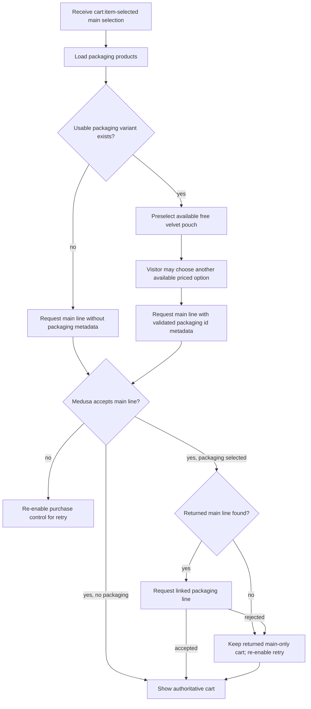
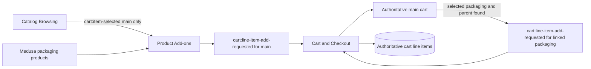

# Product Packaging Add-ons Flow

## 1. Intent

Let a visitor choose an optional packaging product on the PDP, validate that selection, and hand one complete main-plus-packaging request to the Cart and Checkout flow.

Success criteria:

- Available packaging options render with Medusa-owned localized price and stock.
- Catalog supplies only the validated main product selection.
- Product Add-ons resolves the optional packaging selection before requesting any cart mutation.
- Cart and Checkout owns all Medusa cart mutations and links the packaging line to the main line.
- Cart rendering, quantity changes, and removal preserve the main/add-on relationship.

## 2. Scope

In scope:

- Packaging discovery from the Medusa `packaging` category.
- Local packaging selection and availability validation on PDP.
- Catalog → Product Add-ons → Cart handoff contracts.
- Parent metadata, nested cart projection, synchronized quantity/removal, and visible orphan handling.

Out of scope:

- Buying packaging without a main accessory.
- Editing packaging independently inside the cart drawer.
- Client-owned packaging prices or stock decisions.

Deferred decisions: none for the current packaging options.

## 3. Actors and Permissions

| Actor | Permissions | Authority source |
|---|---|---|
| Visitor | Use the preselected free pouch or choose another available packaging option for a validated main accessory | Storefront local selection projected from Medusa data |
| Product Add-ons UI | Resolve the selected packaging variant and coordinate one main-line request plus an optional linked packaging-line request | Medusa product/variant availability and active-currency price projection |
| Cart and Checkout | Create/update one authoritative Medusa cart line per request and preserve returned cart state | Medusa Store API and cart token |
| Medusa backend | Authoritative packaging price, stock, variants, and cart state | Medusa Product, Inventory, Pricing, and Cart modules |

## 4. Diagrams

### User flow

### State machine

```mermaid
stateDiagram-v2
  [*] --> Loading
  Loading --> MainOnly: request failed or no usable packaging
  Loading --> Selecting: options loaded; available brand pouch selected
  Selecting --> Selecting: available priced option changed
  Selecting --> MainRequested: visitor submits valid main selection
  MainOnly --> MainRequested: visitor submits valid main selection
  MainRequested --> Rejected: main mutation rejected
  MainRequested --> Complete: no packaging selected
  MainRequested --> PackagingRequested: main accepted and parent resolved
  PackagingRequested --> Complete: packaging accepted
  PackagingRequested --> MainOnlyComplete: packaging rejected
  Rejected --> Selecting: purchase control re-enabled
  MainOnlyComplete --> [*]
  Complete --> [*]
```

### Data/event flow

## 5. State and Projections

Authoritative state:

- Packaging product/variant identity, price, currency, inventory, and cart lines live in Medusa.
- Main/add-on linkage is stored on the packaging cart line as `metadata.parent_line_item_id`.

Storefront projection:
- `selectedPackagingHandle: string`, defaulting to the seeded free `velvet-pouch`; if that product/variant is absent the resolved packaging id is `null`.
- Available/disabled packaging cards and the cart-bound packaging id share one Medusa inventory/active-currency validity predicate; the temporary `gift-box` card is explicitly disabled until the product is released.
- Main cart rows with linked packaging nested beneath them.
- Orphan packaging rows surfaced as removable root rows so hidden totals are impossible.

## 6. Events/Actions

| Direction | Name | Target flow | Payload | Allowed when | Reject reason |
|---|---|---|---|---|---|
| Incoming | `cart:item-selected` | Product Add-ons | `{ productId, variantId, quantity, regionId }` | Catalog resolved an available main variant and positive quantity | Missing region, invalid/unavailable variant, or non-positive quantity |
| Internal | `product-addon:selected` | None | `{ packagingVariantId: string | null }` | Option is shown, available, and priced for the active region | Unknown, stale, unavailable, or unpriced packaging option |
| Outgoing | `cart:line-item-add-requested` | Cart and Checkout | `{ variantId, quantity, metadata? }` | Main selection is valid; emitted once for the main and again for selected packaging only after the returned parent line is found | Invalid main selection, rejected main mutation, or unresolved parent line |

## 7. Edge Cases

- Packaging request fails or no usable packaging product exists: keep the valid main selection; a submitted main item is added without packaging.
- Selected packaging becomes unavailable before submission: Medusa rejects the affected mutation; the purchase control re-enables for retry.
- Packaging has no calculated price or currency for the active region: disable that option; zero is a valid Medusa-owned free price.
- Main succeeds but the linked packaging mutation fails: retain the authoritative main-only cart returned by the first mutation, do not render packaging as added, and re-enable the purchase control.
- Main quantity changes: update every linked packaging row to the same quantity.
- Main removal succeeds: remove every linked packaging row; refresh and surface an error if linked cleanup fails.
- Packaging metadata points to no active parent: render it visibly as a removable root row.
- Same main variant is added with different packaging selections: keep distinct main rows through the existing packaging metadata contract.

## 8. Side Effects

- Query packaging products once per PDP load.
- Submit the selected packaging id in main-line metadata so repeated main variants with different packaging do not merge.
- Product Add-ons coordinates up to two sequential Cart `addItem` calls; Cart owns each Store API mutation and returned authoritative projection.
- Cart quantity/removal operations synchronize linked packaging rows.

## 9. Schemas Touched

- `storefront/src/components/product/ProductInfoBlock.tsx`: default packaging selection, availability/pricing projection, and selected variant id.
- `storefront/src/components/product/VariantSelector.tsx`: main request, returned-parent resolution, and optional linked packaging request.
- `storefront/src/components/cart/CartContext.tsx`: authoritative single-line mutation and returned cart projection.
- `storefront/src/components/cart/CartDrawer.tsx`: nested/orphan projection and synchronized controls.
- `storefront/src/components/cart/types.ts`: cart-line metadata projection.
- `storefront/src/lib/medusa/cart.ts`: Store API line-item calls and metadata payload.
- `storefront/src/lib/medusa/products.ts`: packaging-category discovery and availability data.
- `storefront/messages/ru.json` and `storefront/messages/en.json`: packaging labels.

## 10. Targeted Tests

| Layer | Behavior | File | Status |
|---|---|---|---|
| Storefront integration | Main add includes selected packaging metadata; accepted main response supplies the parent for the linked packaging add | `storefront/src/lib/__tests__/cart-packaging.test.tsx` | Passed 2026-08-11 |
| Storefront integration | Missing returned parent and rejected linked packaging retain main-only cart and re-enable retry | `storefront/src/lib/__tests__/cart-packaging.test.tsx` | Passed 2026-08-11 |
| Storefront component | Missing amount/currency disables packaging and omits it from cart metadata/mutation; authoritative zero remains selectable/free | `storefront/src/lib/__tests__/product-addons.test.tsx` | Passed 2026-08-11 |
| Storefront integration | Packaging nests under its parent and orphan packaging remains visible | `storefront/src/lib/__tests__/cart-packaging.test.tsx` | Passed 2026-08-11 |
| Storefront integration | Parent quantity/removal synchronizes linked rows and orphan packaging can be removed | `storefront/src/lib/__tests__/cart-packaging.test.tsx` | Planned |
| Storefront integration | Packaging copy and returned prices use the active locale/currency | `storefront/src/lib/__tests__/cart-packaging.test.tsx` | Passed 2026-08-11 |

## 11. Implementation Plan

1. Keep Catalog's outgoing payload limited to the main validated selection.
2. Resolve the default or visitor-selected packaging locally from Medusa product data.
3. Coordinate the existing Cart single-line mutation: add main with packaging metadata, then add linked packaging only from the returned parent line.
4. Preserve nested quantity/removal/orphan behavior and disable unpriced packaging.

## 12. Implementation Trace

Current status: Implemented. Catalog hands off only the main selection; Product Add-ons coordinates the existing main/linked-line requests; Cart remains authoritative for every Medusa mutation and returned projection.

Implementation files:

- `storefront/src/components/product/ProductInfoBlock.tsx`
- `storefront/src/components/product/VariantSelector.tsx`
- `storefront/src/components/cart/CartContext.tsx`
- `storefront/src/components/cart/CartDrawer.tsx`
- `storefront/src/components/cart/types.ts`
- `storefront/src/lib/medusa/cart.ts`
- `storefront/src/lib/medusa/products.ts`
- `storefront/src/app/[locale]/products/[handle]/page.tsx`
- `storefront/src/app/[locale]/checkout/page.tsx`
- `storefront/src/app/[locale]/cabinet/orders/[id]/page.tsx`
- `backend/apps/backend/src/migration-scripts/initial-data-seed.ts`
- `storefront/src/lib/__tests__/cart-packaging.test.tsx`
- `storefront/src/lib/__tests__/product-addons.test.tsx`

Validation: 2026-08-11 focused release-correction suite passed 5 files / 29 tests and the storefront suite passed 20 files / 124 tests before the final default-handle/cart-bound validity correction. Storefront/backend builds and global lint passed with zero errors; five `` optimization warnings remained at that intermediate checkpoint.
Validation: 2026-08-11 final packaging suite passed 2 files / 12 tests; the final storefront suite passed 20 files / 128 tests. Storefront/backend builds and global lint passed with zero errors and zero warnings.

## 13. Open Questions

None. Different packaging configurations remain distinct main rows. A rejected main request leaves the prior cart unchanged; a rejected linked packaging request leaves the already-returned main-only cart visible and re-enables retry.

## 14. Review Checklist

- [x] Catalog → Product Add-ons payload contains only the main selection.
- [x] Product Add-ons coordinates the existing main and optional linked-line requests.
- [x] Product Add-ons → Cart payload and architecture contract match.
- [x] Missing/unusable packaging falls back to a main-only request.
- [x] Partial packaging mutation failure retains the authoritative main-only outcome without displaying packaging as added.
- [x] Nested, quantity, removal, orphan, localization, schema, and test contracts are named.

Flow review v3 (2026-08-11): **APPROVED**. Implementation-aligned Cart boundaries, missing-parent and partial-failure outcomes, exact test claims, and missing-price rejection clear the Approval Bar.

Flow review v4 (2026-08-11): **APPROVED**. Seeded `velvet-pouch` default, main-only metadata omission, shared cart-bound eligibility, and focused tests clear the Approval Bar.