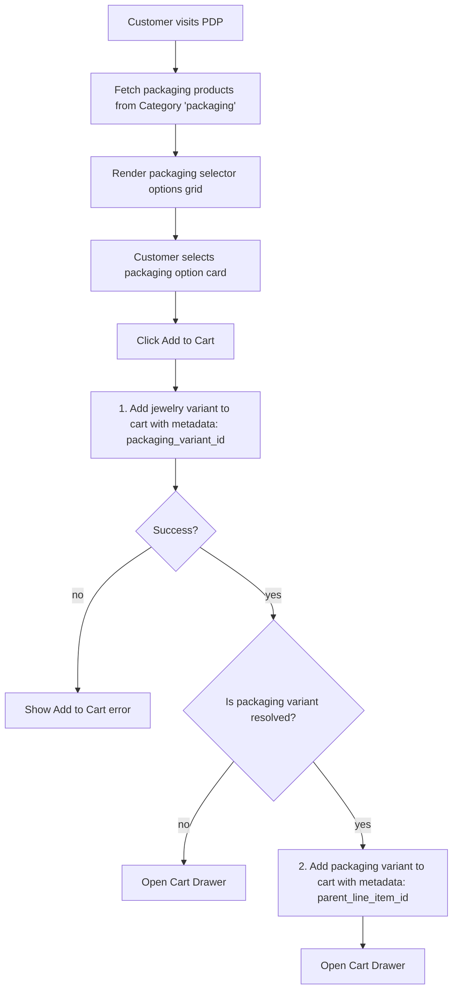
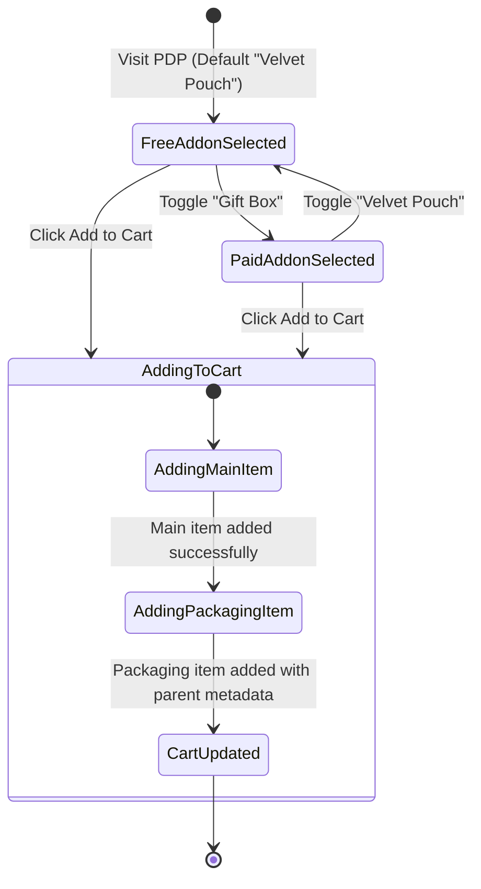
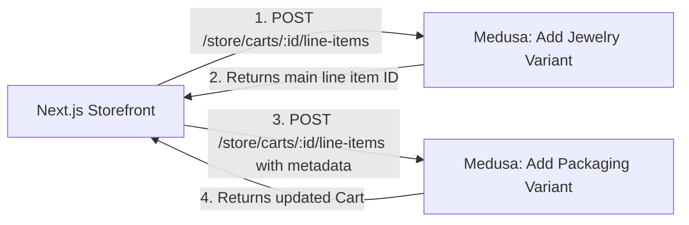

# Product Packaging Add-ons Flow

## 1. Intent

Allow customers to select product packaging add-ons (such as a free velvet pouch or a paid premium gift box) directly on the product detail page (PDP). When the customer adds the jewelry item to the cart, the selected packaging add-on is added alongside it as a linked cart line item. In the cart drawer, the packaging add-on is visually grouped under the parent jewelry item, and its lifecycle (removal and quantity changes) is synchronized with the parent item.

Success criteria:
- Customers can toggle between "Free velvet pouch" and "Premium gift box" on the PDP (no packaging option is omitted).
- The paid gift box displays the correct currency price (RUB/EUR/USD) based on the active region.
- Clicking "Add to cart" adds both the main variant and the packaging variant to the cart.
- The packaging line item is linked to the parent jewelry line item via metadata.
- In the Cart Drawer, packaging items are rendered nested under their parent jewelry items rather than as separate root items.
- Removing the parent jewelry item from the cart automatically deletes the linked packaging item.
- Customers can add multiple quantities of the same jewelry item with different packaging configurations (e.g., one with a free pouch, one with a paid box) and they will be kept as separate line items in the cart (preventing line-item merging).

## 2. Scope

In scope:
- PDP packaging options UI selector with real-time price updates.
- Querying Medusa Store API to retrieve packaging products (using category handle `packaging` or tag `addon-packaging`).
- Cart service logic to perform sequential additions for linked items.
- Cart metadata format: adding `parent_line_item_id` to the packaging item's metadata.
- Cart Drawer UI nesting and styling for add-ons.
- Cart removal sync: intercepting removal of a parent item and dispatching a delete request for the linked item.

Out of scope:
- Editing selected packaging directly inside the Cart Drawer (customers must remove and re-add).
- Buying packaging items separately without any jewelry in the cart.
- Independent quantity adjustment of packaging items in the cart (quantity is strictly synced to match the parent item's quantity).

## 3. Actors and Permissions

| Actor | Permissions | Authority source |
|---|---|---|
| Anonymous visitor / Customer | Browse products, select packaging, mutate cart | Medusa Store API public session |
| Medusa backend | Validates pricing, manages stock of packaging items, holds authoritative cart data | Medusa Cart Module & Product Module |

## 4. Diagrams

### User Flow



### State Machine



### Data/Event Flow



## 5. State and Projections

Authoritative state:
- All cart line items, pricing, and stock of packaging products reside in the Medusa backend.

Storefront projection:
- Cart line items metadata:
  ```json
  {
    "metadata": {
      "parent_line_item_id": "line_item_id_of_jewelry"
    }
  }
  ```
- Local selection state on PDP: `selectedPackagingId` (string | null).

## 6. Events/Actions

| Direction | Name | Target flow | Payload | Allowed when | Reject reason |
|---|---|---|---|---|---|
| Incoming | `cart:item-selected` | PDP Controller | `{ variantId, quantity, packagingVariantId? }` | PDP options selected | None |
| Outgoing | `cart:line-items-added` | Cart Drawer | `{ mainLineItem, packagingLineItem? }` | Both items added successfully to Medusa | Network/Stock error |

## 7. Edge Cases

- **Packaging item out of stock**: If "Premium Gift Box" is out of stock in Medusa, the storefront must disable the button and show a "Temporarily unavailable" label, forcing the customer to choose "No packaging" or "Velvet Pouch" (if in stock).
- **Cart cleanup failure**: If deleting the main item succeeds but deleting the linked packaging item fails, the storefront must handle the error gracefully and retry the deletion, or force a cart refresh.
- **Quantity mismatch**: If the customer changes the quantity of the main item in the cart drawer, the storefront must dispatch a quantity update for the linked packaging item to keep the quantities in sync.
- **Different currencies**: The paid packaging product must have pricing matching the cart's currency (EUR/USD/RUB). If a currency is not defined on the packaging product, it should fallback safely or hide the option.
 - **Metadata merge sensitivity (Medusa v2)**: Medusa compares the entire metadata object (`deepEqualObj(existingItem.metadata, newItem.metadata)`) when deciding whether to consolidate line items. Because the storefront includes both `calculated_price` (price snapshot at add time) and `packaging_variant_id` in the metadata, a mid-session price update or discount change will result in duplicate line items rather than merging, even if the variant and selected packaging options are identical.

## 8. Performance Constraints

- The packaging products should be fetched once per PDP load.
- Avoid fetching packaging details in the cart loop. Use the `cart.items` list directly and look up metadata links.

## 9. Accessibility and UX Rules

- Radios and buttons for packaging selection must have descriptive `aria-label` tags showing the name and additional cost (e.g., "Подарочная упаковка, плюс 500 рублей").
- Display a loader overlay on the PDP CTA button while both the main item and packaging item additions are being processed.

## 10. Localization / Copy

Support English and Russian translations in `messages/{ru,en}.json`:
- `product.packaging.heading`: "УПАКОВКА" / "PACKAGING"
- `product.packaging.none`: "Без упаковки" / "No packaging"
- `product.packaging.pouch`: "Фирменный мешочек" / "Velvet pouch"
- `product.packaging.box`: "Подарочная коробка" / "Premium gift box"
- `product.packaging.free`: "Бесплатно" / "Free"

## 11. Security Best Practices

- Never trust client-calculated add-on prices. The price of the packaging must be defined strictly in Medusa, and the storefront simply sends the packaging variant ID to the Medusa Cart API.

## 12. Implementation Trace

Current status: Completed. PDP includes packaging options grid with live price/currency rendering and stock availability/disabling checks. Adding a main item adds the linked packaging to the cart using metadata `parent_line_item_id`. Quantity adjustments and item removal are synchronized. Packaging discovery uses the Medusa `Packaging` product category (handle `packaging`) as the single source of truth: `listPackagingProducts` queries products by `category_id`, while `listProducts` and `listRelatedProducts` exclude any product whose `categories[]` includes the Packaging category. New packaging products added in Medusa admin (assigned to the Packaging category) are picked up automatically by both flows. The Packaging category ID is resolved once and cached for the process lifetime; on resolution failure `listPackagingProducts` returns `[]` and the PDP shows the packaging selector with no options.

Implementation files:

- PDP Component: `storefront/src/components/product/ProductInfoBlock.tsx`
- Cart Drawer Component: `storefront/src/components/cart/CartDrawer.tsx`
- Cart Helper Context: `storefront/src/components/cart/CartContext.tsx`
- Seed Script: `backend/apps/backend/src/migration-scripts/initial-data-seed.ts`
- Product Data Layer Helper: `storefront/src/lib/medusa/products.ts`
- PDP Page: `storefront/src/app/[locale]/products/[handle]/page.tsx`
- Checkout Page: `storefront/src/app/[locale]/checkout/page.tsx`
- Cabinet Order Detail Page: `storefront/src/app/[locale]/cabinet/orders/[id]/page.tsx`
## 13. Open Questions

- Should we support different packaging options per individual items of the same product (e.g. buying 2 of the same chain, one in a box and one in a pouch)? 
  *Decision*: Yes. To support this, we pass the selected `packaging_variant_id` in the main product's metadata. Medusa compares the entire metadata object before merging, so different packaging variants will prevent line item merging and preserve them as separate line items.

## 14. Review Checklist

- [ ] PDP renders packaging options with correct localized names and prices.
- [ ] Cart Drawer displays the selected packaging nested under the main item.
- [ ] Removing the main item removes the packaging item from the cart.
- [ ] Quantity updates to the main item update the packaging item quantity.
- [ ] Safe fallback when packaging products do not exist in the database.
