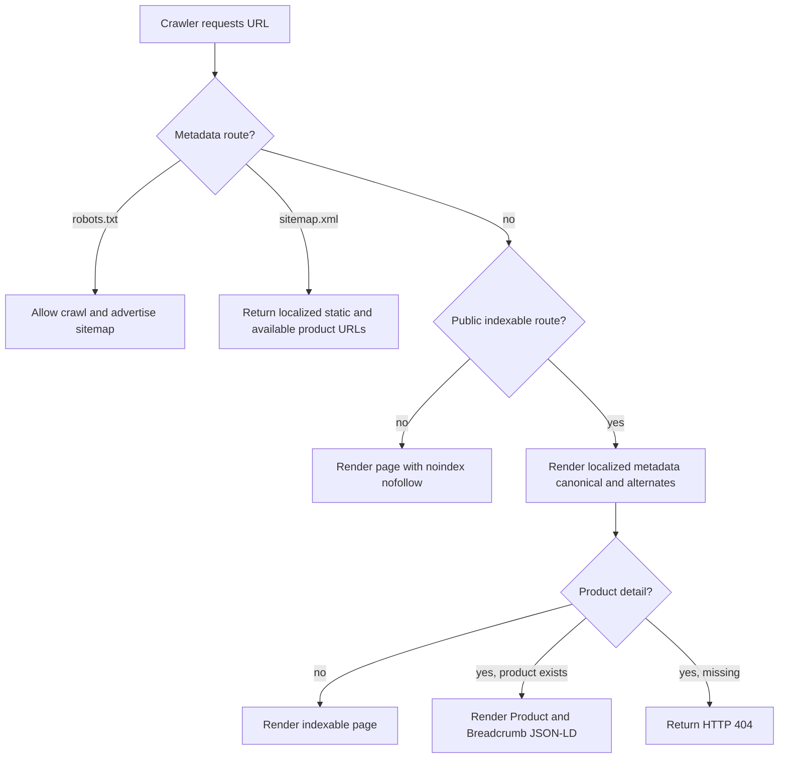
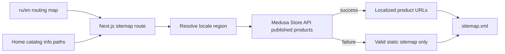
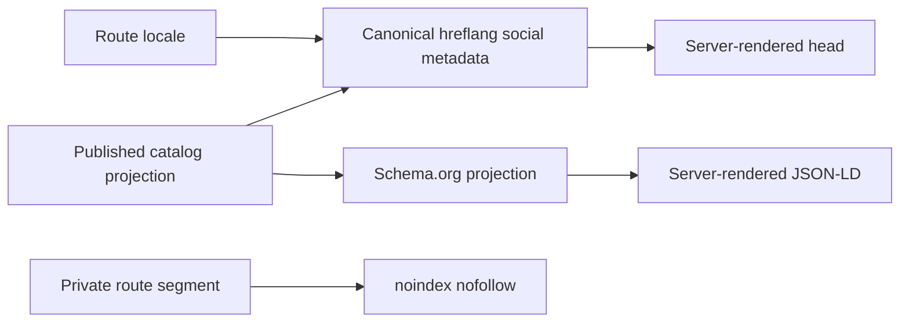

# SEO Readiness Flow

## 1. Intent

Make the SUNLUK storefront technically ready for search indexing in Russian and English without duplicating commerce logic or adding SEO dependencies.

Success criteria:

- Every public page emits a self-referencing canonical URL and `ru`/`en` language alternates.
- Home, catalog, product detail, and information pages have distinct localized metadata.
- Checkout, authentication, cabinet, and order pages emit `noindex, nofollow`.
- `/robots.txt` and `/sitemap.xml` are served by built-in Next.js metadata routes.
- Product URLs in the sitemap come from published Store API products; backend failure leaves a valid static sitemap.
- Product pages return an actual 404 when the product does not exist.
- Search-facing structured data covers the site entity, website, products, and product breadcrumbs.
- Each rendered page has one `main` landmark; critical images and the hero video do not create avoidable loading work.

## 2. Scope

In scope:

- Next.js Metadata API, canonical URLs, `hreflang`, Open Graph, Twitter cards, robots directives, sitemap, and Schema.org JSON-LD.
- Public routes: `/[locale]`, `/[locale]/products`, `/[locale]/products/[handle]`, `/[locale]/info`.
- Private/transactional routes: checkout, checkout success, login, register, cabinet, and order details.
- Confirmed SEO-impact fixes: soft 404s, duplicate `main` landmarks, duplicate Montserrat loading, eager CSS content images, hero video preload, and disabled product image optimization.
- Site origin configuration through `NEXT_PUBLIC_SITE_URL`, with `https://sunluk.com` as the production-safe fallback.

Out of scope:

- Paid acquisition, backlink campaigns, keyword-ranking promises, content production, analytics dashboards, and Search Console ownership verification.
- New category, collection, search, blog, or pagination routes.
- Machine-generated product copy or schema claims not backed by Medusa data.
- New dependencies; Next.js and existing components cover the required behavior.

Deferred decisions:

- Pagination or split sitemaps when the public catalog exceeds the current Store API list limit.
- Dedicated 1200x630 social images when branded assets are provided.
- ISR/static generation after production Medusa latency is measured.

## 3. Actors and Permissions

| Actor | Permissions | Authority source |
|---|---|---|
| Search crawler | Crawl public routes and metadata routes; must not index private or transactional pages | Next.js metadata and robots directives |
| Visitor | Open localized public URLs and receive the matching canonical/language metadata | next-intl route locale |
| Authenticated customer | Use checkout and cabinet without those pages entering the search index | Medusa customer/session state + segment metadata |
| Medusa backend | Authoritative source for published products, prices, currency, availability, and product images | Medusa Store API |
| Storefront | Projects crawlable URLs and structured data; never invents commerce facts | Next.js routes + Medusa responses |

## 4. Diagrams

### Crawler flow

### Sitemap data flow

### Rendering projection

## 5. State and Projections

Authoritative state:

- Supported storefront locales and route prefixes come from `src/i18n/routing.ts`.
- Published product identity, handle, price, currency, availability, and images come from Medusa.
- The production site origin comes from `NEXT_PUBLIC_SITE_URL`; the code fallback is `https://sunluk.com`.

Public projection:

- Absolute canonical URL for the current locale and route.
- `ru`, `en`, and `x-default` alternate URLs for equivalent pages.
- Localized title/description plus social metadata.
- Sitemap entries for public static pages and currently available public products.
- Schema.org objects containing only facts already present in code or Medusa responses.

Private projection:

- Checkout, authentication, cabinet, success, and order-detail content remains functional but emits `noindex, nofollow` and is omitted from the sitemap.

## 6. Events/Actions

| Direction | Name | Target flow | Payload | Allowed when | Reject reason |
|---|---|---|---|---|---|
| Incoming shared data | `catalog:indexable-route-projection` | Catalog Browsing | `{ locale, path, productHandle?, product? }` | Route maps to public published catalog content | Missing/unpublished product or private route |
| Incoming shared data | `catalog:locale-routing-map` | Catalog Localization | `{ locales, defaultLocale, stableProductHandles }` | Locale is supported | Unsupported locale |
| Internal | `seo:metadata-projected` | None | `{ canonical, languages, title, description, robots }` | Route classification and locale are known | Unknown route classification or invalid origin |
| Internal | `seo:sitemap-requested` | None | `{ locales, staticPaths }` | Metadata route is requested | None; product-fetch failure degrades to static entries |
| Internal | `seo:structured-data-projected` | None | `{ organization?, website?, product?, breadcrumb? }` | Required facts are available | Omit schema fields whose source data is absent |
| Outgoing | None | None | None | SEO is a terminal storefront projection | None |

## 7. Edge Cases

- Unsupported locale: existing locale routing handles it; SEO helpers accept only configured locales.
- Missing product: return HTTP 404 rather than a rendered 200 "not found" state.
- Product Store API failure: preserve the existing retryable dependency-error behavior; never turn an upstream failure into a false 404.
- Medusa unavailable during sitemap generation: keep static public URLs and omit unavailable product entries; never fail the XML response.
- A product exists in one locale/region but not the other: include only URLs returned for that locale; metadata still uses stable handles for equivalent-language alternates on a valid PDP.
- Missing description or image: use the existing safe localized description fallback; omit unsupported image/schema fields rather than invent values.
- Query parameters on transactional pages: segment-level `noindex` covers all variants, including checkout success order IDs.
- Private URLs are omitted from sitemap but not blocked in `robots.txt`, so crawlers can observe their `noindex` directive.
- JSON-LD serialization must escape `<` to prevent a data value from terminating the script element.
- A page must contain exactly one `main` landmark, owned by the locale layout.

## 8. Side Effects

- Search crawlers receive new metadata, JSON-LD, robots, and sitemap responses.
- Public social shares receive localized Open Graph/Twitter metadata.
- Sitemap requests may read the public Medusa catalog; failure does not affect normal storefront routes.
- Product images use the existing Next.js image optimizer and responsive output.
- Below-the-fold content images load lazily; the hero video no longer requests full eager preload.
- No commerce state, price calculation, cart, order, payment, or persistence behavior changes.

## 9. Schemas Touched

Expected implementation areas:

- `storefront/src/lib/seo.ts` and its targeted test.
- `storefront/src/app/layout.tsx`, `storefront/src/app/[locale]/layout.tsx`.
- Public page metadata under `storefront/src/app/[locale]/`.
- Private segment layouts under checkout, login, register, and cabinet.
- `storefront/src/app/robots.ts`, `storefront/src/app/sitemap.ts`.
- Product JSON-LD and product detail 404 handling.
- Landing/product image components, hero video, fonts, and duplicate page landmarks.
- Storefront environment example/configuration if present.

Cross-flow references:

- `flows/features/catalog-browsing.md` supplies the public catalog route projection.
- `flows/features/catalog-localization.md` supplies supported locale routing and stable handles.

## 10. Targeted Tests

| Layer | Behavior | File/route | Status |
|---|---|---|---|
| Storefront unit | SEO URL helpers build absolute canonical and all locale alternates | `storefront/src/lib/__tests__/seo.test.ts` | Passed 2026-07-20: 9/9 |
| Storefront build | Next.js accepts metadata, robots, and sitemap route contracts | `npm run build --prefix storefront` | Passed 2026-07-20; `/sitemap.xml` is dynamic |
| HTTP smoke | robots and sitemap render; public pages expose canonical/hreflang; private pages expose noindex | `/robots.txt`, `/sitemap.xml`, `/ru`, `/en/products`, `/ru/checkout` | Passed 2026-07-20 |
| HTTP smoke | Missing product returns 404 while upstream failure does not fake a 404 | `/ru/products/__seo_missing__` | Passed 2026-07-20 with Medusa available and unavailable |
| Browser smoke | Home and catalog render, keep one main landmark, load images, and have no horizontal overflow | `/ru`, `/en/products` at 1440px and 390px | Passed 2026-07-20 |
| Browser smoke | Product page emits Product/BreadcrumbList data and loads product images | `/ru/products/azure`, `/en/products/azure` | Passed 2026-07-20 with no console errors |

## 11. Implementation Plan

1. Add one typed SEO helper for the site origin, canonical URLs, and locale alternates; add the smallest observable helper test.
2. Extend root/locale/public-page metadata and add segment-level `noindex, nofollow` for private routes.
3. Add built-in `robots.ts` and resilient dynamic `sitemap.ts` without dependencies.
4. Add Organization/WebSite and product Breadcrumb JSON-LD; make missing products return 404.
5. Remove duplicate page landmarks and apply confirmed image, font, and hero-video loading fixes.
6. Build the production storefront, run targeted HTTP/browser checks, then run the repository lint gate.
7. Record exact implementation paths and validation results in this flow and synchronize the architecture map.

## 12. Implementation Trace

Current status: Complete. Technical SEO, resilient discovery routes, structured data, route index controls, semantic fixes, and confirmed loading optimizations are implemented.

Flow review: APPROVED 2026-07-20. Main Agent review found explicit route classification, failure behavior, authoritative data boundaries, matched cross-flow shared-data contracts, and observable validation gates.

Implementation files:

- `storefront/next.config.ts`
- `storefront/src/lib/seo.ts`
- `storefront/src/lib/__tests__/seo.test.ts`
- `storefront/src/app/robots.ts`
- `storefront/src/app/sitemap.ts`
- `storefront/src/app/[locale]/layout.tsx`
- `storefront/src/app/[locale]/page.tsx`
- `storefront/src/app/[locale]/products/page.tsx`
- `storefront/src/app/[locale]/products/[handle]/page.tsx`
- `storefront/src/app/[locale]/info/page.tsx`
- `storefront/src/app/[locale]/checkout/layout.tsx`
- `storefront/src/app/[locale]/login/layout.tsx`
- `storefront/src/app/[locale]/register/layout.tsx`
- `storefront/src/app/[locale]/cabinet/layout.tsx`
- `storefront/src/components/product/ProductJsonLd.tsx`
- `storefront/src/components/product/ProductCard.tsx`
- `storefront/src/components/product/ProductGallery.tsx`
- `storefront/src/components/landing/use-entrance.ts`
- `storefront/src/components/landing/HeroSection.tsx`
- `storefront/src/components/landing/EditorialSection.tsx`
- `storefront/src/components/landing/CollectionSection.tsx`
- `storefront/src/components/landing/AboutSection.tsx`
- `storefront/src/components/landing/NewsletterSection.tsx`
- `storefront/src/components/landing/FeaturesSection.tsx`
- `storefront/src/components/landing/SiteHeader.tsx`
- `storefront/src/components/landing/icons.tsx`
- Inner-landmark removals across checkout, success, cabinet, order detail, and loading pages.
- Localized catalog/info message files under `storefront/messages/`.
- Targeted landing tests under `storefront/src/lib/__tests__/`.

Validation:

- Production build passed; Next route table reports dynamic `ƒ /sitemap.xml`.
- Full storefront suite passed: 12 files, 75 tests.
- `/robots.txt` returned `Allow: /` and the absolute production sitemap URL.
- Dynamic sitemap returned 18 URLs with Medusa available (6 static + 12 localized product URLs) and a valid 6-URL static fallback with Medusa unavailable.
- Public pages returned localized canonical, `ru`/`en`/`x-default`, Open Graph, and Twitter metadata.
- Private routes returned `noindex, nofollow`; missing product returned HTTP 404.
- JSON-LD parsed as Organization/WebSite on home and Product/BreadcrumbList on PDP.
- Browser smoke passed at desktop and 390px: one `main`, no horizontal overflow, content images loaded, hero poster/preload correct, no PDP console errors.
- Global lint completed with zero errors; remaining warnings predate this flow and are outside its runtime contract.
- Flow-code sync: IN SYNC 2026-07-20. Final read-only audit found zero drift or blockers across SEO behavior, performance fixes, validation trace, and cross-flow contracts.
- Implementation commits: `dfeffaf` (storefront SEO) and `674197b` (targeted tests).

## 13. Open Questions

None blocking. The production fallback origin is `https://sunluk.com`; deployment may override it with `NEXT_PUBLIC_SITE_URL`.

## 14. Review Checklist

- [x] Public and private route classifications are explicit.
- [x] Canonical and alternate behavior is deterministic for both locales.
- [x] Sitemap backend failure behavior is explicit.
- [x] Product missing/error behavior distinguishes 404 from dependency failure.
- [x] Structured data is limited to authoritative facts.
- [x] SEO changes do not duplicate Medusa commerce logic.
- [x] Cross-flow shared-data dependencies are named.
- [x] Performance work is limited to confirmed defects with observable checks.
- [x] No new dependency or speculative route is introduced.
