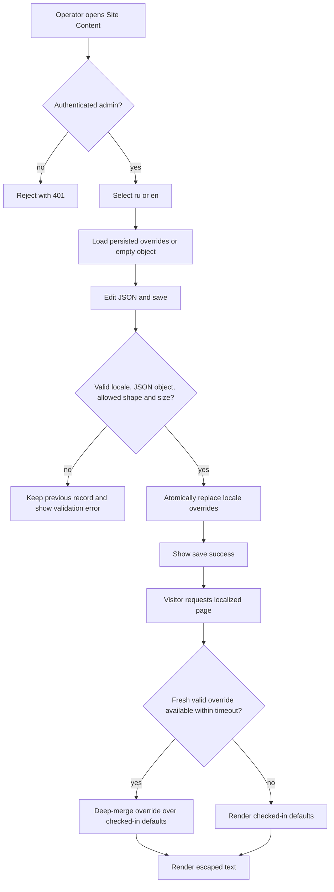
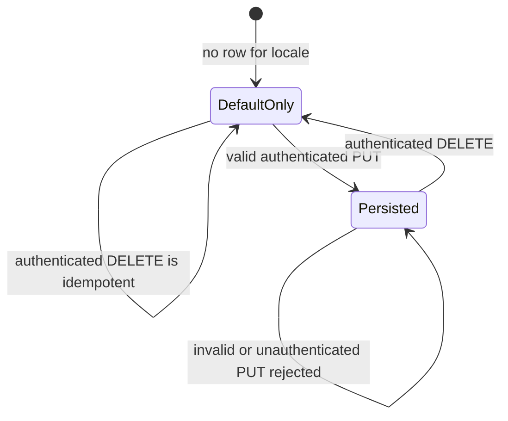
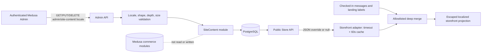

# Site Content Flow

## 1. Intent

Allow an authenticated operator to update localized SUNLUK marketing text without rebuilding or redeploying the storefront, while preserving the current checked-in content whenever no override is available.

Success criteria:

- Russian and English overrides are saved independently through Medusa Admin.
- Only marketing namespaces are editable: home-page copy, information-page copy, navigation labels, and footer labels/copyright.
- A successful save becomes visible on the storefront within 60 seconds without a Git push or application deployment.
- Missing, invalid, timed-out, or unavailable content reads render the current checked-in messages and landing data.
- Commerce state and behavior—catalog, prices, inventory, cart, checkout, payment, fulfillment, and orders—are unchanged.

Non-negotiables:

- Medusa/PostgreSQL is authoritative for persisted overrides; checked-in storefront content is the deterministic fallback.
- Admin write routes require an authenticated Medusa admin session or bearer token.
- Storefront rendering never fails solely because site-content storage or the backend is unavailable.
- React escapes all override strings; this flow does not introduce HTML or rich-text rendering.

## 2. Scope

In scope:

- One optional `SiteContent` override document per supported locale (`ru`, `en`).
- Public Store API read and authenticated Admin API read/replace/reset.
- A small Medusa Admin page with locale selection and a JSON editor.
- Storefront deep merge of allowed message namespaces over local defaults.
- Editable navigation and footer labels while route destinations remain code-owned.
- A 60-second storefront cache window and a bounded backend-read timeout.

Out of scope:

- Page-builder layouts, drafts, scheduled publication, revision history, approval workflows, and rich text.
- Uploading or replacing images and other media.
- Editing route paths, links, React components, Tailwind styles, transactional UI messages, SEO contracts, or commerce data.
- A separate CMS service.

Deferred decisions:

- Add structured form fields when non-technical editors use the page often enough that JSON editing becomes a measured problem.
- Add on-demand revalidation only if the 60-second publication delay is unacceptable.

## 3. Actors and Permissions

| Actor | Can do | Cannot do | Authority source |
|---|---|---|---|
| Medusa admin operator | Read, replace, or reset `ru`/`en` overrides | Write without authentication; change commerce state through site-content endpoints | Medusa Admin authentication middleware |
| Storefront visitor | Read the public merged projection | Read admin credentials, drafts, or mutate overrides | Store API route and storefront server rendering |
| Storefront server | Fetch cached public overrides and merge allowed fields over local defaults | Treat remote content as required; execute HTML from overrides | `site-content` adapter contract |
| Medusa site-content module | Persist one atomic JSON document per locale | Modify catalog, cart, checkout, payment, fulfillment, or orders | `SiteContent` model/service |

## 4. Diagrams

### Operator and visitor flow



### State machine



### Data flow and authority boundaries



## 5. State and Projections

Authoritative state:

- A unique locale-keyed row contains the whole persisted override document.
- A successful PUT atomically replaces that locale's document; partial database writes are not observable.
- Absence of a row means `DefaultOnly`, not an error.

Public projection:

```ts
type SiteContentOverrides = {
  messages?: {
    home?: JsonStringTree;
    info?: JsonStringTree;
  };
  navigation?: Partial<Record<"collection" | "details" | "contacts", string>>;
  footer?: Partial<Record<
    | "customerService"
    | "userAgreement"
    | "privacyPolicy"
    | "purchaseTerms"
    | "deliveryPolicy"
    | "returnsPolicy"
    | "requisites"
    | "shop"
    | "allProducts"
    | "questions"
    | "contactUs"
    | "telegram"
    | "instagram"
    | "email"
    | "copyright",
    string
  >>;
};

type JsonStringTree = { [key: string]: string | JsonStringTree };
```

- Store API response: `{ site_content: { locale, overrides, updated_at } | null }`.
- Storefront Store API requests send the configured publishable key in Medusa's exact `x-publishable-api-key` header.
- Admin GET uses the same projection.
- The storefront accepts only `ru` and `en`, plain objects, string leaves, bounded nesting, and allowlisted top-level keys.
- Local content wins whenever a remote field is absent or invalid; arrays and HTML are not part of the contract.

## 6. Events/Actions

| Direction | Name | Payload | Allowed when | Reject reason |
|---|---|---|---|---|
| Incoming | `site-content:admin-read` | `{ locale }` | Authenticated admin; supported locale | `unauthorized`, `unsupported_locale` |
| Incoming | `site-content:replace` | `{ locale, overrides }` | Authenticated admin; valid bounded document | `unauthorized`, `unsupported_locale`, `invalid_shape`, `payload_too_large` |
| Incoming | `site-content:reset` | `{ locale }` | Authenticated admin; supported locale | `unauthorized`, `unsupported_locale` |
| Incoming | `site-content:store-read` | `{ locale, "x-publishable-api-key": key }` | Supported locale; valid Medusa publishable key | `unsupported_locale`, `invalid_publishable_key` |
| Internal | `site-content:projection-selected` | `{ locale, source: "persisted" | "default" }` | Storefront adapter completes or times out | None; default is always available |

Cross-flow boundaries: None. Site content is presentation-only and emits no commerce or deployment events.

## 7. Edge Cases

| Edge case | Expected behavior |
|---|---|
| Admin is unauthenticated or uses a storefront token | Admin GET/PUT/DELETE returns 401; persisted state is unchanged. |
| Locale is not `ru` or `en` | Store and Admin routes reject it; no row is created. |
| JSON is syntactically invalid in Admin | The UI does not send the request and shows the parse error. |
| Payload is an array, contains non-string leaves, forbidden top-level keys, excessive depth, or exceeds the byte limit | API returns 400; previous persisted document remains authoritative. |
| Two admins save the same locale close together | Each replacement is atomic; last completed write wins. Revision conflict handling is deferred. |
| PUT is retried with the same body | The resulting document is identical; no duplicate locale row is created. |
| DELETE is repeated or no row exists | Reset succeeds idempotently and storefront uses defaults. |
| Backend is offline, slow, or returns malformed JSON | Storefront stops waiting at the configured timeout, logs once per failed request path, and renders local defaults. |
| Publishable key is absent, invalid, or sent under a non-Medusa header name | Store API returns 400; storefront falls back to checked-in defaults and does not persist or mutate content. |
| Locale has only a partial override | Only valid provided leaves replace defaults; all omitted leaves remain current local content. |
| Stored data predates a newly added local message key | The new local key remains visible because merging starts from local defaults. |
| Override contains HTML/script-like text | React renders it as text; no `dangerouslySetInnerHTML` path is introduced. |
| Cache contains the previous valid document after save | Previous copy may remain visible for at most 60 seconds, then the new projection is used. |
| Site-content migration fails during backend deployment | Backend deployment fails before becoming healthy; the previous production service remains the rollback target. |

## 8. Side Effects

- Valid PUT creates or updates one PostgreSQL row for the selected locale.
- DELETE removes that locale row and restores checked-in defaults on subsequent reads.
- Storefront server fetches may hit the Store API at most once per cache window per locale/runtime cache partition.
- No email, payment, inventory, order, cart, or fulfillment side effects occur.

## 9. Schemas Touched

Backend:

- `backend/apps/backend/medusa-config.ts`
- `backend/apps/backend/src/modules/site-content/models/site-content.ts`
- `backend/apps/backend/src/modules/site-content/validation.ts`
- `backend/apps/backend/src/modules/site-content/service.ts`
- `backend/apps/backend/src/modules/site-content/index.ts`
- `backend/apps/backend/src/modules/site-content/migrations/Migration*.ts`
- `backend/apps/backend/src/api/store/site-content/[locale]/route.ts`
- `backend/apps/backend/src/api/admin/site-content/[locale]/route.ts`
- `backend/apps/backend/src/admin/routes/site-content/page.tsx`

Storefront:

- `storefront/src/lib/site-content.ts`
- `storefront/src/i18n/request.ts`
- `storefront/src/lib/landing-data.ts`
- `storefront/src/app/[locale]/page.tsx`
- `storefront/src/lib/__tests__/site-content.test.ts`

Flow documents:

- `flows/features/site-content.md`
- `flows/ARCHITECTURE.md`

## 10. Targeted Tests

| Layer | Behavior | File/command | Status |
|---|---|---|---|
| Backend unit | Validator accepts supported partial documents and rejects forbidden locale/shape/depth/size | `backend/apps/backend/src/modules/site-content/__tests__/validation.unit.spec.ts` | Planned |
| Backend build | Module, API routes, default Medusa Admin authentication, migration, and Admin page compile | `npm run build --prefix backend` | Planned |
| Storefront unit | Valid partial override deep-merges; malformed/unavailable response returns defaults; navigation/footer routes remain code-owned | `npm run test --prefix storefront -- site-content.test.ts` | Planned |
| Storefront build | Server/client boundaries and localized pages compile | `npm run build --prefix storefront` | Planned |
| Manual UI | Save and reset one harmless text override in Admin; observe update and fallback without deploy | Production browser smoke | Planned |
| Regression | Cart/product/checkout smoke still reads commerce data from Medusa | Production browser smoke | Planned |

## 11. Implementation Plan

1. Add the locale-unique Medusa model/service/module and generated migration.
2. Add shared backend validation plus public read and authenticated admin read/replace/reset routes.
3. Add the minimal Medusa Admin JSON editor for `ru` and `en`.
4. Add the storefront adapter with timeout, response validation, and 60-second cache.
5. Merge only `messages.home`, `messages.info`, navigation labels, and footer labels over checked-in defaults.
6. Add focused backend/storefront tests and run package build/lint gates.
7. Deploy backend first, then storefront; verify defaults before testing a harmless override/reset.
8. Fill the implementation trace and run `sync-flows`.

## 12. Implementation Trace

Status: Approved design; implementation pending.

Code files: pending implementation.

Test files: pending implementation.

Validation commands/results: pending implementation.

## 13. Open Questions

None blocking.

Deferred:

- Structured fields instead of JSON editor.
- Revision conflict detection.
- Media management.
- On-demand revalidation.

## 14. Review Checklist

- [x] Intended behavior and fallback are specified independently of current implementation details.
- [x] Diagrams include authorization, validation, failure, reset, timeout, and fallback branches.
- [x] Forbidden actors and commerce boundaries are explicit.
- [x] Duplicate saves, concurrent saves, missing rows, stale cache, invalid payloads, and backend outage are covered.
- [x] Tests map to observable allowed and rejected paths.
- [x] Expected schemas and files are named.
- [x] No product decision is silently assumed.
- [x] Cross-flow boundaries are explicitly `None`.
