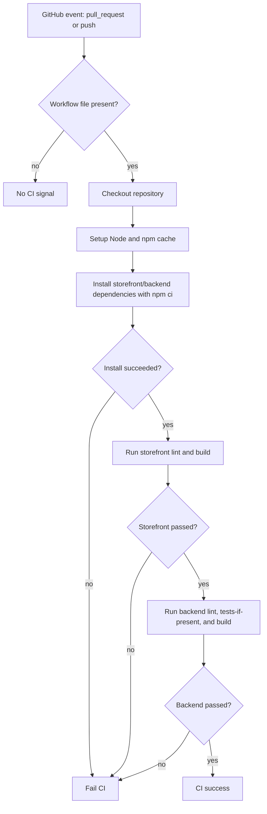
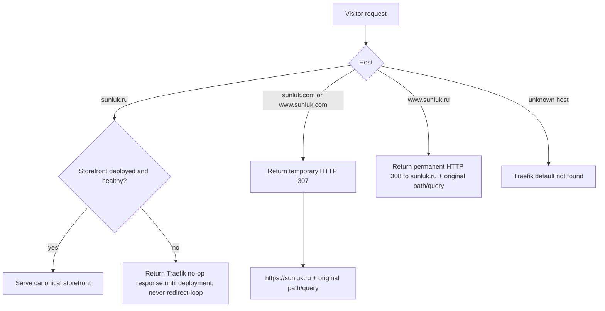
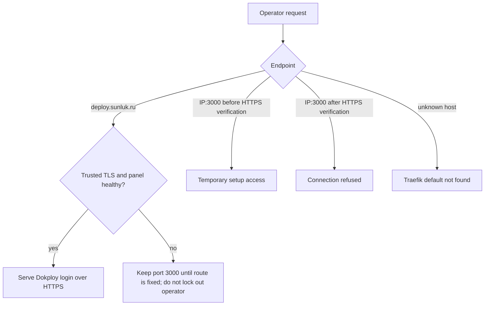
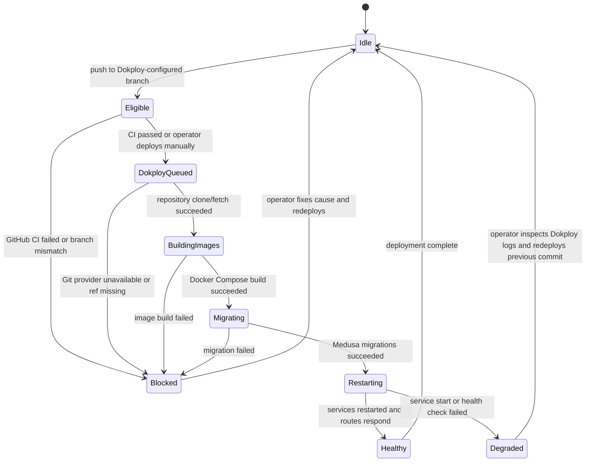
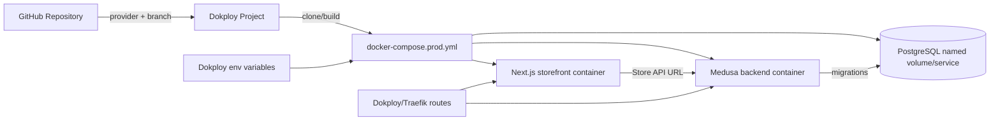

# CI/CD Flow

## 1. Intent

Provide a boring, convenient CI/CD baseline for Sunluk Commerce using GitHub Actions for checks and Dokploy for deployment on one VPS.

Success criteria:

- Pull requests run repeatable checks before merge: install, lint, build, and available backend tests.
- Pushes to `main` are eligible for Dokploy auto-deploy from the configured GitHub repository/branch.
- Dokploy owns deployment orchestration, Traefik routing, domains, TLS, runtime environment variables, and service restarts.
- Runtime secrets live in Dokploy/VPS environment configuration, not in GitHub Actions.
- Production data persists through deploys via Docker named volumes, especially `postgres_data`.
- CI/CD does not seed, reset, or otherwise mutate production data beyond Medusa migrations run during deployment.
- The canonical v0 storefront host is `sunluk.ru`.
- Requests to `sunluk.com` and `www.sunluk.com` temporarily redirect to `https://sunluk.ru` with HTTP 307 while preserving path and query; the redirect is removable when the EU market launches.
- Requests to `www.sunluk.ru` permanently redirect to canonical `https://sunluk.ru` with HTTP 308 while preserving path and query.
- The Dokploy control panel is served only through trusted HTTPS at `deploy.sunluk.ru`; direct public access to port `3000` is removed only after the HTTPS route passes.

Non-negotiables:

- Storefront and backend remain separate runtime services in the compose stack.
- Commerce state remains backend-owned; CI/CD does not calculate or duplicate commerce state.
- Local Windows helper scripts are not used in Linux CI or Dokploy deployment.
- Redis is not part of the v0 production stack unless the backend starts requiring it explicitly.

## 2. Scope

In scope:

- GitHub Actions workflow for PR/push checks.
- Dokploy-friendly Docker build definitions for storefront and Medusa backend.
- Dokploy-friendly production Docker Compose definition for one VPS.
- Operator-facing Dokploy setup instructions, env variables, domains, deploy/rollback notes, and persistence warnings.
- Dokploy/Traefik domain routing for the canonical storefront host and temporary secondary-domain redirect.
- Secure Dokploy panel routing and removal of direct public port `3000` access.

Out of scope for v0:

- SSH-based deploy workflow.
- Custom VPS deploy script.
- Blue/green deployment.
- Multi-server orchestration.
- Kubernetes.
- Automatic database backups.
- Automatic Sentry release upload.
- Registry-based image builds.

Deferred decisions:

- Exact API/Admin production hostname.
- Whether to add automated database backups through Dokploy or an external backup service.
- Whether Redis should be enabled later for production-grade Medusa cache/events/workflows.

## 3. Actors and Permissions

| Actor | Can do | Cannot do | Authority source |
|---|---|---|---|
| Developer | Open PR, inspect CI failures | Deploy production manually without Dokploy/GitHub permission | GitHub repository permissions |
| GitHub Actions CI | Install dependencies and run checks | Read production secrets, mutate VPS state | Workflow permissions and repo checkout |
| Dokploy admin/operator | Configure GitHub provider, env variables, domains, deployments, rollbacks | Bypass application migration safety without changing compose/config | Dokploy project permissions |
| Dokploy deployment engine | Clone repository, build compose services, restart services | Generate production secrets, reset database | Dokploy provider and compose configuration |
| Production services | Read runtime env and serve traffic | Mutate CI workflow state | Docker Compose and application config |
| Storefront visitor | Reach the canonical `sunluk.ru` storefront; follow the temporary `.com` redirect | Select an unfinished EU market through `.com` in v0 | Traefik domain routing |
| Dokploy admin/operator | Reach the control panel through `https://deploy.sunluk.ru` | Use public plaintext `IP:3000` after HTTPS verification | Traefik panel route and Docker service publication |

## 4. Diagrams

### PR/push CI flow

### Storefront domain routing

### Dokploy panel access

### Dokploy deploy state machine

### Deployment data flow

## 5. State and Projections

Authoritative state:

- Git commit SHA is the deployment target.
- GitHub workflow conclusion is the CI authority.
- Dokploy project configuration is the deployment authority.
- Dokploy/VPS environment variables are the runtime secret authority.
- PostgreSQL named volume is the production data authority.
- Dokploy/Traefik dynamic configuration is the authority for canonical-host and temporary redirect behavior.
- The `deploy.sunluk.ru` DNS record plus Traefik panel route are authoritative for Dokploy operator access after direct port removal.

Projections:

- GitHub check summary shows CI status per commit.
- Dokploy deployment log shows clone/build/migration/restart status.
- Dokploy service status/logs show runtime state.

## 6. Events/Actions

| Direction | Name | Payload | Allowed when | Reject reason |
|---|---|---|---|---|
| Incoming | `github:pull-request-opened` | `{ ref, sha }` | PR targets repository branches | Workflow missing or dependency install fails |
| Incoming | `github:push-main` | `{ ref: main, sha }` | CI workflow is configured | Branch not selected in Dokploy, CI failed |
| Incoming | `dokploy:auto-deploy` | `{ provider, branch, sha }` | Dokploy provider is connected and branch matches | Git provider unavailable, branch mismatch, CI gate failed if configured |
| Incoming | `dokploy:manual-deploy` | `{ ref, sha? }` | Operator has Dokploy project permission | Ref cannot be cloned/built |
| Internal | `ci:checks-completed` | `{ sha, status }` | All commands complete | Any required command exits non-zero |
| Internal | `deploy:images-built` | `{ services }` | Dockerfiles and compose valid | Docker build failure |
| Internal | `deploy:migrations-applied` | `{ service: backend }` | Backend image built and DB reachable | Migration exits non-zero |
| Internal | `deploy:services-restarted` | `{ services }` | Compose up succeeds | Container start/route failure |
| Incoming | `traefik:storefront-request` | `{ host, path, query }` | Host is `sunluk.ru`, `www.sunluk.ru`, `sunluk.com`, or `www.sunluk.com` | Unknown host uses Traefik default not found |
| Incoming | `traefik:dokploy-panel-request` | `{ host: deploy.sunluk.ru }` | DNS resolves, TLS is trusted, and Dokploy service is healthy | Unknown host/default route or unhealthy panel |

Cross-flow boundaries: None for v0. CI/CD operates on infrastructure and does not emit commerce domain events.

## 7. Edge Cases

| Edge case | Expected behavior |
|---|---|
| Two pushes to `main` happen close together | Dokploy queues/serializes deployments for the configured app; operator can inspect deployment history. |
| PR changes only docs | CI still runs the baseline unless path filters are later added; correctness over clever skips for v0. |
| Backend test suite has no tests | Workflow skips backend tests only when no backend test files exist; real test failures fail CI. |
| Storefront build needs public backend URL/key | CI uses safe non-production public values for build-time env; production runtime values stay in Dokploy. |
| Dokploy env variable missing | Compose/build fails fast; GitHub Actions does not synthesize production secrets. |
| Docker build fails in Dokploy | Dokploy marks deployment failed; previous running containers/data are not intentionally removed by project config. |
| Migration fails | Deployment fails before the new backend is considered healthy; operator must fix DB/app mismatch before retry. |
| Service restart fails | Dokploy shows a failed/degraded deployment; operator can inspect logs and redeploy a previous commit. Automatic rollback is out of scope v0. |
| Operator accidentally removes `postgres_data` volume | Production data is lost unless backups exist; docs must warn not to delete named volumes and recommend backups. |
| Redis-dependent Medusa feature is enabled later | Flow/compose must be updated to add Redis intentionally before setting `REDIS_URL`. |
| `.com` request contains a nested path or query | Temporary redirect preserves both path and query on `https://sunluk.ru`. |
| `.com` redirect is configured before storefront deployment | Redirect resolves deterministically; the `.ru` target terminates with Traefik's 418 no-op response until storefront deployment rather than looping or serving unrelated content. |
| EU storefront later replaces the redirect | Redirect is temporary (307), so operators can remove it without a deliberately permanent browser cache contract. |
| `www.sunluk.ru` request contains a nested path or query | Permanent 308 redirect preserves both on canonical `https://sunluk.ru`. |
| Request targets an unknown Host header | Traefik returns its default not-found response and does not route it to the storefront. |
| `deploy.sunluk.ru` DNS has not propagated | Do not request TLS or remove port `3000`; retry authoritative and public DNS first. |
| HTTPS route or certificate is invalid | Keep temporary `IP:3000` access and fix the route before hardening. |
| Port `3000` is removed before HTTPS verification | Treat as operator lockout risk; restore the publication or use server console until HTTPS works. |
| HTTPS works after port `3000` removal | Dokploy remains reachable through Traefik on `443`; direct `IP:3000` refuses connections. |

## 8. Side Effects

- GitHub Actions consumes runner minutes.
- Dokploy clones/fetches the repository on the VPS.
- Dokploy builds Docker images locally on the VPS.
- Deployment may run Medusa migrations against production PostgreSQL.
- Deployment restarts storefront/backend/PostgreSQL services defined by production Compose.
- Dokploy/Traefik routes public domains to the configured services.
- Traefik issues a temporary cross-domain redirect from `sunluk.com`/`www.sunluk.com` to canonical `sunluk.ru`.
- Traefik permanently redirects `www.sunluk.ru` to canonical `sunluk.ru`.
- Dokploy panel access moves from public plaintext port `3000` to `https://deploy.sunluk.ru`.

## 9. Schemas Touched

Expected files:

- `.github/workflows/ci.yml`
- `storefront/Dockerfile`
- `backend/apps/backend/Dockerfile`
- `docker-compose.prod.yml`
- `docs/ci-cd.md`
- `flows/ARCHITECTURE.md`
- `flows/integrations/ci-cd.md`
- VPS runtime file `/etc/dokploy/traefik/dynamic/sunluk-domains.yml`
- VPS runtime file `/etc/dokploy/traefik/dynamic/dokploy-panel-domain.yml`

Removed from v0:

- `.github/workflows/deploy-vps.yml`
- `scripts/deploy-vps.sh`

## 10. Targeted Tests

| Layer | Behavior | File/command | Status |
|---|---|---|---|
| Workflow syntax | GitHub Actions YAML parses as valid YAML | Python/PyYAML parse of `.github/workflows/ci.yml`, `docker-compose.prod.yml` | Passed |
| Storefront build | Storefront compiles with CI env | `npm run build --prefix storefront` | Passed |
| Backend build | Backend compiles/builds | `npm run build --prefix backend` | Passed |
| Storefront lint | Existing lint stays error-free | `npm run lint --prefix storefront` | Passed with 7 existing warnings, 0 errors |
| Backend lint | Existing lint stays error-free | `npm run lint --prefix backend` | Passed; Turbo reported no lint tasks configured |
| Backend tests | Backend test suite policy does not mask real failures | Backend test-file lookup found no backend `*.test.*`/`*.spec.*` files; CI skips only in that case | Passed |
| Dokploy compose | Production Compose avoids Redis and keeps Postgres named volume | Static review + YAML parse | Passed |
| Domain DNS | Apex and `www` names for `.ru` and `.com` resolve to the VPS | External DNS lookup | Passed |
| Temporary redirect | HTTP and HTTPS `.com` requests return 307 to `.ru`, preserving path/query | External `curl` requests | Passed |
| Canonical alias | HTTP and HTTPS `www.sunluk.ru` requests return 308 to `sunluk.ru`, preserving path/query | External `curl` requests | Passed |
| Redirect safety | `.ru` does not redirect back to `.com`; unknown hosts are not routed | External `curl` requests | Passed |
| Dokploy panel DNS | `deploy.sunluk.ru` resolves to the VPS | Authoritative and public DNS lookup | Pending |
| Dokploy panel HTTPS | Trusted TLS serves the Dokploy login through `deploy.sunluk.ru` | External browser/curl request | Pending |
| Direct panel port | `IP:3000` refuses connections after HTTPS passes while domain access remains healthy | External curl plus HTTPS recheck | Pending |

## 11. Implementation Plan

1. Remove SSH VPS deployment workflow and deploy script.
2. Keep GitHub Actions CI only.
3. Update production Compose for Dokploy: backend, storefront, postgres; no Redis.
4. Keep Dockerfiles compatible with Dokploy compose builds.
5. Replace operator docs with Dokploy setup, env, domains, persistence, rollback notes.
6. Update architecture map with infrastructure flow.
7. Run targeted verification and fill implementation trace.
8. Configure `sunluk.ru` as the canonical storefront host.
9. Add a temporary path/query-preserving 307 from `sunluk.com` and `www.sunluk.com` to `sunluk.ru`.
10. Add a permanent path/query-preserving 308 from `www.sunluk.ru` to `sunluk.ru`.
11. Verify DNS, TLS, status codes, redirect targets, and absence of loops.
12. Wait until `deploy.sunluk.ru` resolves publicly to the VPS.
13. Add a trusted HTTPS Traefik route to the Dokploy service.
14. Verify the login page through the domain, then remove the Docker Swarm publication for port `3000`.
15. Recheck domain access and confirm direct `IP:3000` refuses connections.

## 12. Implementation Trace

Status: Implemented.

Code files:

- `.github/workflows/ci.yml`
- `storefront/Dockerfile`
- `backend/apps/backend/Dockerfile`
- `docker-compose.prod.yml`
- `docs/ci-cd.md`
- `flows/ARCHITECTURE.md`
- `flows/integrations/ci-cd.md`

Removed files:

- `.github/workflows/deploy-vps.yml`
- `scripts/deploy-vps.sh`

Validation commands/results:

- `npm run lint --prefix storefront` — passed with 7 existing warnings, 0 errors.
- `npm run build --prefix storefront` — passed.
- `npm run lint --prefix backend` — passed; Turbo reported no lint tasks configured.
- `npm run build --prefix backend` — passed.
- Backend test-file lookup — no backend `*.test.*`/`*.spec.*` files found; CI skips tests only when no test files exist.
- Python/PyYAML parse of `.github/workflows/ci.yml` and `docker-compose.prod.yml` — passed.
- `docker compose -f docker-compose.prod.yml config` — not run because Docker CLI is unavailable on this workstation.

Implementation notes:

- Dokploy is the CD authority; GitHub Actions now handles CI only.
- Production runtime env variables are configured in Dokploy, not GitHub.
- Production Compose includes PostgreSQL, backend, and storefront; Redis is intentionally omitted for v0.
- PostgreSQL data persists in the `postgres_data` named volume.
- Backend startup command runs `npx medusa db:migrate && npm run start`; no reset or seed is run.

Domain routing update (2026-07-27):

- Status: Complete.
- Runtime file: `/etc/dokploy/traefik/dynamic/sunluk-domains.yml`.
- Operator documentation: `docs/ci-cd.md`.
- Decision: `.com` uses Traefik's temporary 307, not a permanent 301, because a dedicated EU storefront is planned later.
- Decision: `www.sunluk.ru` uses Traefik's permanent 308 because the apex `.ru` host is canonical.
- DNS: `sunluk.ru`, `www.sunluk.ru`, `sunluk.com`, and `www.sunluk.com` resolve to `201.24.118.185`.
- HTTP/HTTPS redirect check: `.com` and `www.sunluk.com` returned 307 to the matching `https://sunluk.ru` path/query.
- HTTP/HTTPS canonical-alias check: `www.sunluk.ru` returned 308 to the matching `https://sunluk.ru` path/query with trusted TLS.
- Canonical pre-deploy check: `https://sunluk.ru` completed trusted TLS and returned Traefik's expected 418 no-op response without a redirect loop.
- Unknown-host check: Traefik returned 404 and did not route the request to the canonical host.

Dokploy panel hardening update (2026-07-27):

- Status: Pending DNS propagation.
- Intended runtime file: `/etc/dokploy/traefik/dynamic/dokploy-panel-domain.yml`.
- Intended domain: `https://deploy.sunluk.ru`.
- Port `3000` must remain published until trusted HTTPS is verified.

## 13. Open Questions

Resolved by user:

- Deployment platform: Dokploy on one VPS.
- Redis: not used for v0 production stack.
- Canonical v0 storefront domain: `sunluk.ru`.
- Temporary secondary-domain behavior: `sunluk.com` and `www.sunluk.com` redirect to `sunluk.ru`, preserving path/query.
- Canonical alias behavior: `www.sunluk.ru` permanently redirects to `sunluk.ru`, preserving path/query.
- Dokploy panel domain: `deploy.sunluk.ru`; direct public port `3000` is removed after HTTPS verification.

Deferred:

- Exact API/Admin production hostname.
- Automated backup provider/schedule.
- Registry-based image builds.
- Automatic rollback strategy.

## 14. Review Checklist

| Item | Status |
|---|---|
| Intended behavior, not current implementation | Ready |
| Diagrams include decisions/rejection paths | Ready |
| Forbidden paths explicit | Ready |
| Concrete edge cases named | Ready |
| Tests derivable from flow | Ready |
| Expected files named | Ready |
| Open questions surfaced | Ready |
| Cross-flow boundaries declared | Ready |
| Flow review verdict | Approved v4 2026-07-27; no blockers |
