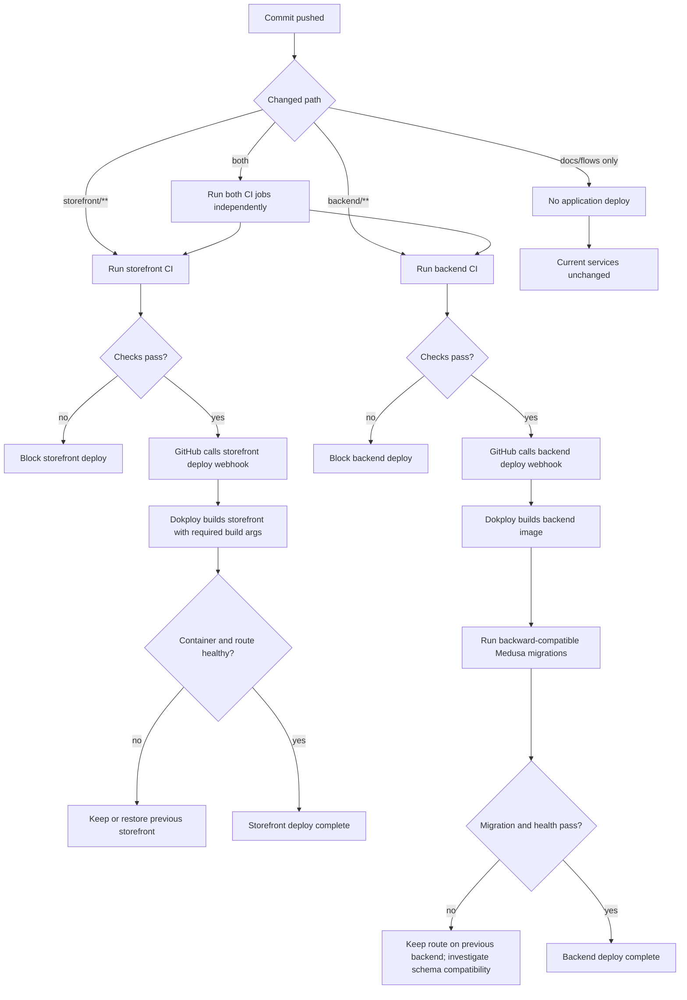
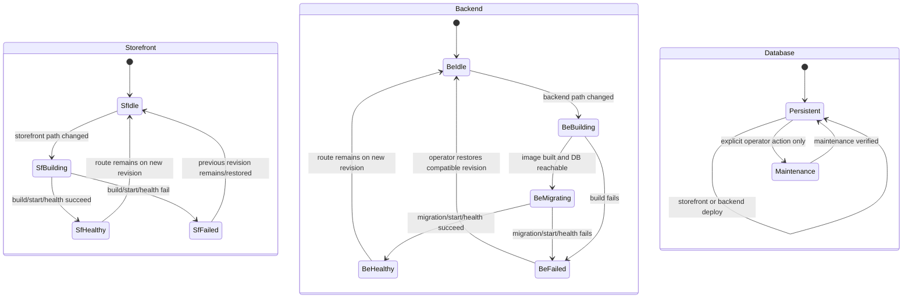
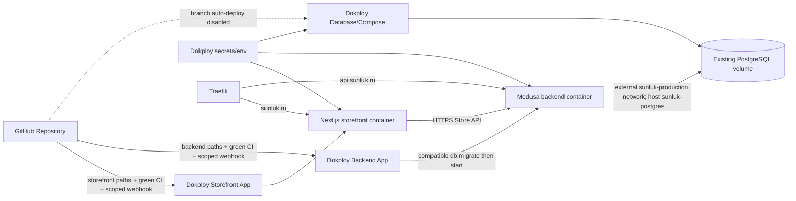

# CI/CD Flow

## 1. Intent

Deploy Sunluk Commerce components independently on the existing Dokploy/Timeweb VPS so a storefront change does not rebuild or restart Medusa or PostgreSQL, and a backend change does not rebuild or restart the storefront or PostgreSQL.

Success criteria:

- Storefront and backend have independent GitHub checks, Dokploy applications, image builds, deployment histories, health checks, and rollback targets.
- PostgreSQL remains a separate long-lived Dokploy database/Compose service with automatic deployment disabled.
- A content-only update through Medusa Admin causes no image build or deployment.
- Backend migrations run only during a backend deployment and before the new backend is healthy.
- The existing canonical domain, redirects, API routing, TLS, secrets, and persistent production data remain intact.
- Locally built production images pass smoke checks before the production rollout.

Non-negotiables:

- Production data is backed up before the one-time split and the existing `postgres_data` volume is never deleted or recreated.
- Commerce state remains backend-owned; CI/CD does not seed, reset, or calculate commerce state.
- Runtime application secrets remain in Dokploy and never enter GitHub or image layers; GitHub stores only the two scoped Dokploy deployment webhook URLs.
- The current service stays available until each replacement application is healthy and its route is switched.
- Online backend rollout permits only backward-compatible additive migrations; destructive schema changes require an explicit maintenance flow.

## 2. Scope

In scope:

- Separate GitHub Actions workflows/check jobs for `storefront/**` and `backend/**` changes.
- Separate Dokploy applications for the existing storefront and backend Dockerfiles.
- PostgreSQL-only production Compose/database service with preserved storage.
- Build arguments, runtime environment, shared network, health checks, migration timing, route cutover, rollback, and operator documentation.
- Local production-image build and container smoke tests before deployment.

Out of scope:

- Kubernetes, multi-server orchestration, blue/green automation, canary rollout, and a new image registry.
- Rewriting either Dockerfile or backend commerce logic unless a build defect requires a minimal correction.
- Automatic schema rollback; Medusa migrations remain forward-only operational changes.
- Redis unless the backend explicitly requires it.

Deferred decisions:

- Registry-based build-once/promote when VPS build time or reproducibility becomes a measured issue.
- Automated PostgreSQL backup scheduling; a manual pre-cutover backup is mandatory now.

## 3. Actors and Permissions

| Actor | Can do | Cannot do | Authority source |
|---|---|---|---|
| Developer | Push code, inspect checks, build local images | Read production secrets or mutate VPS state without scoped deploy permission | GitHub permissions and local Docker |
| GitHub Actions | Run package-scoped checks and call only that package's scoped Dokploy deployment webhook after a green `main` push | Read runtime application secrets, deploy the other application, or mutate PostgreSQL | Workflow permissions and GitHub webhook secrets |
| Dokploy operator | Configure applications, disable branch auto-deploy, set env/build args, domains, networks, deploy and rollback | Delete persistent database storage as part of an app deploy | Dokploy project permissions |
| Storefront application | Serve Next.js and call the public Store API | Run database migrations or connect directly to PostgreSQL | Storefront image/env |
| Backend application | Serve Medusa and run backward-compatible migrations before startup | Recreate PostgreSQL or deploy storefront | Backend image/env |
| PostgreSQL service | Persist Medusa data across application deployments | Auto-deploy on storefront/backend Git pushes | Database Compose/service configuration |

## 4. Diagrams

### Change-to-deployment decision flow

### Independent deployment state machines

### Runtime and authority boundaries

## 5. State and Projections

Authoritative state:

- Git commit SHA is each application revision target.
- Each package-scoped GitHub workflow conclusion is the check authority and its scoped Dokploy webhook is the only automatic deploy trigger.
- Separate Dokploy application configuration is the deploy, environment/build-argument, route, network, and rollback authority; repository branch auto-deploy is disabled.
- The external `sunluk-production` Docker network joins the backend application and `sunluk-postgres`; `DATABASE_URL` resolves host `sunluk-postgres`.
- The existing PostgreSQL volume/service is the production data authority and is not replaced during app deployment.
- Dokploy/Traefik owns canonical host routing and TLS.

Projections:

- GitHub shows storefront and backend checks independently.
- Dokploy shows separate deployment histories/logs for storefront and backend.
- `/health` and the public storefront show current runtime health.
- PostgreSQL backup artifact and volume inspection prove pre-cutover recoverability.

## 6. Events/Actions

| Direction | Name | Payload | Allowed when | Reject reason |
|---|---|---|---|---|
| Incoming | `github:storefront-change` | `{ sha, paths }` | A changed path matches `storefront/**` | No matching path or failed checks |
| Incoming | `github:backend-change` | `{ sha, paths }` | A changed path matches `backend/**` | No matching path or failed checks |
| Outgoing | `github:storefront-deploy-webhook` | `{ sha }` | Storefront workflow passed on `main` and scoped secret exists | Failed checks, non-main ref, missing webhook secret |
| Outgoing | `github:backend-deploy-webhook` | `{ sha }` | Backend workflow passed on `main` and scoped secret exists | Failed checks, non-main ref, missing webhook secret |
| Incoming | `dokploy:storefront-deploy` | `{ sha }` | Storefront checks and required build args are valid | Build/start/health failure |
| Incoming | `dokploy:backend-deploy` | `{ sha }` | Backend checks, secrets, database and network are available | Build/migration/start/health failure |
| Internal | `deploy:backend-migrated` | `{ sha, migrationResult }` | Image built and existing DB is reachable | Migration non-zero exit |
| Incoming | `dokploy:database-maintenance` | `{ operator, action }` | Explicit authorized operator action | Automatic Git-triggered database deploy is forbidden |
| Incoming | `traefik:storefront-request` | `{ host, path, query }` | Known storefront host | Unknown host |
| Incoming | `traefik:backend-request` | `{ host, path, query }` | Known API/Admin host | Unknown host |

Cross-flow boundaries: None. CI/CD deploys infrastructure and emits no commerce-domain events.

## 7. Edge Cases

| Edge case | Expected behavior |
|---|---|
| Storefront-only commit | Only storefront checks call only the storefront deploy webhook; backend and PostgreSQL container identities and uptime are unchanged. |
| Backend-only commit | Only backend checks call only the backend deploy webhook; storefront and PostgreSQL are not rebuilt. |
| Commit changes both applications | Checks and webhook calls are independent; backend migration failure does not roll back a healthy storefront revision. |
| Content override is saved in Medusa Admin | No GitHub workflow or Dokploy deployment starts. |
| Dokploy repository auto-deploy remains enabled | Preflight fails; disable it before scoped webhooks are enabled or every push may deploy both apps. |
| A deploy webhook secret is absent or invalid | The package workflow fails its deploy step without invoking the other application. |
| New storefront image lacks `NEXT_PUBLIC_MEDUSA_BACKEND_URL`, publishable key, or site URL build args | Build/smoke fails before route cutover; current storefront remains available. |
| Backend and PostgreSQL are not both attached to `sunluk-production` or `DATABASE_URL` uses the old Compose hostname | Backend deployment fails before health; operator fixes network/env without recreating DB. |
| Additive backend migration fails | New backend is not considered healthy; operator inspects compatibility and keeps/restores the previous compatible service. Database rollback is not guessed. |
| A proposed migration renames/drops a live column or otherwise breaks the old backend | Online rollout is forbidden; use an explicit maintenance/expand-contract rollout instead. |
| Dokploy auto-removes Compose orphans | One-time cutover changes the old Compose only after new apps are healthy; PostgreSQL remains declared and its named volume remains attached. |
| New app initially conflicts with old container name or route | Use distinct temporary app/container identity and switch the Traefik route only after health passes. |
| Two pushes arrive close together | Each Dokploy app serializes or supersedes only its own webhook-triggered deployments; database remains independent. |
| VPS restarts | PostgreSQL and backend rejoin `sunluk-production`; both applications restart through their own policies. |
| Local Docker cannot start | Production rollout is blocked until production images are built and smoke-tested elsewhere; no unchecked image is deployed. |
| `.com` request contains path/query | Temporary 307 preserves both when redirecting to `https://sunluk.ru`. |
| `www.sunluk.ru` request contains path/query | Permanent 308 preserves both on canonical `https://sunluk.ru`. |
| Dokploy panel TLS fails | Restore/fix trusted `deploy.sunluk.ru`; do not expose plaintext public port as a steady state. |

## 8. Side Effects

- GitHub Actions usage is reduced to the changed application path and successful `main` checks call a scoped deployment webhook.
- Dokploy branch auto-deploy is disabled; each webhook builds and restarts only its selected application.
- Backend deployments may apply only backward-compatible additive migrations during online rollout; storefront deployments never mutate schema.
- The one-time split changes Dokploy application definitions, shared-network attachment, and Traefik targets.
- A pre-cutover PostgreSQL backup consumes temporary disk/storage.
- PostgreSQL is not restarted as a normal application-deployment side effect.

## 9. Schemas Touched

Repository:

- `.github/workflows/storefront-ci.yml`
- `.github/workflows/backend-ci.yml`
- `.github/workflows/ci.yml` (removed after split)
- `docker-compose.prod.yml` (PostgreSQL-only service after successful cutover)
- `storefront/Dockerfile` (review; modify only if a verified build defect exists)
- `backend/apps/backend/Dockerfile` (review; modify only if a verified build defect exists)
- `docs/ci-cd.md`
- `flows/integrations/ci-cd.md`
- `flows/ARCHITECTURE.md`

Dokploy/runtime configuration:

- PostgreSQL database/Compose service with automatic Git deployment disabled and attachment to external network `sunluk-production`
- Storefront application: context `storefront`, Dockerfile `storefront/Dockerfile`, branch auto-deploy disabled, port `3000`, scoped deployment webhook
- Backend application: context repository root, Dockerfile `backend/apps/backend/Dockerfile`, branch auto-deploy disabled, port `9000`, scoped deployment webhook
- GitHub secrets: `DOKPLOY_STOREFRONT_WEBHOOK`, `DOKPLOY_BACKEND_WEBHOOK` only; no runtime application secret
- Storefront build arguments: `NEXT_PUBLIC_MEDUSA_BACKEND_URL`, `NEXT_PUBLIC_MEDUSA_PUBLISHABLE_KEY`, `NEXT_PUBLIC_SITE_URL`
- Backend and `sunluk-postgres` attached to external network `sunluk-production`; `DATABASE_URL` host is `sunluk-postgres`
- Existing runtime env values and `sunluk.ru` plus API/Admin domain routes

## 10. Targeted Tests

| Layer | Behavior | File/command | Status |
|---|---|---|---|
| Workflow syntax | Both package-scoped workflows parse, use correct native path triggers, and gate scoped webhook calls on green `main` checks | YAML parse/static inspection | Planned |
| Storefront image | Production image builds with required public build args and serves the current page | `docker build -f storefront/Dockerfile --build-arg NEXT_PUBLIC_MEDUSA_BACKEND_URL=https://api.sunluk.ru --build-arg NEXT_PUBLIC_MEDUSA_PUBLISHABLE_KEY=<public-key> --build-arg NEXT_PUBLIC_SITE_URL=https://sunluk.ru -t sunluk-storefront:<sha> storefront` + container/browser smoke | Planned |
| Backend image | Production image builds and `/health` responds against an isolated test DB | `docker build -f backend/apps/backend/Dockerfile -t sunluk-backend:<sha> .` + container health smoke | Planned |
| Data persistence | Existing DB has a backup and volume/container survive app cutover | VPS backup + volume/container identity check | Planned |
| Independent deploy | Storefront rollout leaves backend/DB unchanged; backend rollout leaves storefront/DB unchanged | Dokploy deployment histories/container inspection | Planned |
| Public routes | Canonical storefront, API health, redirects, TLS, cart/product reads remain healthy | Production browser/HTTP smoke | Planned |
| Visual regression | Post-deploy desktop/mobile pages match captured baseline apart from dynamic product data | Before/after browser screenshots and DOM smoke | Planned |

## 11. Implementation Plan

1. Split GitHub checks into storefront and backend workflows with native path triggers and scoped post-check Dokploy webhooks on `main`.
2. Preserve Dockerfiles; change only proven build defects and pass all required storefront build arguments.
3. Build and smoke-test both production images locally.
4. Back up production PostgreSQL and record current service/volume/network state.
5. Create external network `sunluk-production`; attach the existing `sunluk-postgres` and the replacement backend without recreating the database.
6. Create the backend application with branch auto-deploy disabled, scoped webhook, existing secrets, `DATABASE_URL` host `sunluk-postgres`, and backward-compatible migration-before-start behavior.
7. Create the storefront application with branch auto-deploy disabled, scoped webhook, and existing public build args/runtime env.
8. Switch API and storefront routes only after replacement health checks pass.
9. Reduce the old Compose definition to PostgreSQL, attach it to `sunluk-production`, and keep automatic deployment disabled.
10. Add the two scoped webhook URLs as GitHub secrets; trigger each package workflow independently.
11. Verify independent histories, production commerce health, redirects, and visual equivalence.
12. Fill the implementation trace and run `sync-flows`.

## 12. Implementation Trace

Status: Revised design; implementation pending.

Code/config files: pending implementation.

Runtime changes: pending implementation.

Validation commands/results: pending implementation.

## 13. Open Questions

None blocking in repository design.

Runtime prerequisite:

- Production deployment requires an authenticated Dokploy operator session or equivalent API access. Repository work and local image verification can complete without it; the production cutover cannot.

## 14. Review Checklist

- [x] Intended independent deploy behavior is specified before implementation.
- [x] Diagrams include path selection, check/build failures, migration failures, rollback, and database isolation.
- [x] Operator permissions and forbidden automatic DB deployment are explicit.
- [x] Concurrent pushes, route conflicts, network failure, migration failure, and Compose orphan removal are concrete.
- [x] Tests prove both image behavior and independent production effects.
- [x] Repository and Dokploy schemas/settings are named.
- [x] Runtime access prerequisite is explicit; no product behavior is silently assumed.
- [x] Cross-flow boundaries are explicitly `None`.
